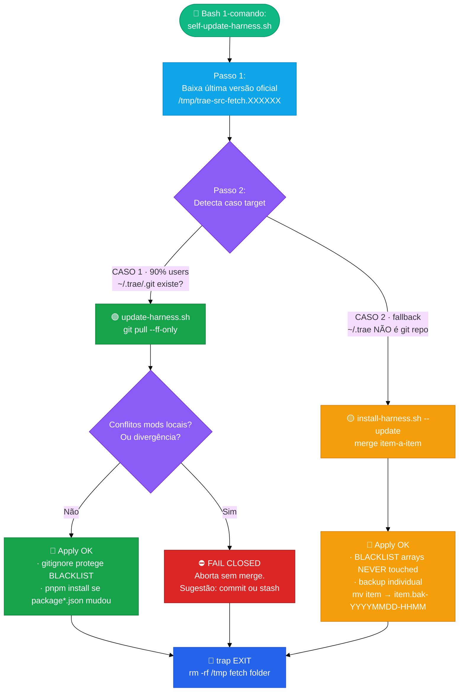

# 🧰 Harness Trae — `.trae` global

> **Repo oficial (público):** [`laionazeredo/trae-config`](https://github.com/laionazeredo/trae-config)  
> **O que é:** Um time ágil simulado inteiro que roda **dentro da sua IDE Trae**.  
> **Arquitetura:** Graph & Loop Engineering (LangGraph-like) via contracts + prompt-rules — sem framework lock-in, 100% reversível.  
> **22 comandos · 43 skills · 3 hooks automáticos · 3 scripts install/update/self-update**  
> **Premissas não negociáveis:** KISS + YAGNI + **No Accidental Complexity** + blast radius mínimo + fail-closed + default dry-run.

---

## 📑 Índice

1. 🚀 **Getting started** — instalar em 3 comandos (máquina nova)
2. ⚡ **Runbook do dia-a-dia** — os 4 comandos que você usa sempre
3. 🏗️ **Arquitetura** — 3 diagramas Mermaid + premissas + precedência 3 camadas
4. 🛡️ **Garantias** — BLACKLIST intocável · defaults · backups · o que NUNCA fazemos
5. 🧭 **19 Comandos** — referência compacta tabela
6. 📝 **Cheatsheet** — copy-paste CLI (scope-check · merge-resolve · bindings · decisions · token reduction)
7. 🔧 **Troubleshooting** — 3 casos comuns + rollback
8. ❌ **O que NÃO existe (YAGNI)** · como pedir features novas

---

## 1. 🚀 Getting started (máquina NOVA, `~/.trae` não existe)

> ⚠️ Requisitos mínimos (1 dos 2): `gh` CLI logado, OU só `git` (fallback clone HTTPS).  
> Mais: `corepack enable` (para pnpm/tsx).  
> **Opcional (RECOMENDADO p/ onboarding e raio-X de repositórios):** `graphify` CLI (PyPI `graphifyy`, via `pipx`). Converte qualquer pasta em knowledge graph consultável (71.5× menos tokens por query vs ler arquivos raw).

```bash
# 1. Clone repo DIRETO em ~/.trae (RECOMENDADO: ~/.trae vira git repo)
gh repo clone laionazeredo/trae-config ~/.trae -- --depth 1

# 2. Instala deps TS (tsx executor zero-build + ts strict + @types/node)
corepack enable
corepack pnpm --dir ~/.trae install --prefer-offline

# 3. (Opcional RECOMENDADO) Instala graphify CLI via pipx (knowledge graph de repositórios)
pipx install graphifyy     # provê o comando `graphify`
#
# 3b. Node.js alternatives (OPCIONAL · unificar ecossistema só JS):
#     Se preferir manter só ferramentas npm (sem Python/pipx), o harness usa
#     como engine preferencial as alternativas abaixo (fallback chain
#     implementado em skills/harness-graph/SKILL.md — nenhuma é mandatória,
#     o fallback grep-based funciona SEM nenhum deles instalado):
#
#     · 1ª escolha · @colbymchenry/codegraph (Node 20+ · 21 linguagens · MCP + SQLite FTS5
#                   incremental file-watcher · benchmarks ~58% fewer tool calls):
#                   npm install -g @colbymchenry/codegraph
#     · Ontologia multimodal · @sentropic/graphify (código + PDFs + CSVs + imagens):
#                   npm install -g @sentropic/graphify
#     · Mais leve, só depgraph visualização · codebase-vis (6 linguagens · 17 deps):
#                   npm install -g codebase-vis
#     · Context-pack compiler TS/Node only · @lubab/madar (5.28× fewer tokens em benchmarks):
#                   npm install -g @lubab/madar

# 4. Smoke rápido (OBRIGATÓRIO · 10s)
ls ~/.trae/commands | wc -l                           # esperado >= 22
corepack pnpm --dir ~/.trae decisions --help | head -2  # CLI decisions TS funciona?
command -v graphify >/dev/null && echo "graphify OK"    # opcional mas recomendado
```

Recarregue o Trae (feche/abra ou reload window). **Pronto.**

---

## 2. ⚡ Runbook do dia-a-dia

### Ciclo de vida completo — SDLC formal (Graph & Loop Engineering)

> **Padrão:** Graph Engineering (nós + arestas + checkpoints persistentes) e Loop Engineering (iterações limitadas, progresso explícito, falha bounded). Implementado via contracts + rules + SKILLs (equivalente a 1 LangGraph node por skill, edges = ordem obrigatória, checkpoints = `decisions.log.jsonl` + workspace artifacts). **Zero lock-in de framework:** migrar p/ LangGraph se um dia precisar é direto (1 skill = 1 node, HARNESS_RULES ordem = edges, decisions.log = checkpointer state).

```mermaid
%%{init: {'theme':'base'}}%%
flowchart TD
    NewRepo([👤 Cheguei numa codebase NOVA ou voltei depois de meses])
    ProdInit([👤 Criando produto/projeto do zero])
    NewRepo -->|1 vez por repo| XRay([0️⃣  harness-xray Raio-X do repositório\n(Graphify first → fallback lightweight AST scan)\nsalva project_profile no registry global])
    ProdInit -->|1 vez por projeto| PK([0️⃣  harness-project-knowledge\nregistry global: produto + arquitetura + roadmap + personas + integrações])
    XRay & PK --> Read{Qualquer sessão a partir de AGORA\nlê registry FIRST antes de qualquer coisa}
    Read --> B([👤 Pede feature/bug/refactor])
    B --> Spec([1️⃣  harness-spec SPEC 7 seções canônicas + YAML frontmatter\nApproved gate = libera escopo])
    Spec --> ADRGate{change_class é\narch/platform/large-migration?}
    ADRGate -->|Sim| ADR([adr-architecture skill\ncria ADR-XXX design doc\n(em workspace/design/)])
    ADRGate -->|Não| SM([2️⃣  harness-start Scrum Master\ngates 0-1.5: binding + spec aprovado + ADR se aplicável + tasks graph + envelopes])
    ADR --> SM
    SM --> Dev{3️⃣ Dev tasks atomic}
    Dev -->|Serial T1→TN| T1[T1] --> Tn[...TN]
    Dev -->|Paralelo Kahn waves| Parallel([harness-parallel executor dispatcher\nfile locks + blast radius])
    Tn --> QA(QA 🔬 per-task\nbuild/lint/typecheck/test)
    Parallel --> QA
    QA --> CL(🛡 Compliance Light per-task\nPII/secrets/SQL injection)
    CL --> Done{Todas tasks DONE?}
    Done -->|Não| Dev
    Done -->|Sim| Ship([4️⃣  harness-ship\n§0.9 4-GATES EXECUTÁVEIS fail-fast order:])
    Ship --> G1(Gate 0.9.1 🔍 SCOPE 6-checks\nAC delivered × tests × docs × env × LEAN YAGNI × SCORE=√(scope·LEAN)≥7.0)
    G1 --> G2(Gate 0.9.2 🔎 CODE-REVIEW\n0C + ≤2H → auto-remediate SEM perguntar\nany CRITICAL ou ≥3H → BLOQUEIA ship)
    G2 --> G3(Gate 0.9.3 🛡 COMPLIANCE HEAVY\nfull diff scan 0C + 0H SEM override direto)
    G3 --> G4(Gate 0.9.4 🧪 QA FINAL\nopcional --run-qa flag; detect stack)
    G4 --> PR([📤 Draft PR aberto · 1 conventional commit])
    PR -->|human reviewer| Cmt([harness-pr-comments triage: actionable/nit; reply drafts + implementation plan])
    PR -->|CI vermelho| Ci([harness-ci-fix diagnostica + corrige até 3 planos de fix])
    PR -->|nit, quality, blockers| Rv([harness-review blocking: runtime/security/deps/scope])
    Cmt & Ci & Rv --> Mergeable{PR mergable?}
    Mergeable -->|Não| PR
    Mergeable -->|Sim Merge!| Obs([Post-deploy checklist:\nrollback doc · observabilidade provider · SLO baseline\n(decision log entry POST_DEPLOY_CHECK)])
    Obs --> End([✅ SDLC COMPLETO end-to-end])
```

### O Runbook em 4 + 2 comandos (os que você usa todo dia)

| # | Comando | O que faz | Quando rodar |
|---|---|---|---|
| ⚡0 | **`bash ~/.trae/scripts/self-update-harness.sh`** + `--apply` | 1-comando update da última versão oficial. Default dry-run. | **Todas as manhãs.** |
| 0R | **`/harness-xray --worktree <abs_path>`** | 🔴 **1 vez por nova codebase.** Raio-X estruturado. Graphify-first. Salva project_profile + architecture auto-detectada no registry global. | Hoje mesmo em todos os seus projetos ativos. |
| 0P | **`/harness-project-knowledge --project <slug> (edit\|view\|refresh)`** | Memória persistente do PRODUTO: nome, ramo, arquitetura geral alto-nível, roadmap futuro, personas, integrações externas, áreas de risco. Todo skill lê isso ANTES de começar. | 1 vez quando começa um projeto; atualiza sempre que algo muda no produto. |
| 1 | **`/harness-spec input=<desc or ticket URL>`** | SPEC canônico 7 seções + 15 campos YAML frontmatter + Approved gate. | **Antes de escrever 1 linha de código.** |
| 2 | **`/harness-start --worktree <path>`** | **SM gates 0→1.5 obrigatórios**: binding 2-level → spec aprovado (ADR se necessário) → task graph + file locks → envelopes por task → dev serial ou paralelo Kahn → QA per-task → compliance light → loop até done. | SPEC Approved. |
| 3 | **`/harness-ship`** | **§0.9 4-GATES EXECUTÁVEIS** antes de qualquer git op: 0.9.1 scope 6-checks → 0.9.2 review auto-fix threshold → 0.9.3 compliance heavy → 0.9.4 QA opcional. Depois: conventional commit atômico → push → Draft PR → assign user. | Todas tasks + QA per-task + compliance light fechados. |

**Intermediários úteis:**
- `/harness-graph (refresh|query|path|stats)` — wrapper genérico do graphify CLI (se instalado). Atualiza graphify-out/ ou lê o knowledge graph existente.
- `/harness-status` — snapshot binding / gates / tasks.
- `/harness-fix expected=<X> repro=<steps>` — debugging científico bounded (hipótese→instrumentar→reproduzir→corrigir→verificar).
- `/harness-ci-fix <PR URL>` — 3 planos de fix, depois pergunta user.
- `/harness-abort` — ABORTED decision log + unlocks limpos.

---

## 3. 🏗️ Arquitetura (4 diagramas + premissas)

### 3.1 Graph & Loop Engineering — conceitual vs framework (mapping)

> Implementamos os mesmos padrões de Graph Engineering (LangGraph, LangChain) e Loop Engineering (bounded iterations, progress tracking) **via contracts + rules + skills**. Nenhum framework novo, nenhum lock-in. Migração p/ LangGraph no futuro é mecânica e direta.

| Conceito Graph / Loop Engineering | Nossa implementação canônica | Equivalente em LangGraph / frameworks |
|---|---|---|
| **Nó atômico de trabalho (Node)** | 1 pasta `skills/<nome>/SKILL.md` (harness-spec, harness-developer, harness-code-review…) | `StateGraph.add_node("review", fn)` |
| **Arestas / fluxo obrigatório (Edges)** | `HARNESS_RULES.md` §Time Ágil ordem obrigatória 1→7 + `harness-ship §0.9` 4-gates fail-fast order | `add_edge(spec, start)`; `add_conditional_edges(scope_gate, ok=review, fail=block)` |
| **Arestas condicionais (gates com thresholds)** | Scope-checker SCORE≥7.0 APPROVED; ≤2 HIGH review auto-fix SEM perguntar; CRITICAL≥1 ou HIGH≥3 → block ship; CI ≤ 3 plans bounded | `add_conditional_edges(gate, condition, branches)` |
| **State persistente / checkpoints (Checkpointer)** | `$HARNESS_SESSIONS_ROOT/<ws>/<wt>/workspace/` + `decisions.log.jsonl` append-only (helper oficial) + `task_graph.md` + `spec_*.md` Approved | `MemorySaver`, `SqliteSaver` checkpointer |
| **Human-in-the-loop / breakpoint** | SPEC Approved gate (SM §0.5); override gates com `EXPLICIT_OVERRIDE` logged em decisions; `AskUserQuestion` tool built-in; `EXPLICIT_OVERRIDE` para ship --skip-gates | `interrupt()` + resume |
| **Bounded Loop Engineering (stop conditions)** | `HARNESS_RULES` §Loop Time-outs table: geral=2, debug=5, ci=3 iterações SEM PROGRESSO CLARO. Progresso = diff state antes/depois. | `max_iterations` + `StateSnapshots` comparison |
| **Parallel sub-graphs (fan-out)** | `harness-executor-dispatcher` Kahn topological waves + `file_lock` blast radius partitions | Parallel subgraphs + concurrency config |
| **Session scoped state** | `$HARNESS_SESSION_DIR/` (efêmero) binding.md + reports/ + qa/ | Thread-local / run_id scoped state |
| **Replay / time-travel (nice-to-have)** | `decisions.log.jsonl` audit trail + envelopes imutáveis em tasks/<TASK_ID>/ (reiniciar SM de task específica = replay) | `checkpointer.get_tuple(config).values` replay |
| **Sub-graph composition** | Scrum Master §0→1.5 orquestra skills internas (spec→ADR→graph→tasks) como pipeline composto | Compiled StateGraph subgraph |
| **Streaming de eventos** | TRAE chat incremental toolcall→result→toolcall (output built-in da IDE) | `stream_mode=updates/values/messages` |

> **Reversibility commitment:** Se um dia você migrar para LangGraph/LangChain, o trabalho de tradução é 1:1 — nenhuma regra de negócio ou contrato muda; só muda a **forma de declarar o grafo** (de Markdown rules → código Python/TS). `engineering-contracts` precendência 1-18 continua a mesma fonte canônica.

---

### 3.2 Camadas de precedência (3 camadas + user_rules ganha de TUDO)


### 3.3 Update Flow (como checam novas versões — 1 comando)



### 3.4 Estrutura do diretório (vista pássaro) + registry global (.registry)

Além da estrutura abaixo, existe **um level intermediário NOVO** de conhecimento global de projeto. Fica **ABAIXO de $HARNESS_SESSIONS_ROOT/.registry/** (compartilhado entre TODAS worktrees do mesmo projeto e entre TODAS sessões):

```
$HARNESS_SESSIONS_ROOT/                 (default: $HOME/code/harness-sessions)
├── .registry/                          🔴 NOVO Level 1.5 (compartilhado workspaces × worktrees)
│   └── projects/<PROJECT_SLUG>/        slug = derivado CANONICAMENTE do git remote origin URL
│       ├── project_profile.md          ← harness-xray (auto gerado 1 vez; refresh periódico)
│       ├── product_context.md          ← harness-project-knowledge (usuário edita 1 vez)
│       ├── architecture.md             ← metade auto (xray + graphify) + metade manual (design)
│       ├── roadmap.md                  ← funcionalidades planejadas / roadmap
│       └── registry.jsonl              ← append-only: edições, refresh xray, mudanças produto
│
├── <WORKSPACE_NAME>/                   (ex: Flockr  default se não tem .code-workspace)
│   └── <WORKTREE_SLUG>/                (ex: Lumos__feat--FLO-745)
│       ├── workspace/                  ← você conhece: specs, task_graph, decisions, envelopes
│       └── sessions/<SESSION_ID>/
```

```
~/.trae/
├── README.md                 ← ESTE ARQUIVO (ponto de entrada)
├── HARNESS_RULES.md          ← Gates obrigatórios, SPEC approval, paralelismo
├── REFERENCE_USER_RULES_MINIFIED.md  ← Versão bolso p/ agente
│
├── commands/     (22 .md)    ← LEVES (inline) + HEAVIES (skill wrapper + gates)
├── skills/       (43 pastas) ← 22 personas ágeis + 21 domínio (Stripe/Next/Supabase… + xray + project-knowledge + graph)
├── contracts/                 ← SINGLE SOURCE OF TRUTH · helpers shell + CLI TS
│   ├── harness_sessions_contract.sh   # paths + decisions + PROJECT REGISTRY helpers
│   └── decisions-query.cli.ts         # 4 modos: summary · filter · tail · export
│
├── hooks/        (3)         ← AUTOMÁTICOS: binding scissor · 3layer-dedup · lang-pt
├── scripts/      (3 .sh)     ← install · update · self-update (1-comando fetch GH)
├── permission/               ← global.json allow/deny tools
│
├── user_rules/*  🔴 BLACKLIST  ← VOCÊ que escreve. 1ª precedência. NÃO versiona.
├── bindings/registry.jsonl 🔴 BLACKLIST  ← Level1 session→worktree. Writer ÚNICO contracts helper.
└── memory/       🔴 BLACKLIST  ← Dados Trae. Não toque.
```

### Premissas chave (não muda)

| ID | Premissa | O que significa |
|---|---|---|
| P1 | **Single Writer Principle** | decisions / registry / paths → 1 HELPER OFICIAL em contracts. NUNCA Edit/Write manual. |
| P2 | **Blast radius mínimo** | Escreve só em worktree BOUND + `HARNESS_SESSIONS_ROOT/`. Hook1 BLOQUEIA qualquer path fora. |
| P3 | **Default SEMPRE dry-run** | Nenhum script (install/update/self-update) altera 1 byte sem `--apply` explícito. |
| P4 | **Nenhum `rm` sobre /home** | Todos os scripts. Só `rm -rf /tmp/<temp>` via trap EXIT. Backups são `mv` (item → .bak-TS). |
| P5 | **No dual-write** | Decisions e registry = JSONL só. Nenhum `.md` duplica. |
| P6 | **Update não destrutivo** | Item-a-item. Source não tem, target tem → NUNCA tocado (preserva suas skills/commands custom). |

---

## 4. 🛡️ Garantias — BLACKLIST + defaults

### BLACKLIST ABSOLUTO (nenhum script lê / escreve / renomeia / deleta)

```
🔴 user_rules/*                # suas regras, preferências, idioma, perfil
🔴 bindings/registry.jsonl     # level-1 binding global · single writer contracts
🔴 memory/*                    # histórico do Trae · gerado pela IDE
🔴 skills/<sua-skill-custom>/  # qualquer coisa em skills/ ou commands/ que VOCÊ criou
                               # e NÃO existe no repo oficial: NUNCA iterado, NUNCA tocado
🔴 node_modules/  *.bak-*      # técnicos: ignorados por .gitignore
```

Proteção automática em todos os caminhos:
- **CASO 1 (git ff-only pull):** `.gitignore` protege tudo. Esses arquivos **nunca são trackeados**.
- **CASO 2 (install-update merge):** BLACKLIST_DIRS + BLACKLIST_FILES arrays + skip de target-only items.

### Backups individuais (item granular, não backup gigante)

Sempre que um **item oficial foi alterado**, antes de sobrescrever:
```bash
mv target/skills/harness-developer  \
   target/skills/harness-developer.bak-20260831-231503
```
Rollback manual de 1 item: `mv item.bak-20260831-231503 item`. Nada de restaurar backup gigante.

---

## 5. 🧭 22 Comandos (tabela compacta)

| # | Comando | Tipo | Quando usar |
|---|---|---|---|
| 0S | **`bash scripts/self-update-harness.sh [--apply]`** | shell script (não `/harness-*`) | Manhã diária: pegar últimas skills/commands. Default dry-run. |
| 0R | **`/harness-xray [--worktree <path>]`** | HEAVY onboarding | **PRIMEIRA VEZ num repo novo:** raio-X completo. Detecta stack, estrutura, convenções, escreve `project_profile.md` no registry global do projeto. |
| 0P | **`/harness-project-knowledge [--edit\|--show]`** | HEAVY registry | Preenche/review **contexto humano** do projeto: produto, ramo, arquitetura manual, roadmap, personas, riscos. O harness lê ISSO ANTES de qualquer SPEC. |
| 0G | **`/harness-graph {refresh\|query "?"\|path A B\|stats}`** | HEAVY graphify | Wrapper genérico Graphify: atualiza knowledge graph AST local, faz perguntas, busca paths entre símbolos, estatísticas do repo. Usa CLI `graphify` (pipx). |
| 1 | `/harness-spec input=<desc\|ticket>` | LEVE inline | Criar/validar SPEC + approval ANTES de dev. |
| 2 | `/harness-start [--worktree <path>]` | HEAVY SM | Iniciar time ágil completo. Gates 0→1.5. |
| 3 | `/harness-status` | LEVE | Snapshot binding · gates · tasks · registry. |
| 4 | `/harness-parallel <task_graph.md>` | HEAVY dispatcher | Kahn waves + file locks para ≥2 tasks independentes. |
| 5 | `/harness-abort` | LEVE | Cancelar sessão: decisions CANCELLED + release locks. |
| 6 | `/harness-skip --task Tn --reason=<x>` | LEVE | Skip 1 task com motivo logged. |
| 7 | `/harness-summary [--deep]` | LEVE | Resumo ACs / decisions / blockers / next steps. |
| 8 | `/harness-review [--worktree <p>]` | HEAVY CR | Só bloqueios: runtime regressions / PII / scope drift. Fix CRIT/HIGH. |
| 9 | `/harness-diff [--worktree <p>]` | HEAVY context | Converte diff em talking points (PR OU worktree local). |
| 10 | `/harness-pr-comments <PR URL>` | HEAVY triage | Classifica comentários PR: válido / nitpick / inválido + respostas EN pré-escritas. |
| 11 | `/harness-fix expected=<X> repro=<steps>` | HEAVY bugfix | Scientific debugging hyp→inst→repro→fix→verify. |
| 12 | `/harness-manual-test <plan.md>` | HEAVY Playwright | Executa plan manual com evidências screenshots/logs. |
| 13 | `/harness-ci-fix <PR/Run URL>` | HEAVY CI | Diagnose failing jobs → classify root cause → fix → rerun. |
| 14 | `/harness-design <spec\|brief>` | HEAVY UI | UI pipeline 4 modos. Gate APPROVAL EXPLÍCITA obrigatório antes de executar. |
| 15 | `/harness-figma <link Figma>` | HEAVY UI | Dev-mode exato → reuso componentes → implementa 1ª tentativa → pixel-check. |
| 16 | `/harness-decisions [summary\|filter\|tail\|export]` | Skill | Query JSONL decisions. Summary PT-BR default. |
| 17 | **`/harness-ship`** | HEAVY FINAL | Gate final. 1 conventional commit → push → Draft PR. |
| 18 | **`/harness-scope-check --prd=\|--ticket=\|--task-graph=\|--scope=<X> [PR URL \| --worktree <p>]`** | HEAVY AUDIT | **6-checks audit (média geométrica SCOPE×LEAN ≥ 7.0):** 1 entrega escopo completo, 2 testes cobrem comportamento, 3 docs atualizados, 4 novas env vars declaradas + parsers, 5 LEAN/YAGNI scanner (12 categorias overengineering + 13 Ousterhout red flags) com justificador AC, 6 SCORE FINAL 0-10. Verdict 🟢🟡🔴. Gate antes de /harness-ship. |
| 19 | **`/harness-merge [--worktree <p>] [--strategy ours\|theirs] [--path <dir\|file>]`** | HEAVY RESOLVER | Resolve merge conflicts **1 hunk por vez** (MIN BLAST RADIUS). DEFAULT favorece worktree atual (ours). 3 casos: 🟢 trivial auto (ws/imports) · 🟡 clash pergunta 2 opções com justificativa agente · 🔴 ambiguidade NUNCA decide sozinho, pede user. Cada hunk logado decisions.

---

## 6. 📝 Cheatsheet CLI (copy-paste)

```bash
# ====== Atualizar harness (diário de manhã) ======
bash ~/.trae/scripts/self-update-harness.sh          # dry-run, veja relatório
bash ~/.trae/scripts/self-update-harness.sh --apply  # apply real

# ====== 🔍 SCOPE CHECK (antes de /harness-ship ou revisar PR) ======
# 6-checks audit (média geométrica SCOPE×LEAN ≥ 7.0): 1 entrega escopo | 2 cobertura testes | 3 docs | 4 env vars declaradas | 5 LEAN/YAGNI+Ousterhout | 6 score final
# Modo A: revisar PR do GitHub + PRD (ou ticket, task-graph, scope free-text)
/harness-scope-check \
  --prd=/abs/path/docs/prd-refund.md \
  https://github.com/owner/repo/pull/123

# Modo B: revisar worktree local antes de commitar
/harness-scope-check \
  --ticket=https://linear.app/team/issue/FLO-732 \
  --worktree=/home/laion/code/flockr/Lumos.worktrees/feat-FLO-732-abc

# Modo B com base branch explícita (default: auto-detect main/dev)
/harness-scope-check --scope="adiciona filtros dashboard admin + export CSV" \
  --worktree=/abs/wt --base=origin/dev

# ====== 🔀 MERGE RESOLVE (quando Git trava com <<<<<<< markers) ======
# Resolver todos conflitos 1 hunk por vez, default OURS (worktree atual wins incoming loses)
/harness-merge --worktree=/abs/wt

# Modo mais restrito: só resolver conflitos dentro de packages/db (menor blast radius)
/harness-merge --worktree=/abs/wt --path=packages/db

# Quiser favorecer branch incoming ao invés worktree
/harness-merge --strategy=theirs --worktree=/abs/wt

# ====== Registry Binding (não use Edit/Write manual) ======
source ~/.trae/contracts/harness_sessions_contract.sh
harness_registry_path
harness_registry_lookup_last "$SESSION_ID" | jq -r .worktree_root
harness_registry_append_jsonl "$SESSION_ID" BOUND "$WT" \
  '{"workspace_name":"Flockr","flags":{"LANG_PT_CHECK":"ENABLED"}}'

# ====== Decisions ======
harness_decisions_path "$WT"
harness_append_decision_jsonl "$WT" "GATE_PASS" \
  '{"gate":"0.3_SPEC_APPROVED","spec_id":"SPEC-X","approver":"user"}'
corepack pnpm --dir ~/.trae decisions "$(harness_decisions_path $WT)" summary --lang pt

# ====== Token Reduction H1-H5 (aplicar em outputs longos) ======
git diff big.patch | harness_tr_diff                             # H1 diff trim
{ echo "linhas lidas"; wc -l; } | harness_tr_read 600           # H2 Read cap 300
some-build-command 2>&1 | harness_tr_stdout                     # H4 stdout cap 4k
grep -R "pattern" src/ | harness_tr_collapse_blank              # H3 collapse blank
harness_tr_grep "pattern" src/ ts                               # H5 grep compact
```

---

## 7. 🔧 Troubleshooting (3 casos comuns)

| Caso | Sintoma | Causa provável | Resolução em 2 passos |
|---|---|---|---|
| **Self-update CASO 1 abortou** | `FAIL: non-ff merge would be needed` ou `abort: uncommitted tracked changes` | Ou você tem mods locais trackeados sem commit, OU sua branch divergiu (commits locais + upstream mudou). | **Mods:** `git -C ~/.trae stash push -m "wip harness local"` → apply update → `git stash pop`. **Divergência:** merge manual (o script não faz merges automáticos) ou resete. |
| **Rollback de 1 item** | Update sobrescreveu `SKILL.md` de uma skill que você tinha editado localmente. | Item oficial alterado, backup criado. | `ls -t ~/.trae/skills/harness-developer.bak-* \| head -1` → copy de volta: `mv ~/.trae/skills/harness-developer.bak-TS ~/.trae/skills/harness-developer`. |
| **TypeScript/typecheck quebrou no ~/.trae** | `tsx not found` ou `Cannot find module @types/node`. | node_modules não instalados, ou não rodou `pnpm install` após update que mudou `package.json`. | 1. `corepack enable` · 2. `corepack pnpm --dir ~/.trae install --prefer-offline`. |

### Rollback total (último recurso CASO 1 git)

```bash
cd ~/.trae && git reset --hard HEAD@{1}
```
(Desfaz o último `git pull --ff-only`. Tudo volta. BLACKLIST NUNCA é tocada por git, então user_rules/ bindings/ memory continuam intactos.)

---

## 8. ❌ O que NÃO existe (de propósito — YAGNI hard-stop)

- ❌ Sem SDK `.d.ts` auto-gerado p/ scripts. MVP Script Mode (bash ≤20 lines / node ≤40 lines) resolve 95%.
- ❌ Sem worker thread `isolated-vm` / sem `run_code` transport dedicado. RunCommand shell existe.
- ❌ Sem UI web dashboard do harness. Tudo CLI + markdown docs.
- ❌ Sem deployment/infra integrados com o próprio harness (use as skills individuais: Terraform, Railway, devops-engineer, etc).
- ❌ Sem deploy automático de PRs. Draft PR é entregue para você aprovar.

> **Pedir uma feature nova?** Use `/harness-spec input="adicionar <X> ao harness"` → cria SPEC canônico, approval gate, depois inicie.

---

**Autor:** Manifesto48 (17 personas skills simuladas).  
**Changelog recente 2026-08-31:** feat(update): self-update 1-comando · update-harness alias inteligente · install --update merge item-a-item · REGRA 7.9 nomes de testes comportamento observável.
