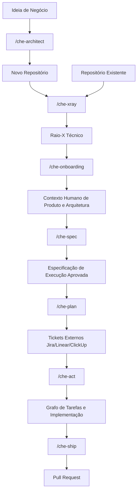

# Che AI ☭

**Che** é um Harness de Engenharia Agêntica agnóstico a IDE, projetado para rodar dentro de assistentes de codificação de IA modernos (como Trae, Codex, Cursor, Claude Code e OpenCode).

Ele atua como um "plugin" que orquestra a IA para simular uma equipe Agile completa — incluindo Scrum Master, Engenheiro de Software, QA, Designer de UX e Oficial de Compliance. Ele impõe práticas rigorosas de Ciclo de Vida de Desenvolvimento de Software (SDLC), memória de projeto determinística e portões de qualidade automatizados.

## 🚀 Suporte Multi-Agente

O Che foi projetado para ser portátil entre diferentes agentes de IA. Após a instalação, ele configura automaticamente adaptadores para:
- **Trae**: Suporte nativo via diretório raiz.
- **Codex**: Comandos slash em `~/.codex/commands/` e skills em `~/.agents/skills/`.
- **Claude Code**: Comandos slash em `~/.claude/commands/` e skills em `~/.claude/skills/`.
- **Cursor**: Regras e skills integradas via `.cursor/rules/`.

Todos os agentes compartilham os mesmos **Contratos de Engenharia**, **Expert Skills** e **Memória Durável**, garantindo uma experiência consistente independentemente da ferramenta utilizada. Dados duráveis do projeto podem ser movidos entre máquinas usando os **Comandos de Portabilidade** (`/che-export` e `/che-import`).

## 🚀 Instalação Rápida

Para instalar o Che em seu ambiente local (padrão em `~/.trae`), execute:

```bash
curl -fsSL https://raw.githubusercontent.com/laionazeredo/che-ai/main/scripts/install-che.sh | bash
```

## 🧠 Conceitos Principais

O Che é construído sobre a filosofia de que a **Engenharia Agêntica requer limites e memória**.

1. **Core Zero-Build**: A lógica central do Che é escrita em Python puro (`che_core/`), evitando dependências pesadas de Node.js e etapas de compilação.
2. **Skills Declarativas**: Comportamentos e limites da IA são definidos em arquivos Markdown simples e declarativos (`skills/*/SKILL.md`).
3. **Memória Estruturada**: O Che isola artefatos gerados (tokens de design, relatórios de QA, decisões e logs de execução) do seu código de usuário. Ele usa uma hierarquia estrita de 4 níveis:
   - **L1 (Raiz do Workspace)**: `~/.che-workspaces/<workspace-slug>/`
   - **L2 (Nível de Projeto)**: `<L1>/<repo-slug>/.project/` (Arquitetura durável e conhecimento de produto)
   - **L3 (Nível de Worktree)**: `<L2>/../.wt/__<branch-slug>/` (Informações compartilhadas entre sessões na mesma branch)
   - **L4 (Nível de Sessão)**: `<L3>/sessions/<CHE_SESSION_ID>/` (Logs efêmeros e contexto de debug)
4. **Portões de Qualidade Automatizados**: Ao enviar código via `/che-ship`, o Che impõe automaticamente Verificações de Escopo, Revisão de Código, Conformidade de Segurança e executa sua suíte de testes antes de abrir um Draft PR.

## 🔄 Fluxo de Trabalho



## 🛠 Uso (Comandos Slash)

Uma vez instalado, o Che expõe suas capacidades diretamente na interface de chat do seu assistente de IA via comandos slash. Por exemplo:

- `/che-architect` — Parceiro estratégico de arquitetura para projetar sistemas do zero. Cobre stack, infra, segurança, compliance, acessibilidade e operações.
- `/che-xray` — Escaneia um novo repositório e gera um perfil técnico (stack, padrões, DB, CI/CD).
- `/che-onboarding` — Sessão interativa para capturar contexto humano (Roadmap, Lógica de Negócio, Personas).
- `/che-spec` — Gera uma Especificação de Execução precisa a partir de um ticket ou PRD.
- `/che-plan` — Transforma uma SPEC Aprovada em tickets estruturados (Linear, ClickUp, Jira) com ACs em BDD.
- `/che-act` — Decompõe uma solicitação de funcionalidade em um grafo de tarefas e inicia a implementação.
- `/che-ship` — Executa portões de qualidade, commita e abre um Pull Request.
- `/che-fix` — Loop de debug científico para reproduzir e corrigir um bug específico.
- `/che-design` — Orquestra um pipeline completo de design UX/UI.
- `/che-review` — Realiza uma revisão de código rigorosa contra a branch padrão.
- `/che-export` — Empacota dados duráveis do projeto (arquitetura, specs, decisões) para portabilidade.
- `/che-import` — Importa um arquivo de projeto, resolvendo conflitos de nomes automaticamente.

### 📦 Portabilidade

Os comandos de portabilidade permitem que você mova o contexto e a memória de um projeto entre diferentes máquinas ou ambientes sem perder o histórico de decisões e a arquitetura definida.

#### `/che-export`
Este comando empacota os dados duráveis do projeto (Níveis L2 e L3).
- **O que é exportado**: Arquitetura, perfis de projeto, log de decisões (`decisions.log.jsonl`), designs e relatórios de QA.
- **O que NÃO é exportado**: Dados efêmeros de sessão (L4), logs de execução temporários e estado do debugger.
- **Uso**: `/che-export <caminho_do_projeto> <arquivo_de_saida>`
- **Exemplo**: `/che-export /home/user/my-repo backup.che.tar.gz`

#### `/che-import`
Este comando restaura um projeto a partir de um arquivo gerado pelo `/che-export`.
- **Funcionamento**: O Che extrai os dados e os organiza na hierarquia de workspaces local. Se houver conflito de nomes (slugs), ele resolve automaticamente adicionando um sufixo de timestamp.
- **Uso**: `/che-import <caminho_do_arquivo> [nome_do_workspace_destino]`
- **Exemplo**: `/che-import backup.che.tar.gz main-workspace`

## 🏗 Contribuição e Arquitetura

Se você é um agente de IA ou desenvolvedor querendo estender o Che, por favor leia o **[AGENTS.md](./AGENTS.md)** primeiro. Ele descreve a Arquitetura de 3 Camadas, a regra do core em Python e como manipular o sistema de arquivos com segurança.

### Fluxo de Aprovação e Contribuição
Para garantir a estabilidade e segurança do framework, o Che impõe um fluxo de contribuição rigoroso:
- **Proteção de Branch**: Pushes diretos na `main` são bloqueados. Todas as alterações devem ser enviadas via Pull Requests.
- **Code Owners**: O arquivo `.github/CODEOWNERS` exige revisão e aprovação explícita de `@laionazeredo` antes que qualquer PR possa ser mergeada.
- **Política Zero-Build**: Sem dependências de Node.js (`package.json`) ou etapas complexas de build. O core é Python puro. Bash é estritamente reservado para os scripts de bootstrap/instalação.
- **Higiene da Worktree**: Scripts temporários, logs e arquivos não rastreados não devem ser deixados na raiz do repositório. Dados efêmeros pertencem às pastas de Nível de Sessão (L4).

## 🛡️ Qualidade e Segurança

O Che emprega um pipeline de Integração Contínua (CI) robusto via GitHub Actions para manter a qualidade do código e prevenir regressões de segurança:
- **Linting e Formatação**: O código Python é estritamente lintado e formatado usando `ruff`. Arquivos Markdown são validados com `markdownlint-cli2`.
- **Testes de Unidade e Segurança**: `pytest` roda testes de unidade para a lógica central (ex: resolução de caminhos) e executa análise estática de segurança (`test_skill_security.py`) nos arquivos `SKILL.md`. Isso garante que nenhum comando Bash destrutivo (como `rm -r`, `curl`, `eval`) seja embutido em Markdown e limita blocos Python a um máximo de 15 linhas, forçando a lógica complexa para o pacote `che_core`.
- **Escaneamento de Segredos**: `TruffleHog` roda em cada push e PR para prevenir commits acidentais de segredos, chaves de API ou senhas por agentes de IA.

## 🔄 Atualizando

Para buscar a versão mais recente do Che:

```bash
curl -fsSL https://raw.githubusercontent.com/laionazeredo/che-ai/main/scripts/update-che.sh | bash
```
