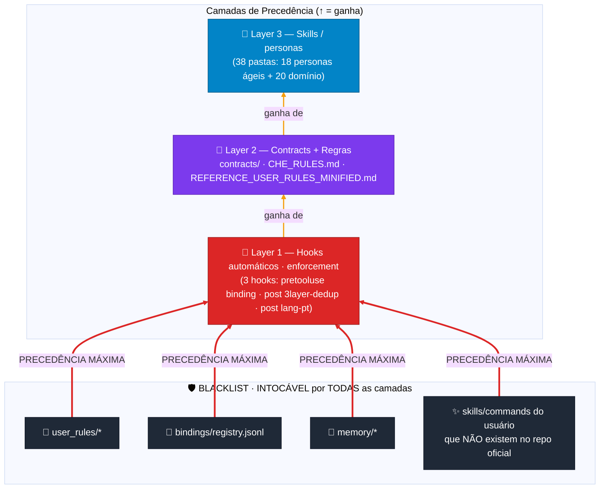
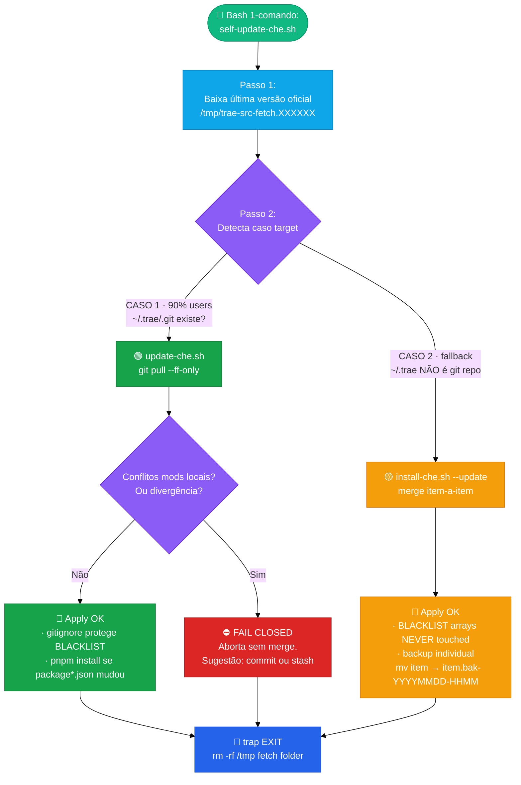

# 🧰 Che Trae — `.trae` global

> **Repo oficial (público):** [`laionazeredo/trae-config`](https://github.com/laionazeredo/trae-config)  
> **O que é:** Um time ágil simulado inteiro que roda **dentro da sua IDE Trae**.  
> **Arquitetura:** Graph & Loop Engineering (LangGraph-like) via contracts + prompt-rules — sem framework lock-in, 100% reversível.  
> **22 comandos · 43 skills · 3 hooks automáticos · 3 scripts install/update/self-update**  
> **Premissas não negociáveis:** KISS + YAGNI + **No Accidental Complexity** + blast radius mínimo + fail-closed + default dry-run.

---

## 📑 Índice

1. 🚀 **Getting started** — instalar em 3 comandos (máquina nova)
2. ⚡ **Runbook do dia-a-dia** — os 4 comandos que você usa sempre
3. 🏗️ **Arquitetura** — 3 diagramas Mermaid + premissas + precedência 3 camadas
4. 🛡️ **Garantias** — BLACKLIST intocável · defaults · backups · o que NUNCA fazemos
5. 🧭 **19 Comandos** — referência compacta tabela
6. 📝 **Cheatsheet** — copy-paste CLI (scope-check · merge-resolve · bindings · decisions · token reduction)
7. 🔧 **Troubleshooting** — 3 casos comuns + rollback
8. ❌ **O que NÃO existe (YAGNI)** · como pedir features novas

---

## 1. 🚀 Getting started (máquina NOVA, `~/.trae` não existe)

> ⚠️ Requisitos OBRIGATÓRIOS (HARD RULE): **`gh` CLI instalado E autenticado.** NÃO existe mais fallback para clone por `git https://github.com/` direto ou HTTP API manual. Todos acessos a GitHub do che passam EXCLUSIVAMENTE por gh CLI (autenticação, scopes, rate-limit, repos privados, 2FA, enterprise).  
> Mais: `corepack enable` (para pnpm/tsx).  
> **Opcional (RECOMENDADO p/ onboarding e raio-X de repositórios):** `graphify` CLI (PyPI `graphifyy`, via `pipx`). Converte qualquer pasta em knowledge graph consultável (71.5× menos tokens por query vs ler arquivos raw).

```bash
# 1. Clone repo DIRETO em ~/.trae (RECOMENDADO: ~/.trae vira git repo)
gh repo clone laionazeredo/trae-config ~/.trae -- --depth 1

# 2. Instala deps TS (tsx executor zero-build + ts strict + @types/node)
corepack enable
corepack pnpm --dir ~/.trae install --prefer-offline

# 3. (Opcional RECOMENDADO) Instala graphify CLI via pipx (knowledge graph de repositórios)
pipx install graphifyy     # provê o comando `graphify`
#
# 3b. Node.js alternatives (OPCIONAL · unificar ecossistema só JS):
#     Se preferir manter só ferramentas npm (sem Python/pipx), o che usa
#     como engine preferencial as alternativas abaixo (fallback chain
#     implementado em skills/che-graph/SKILL.md — nenhuma é mandatória,
#     o fallback grep-based funciona SEM nenhum deles instalado):
#
#     · 1ª escolha · @colbymchenry/codegraph (Node 20+ · 21 linguagens · MCP + SQLite FTS5
#                   incremental file-watcher · benchmarks ~58% fewer tool calls):
#                   npm install -g @colbymchenry/codegraph
#     · Ontologia multimodal · @sentropic/graphify (código + PDFs + CSVs + imagens):
#                   npm install -g @sentropic/graphify
#     · Mais leve, só depgraph visualização · codebase-vis (6 linguagens · 17 deps):
#                   npm install -g codebase-vis
#     · Context-pack compiler TS/Node only · @lubab/madar (5.28× fewer tokens em benchmarks):
#                   npm install -g @lubab/madar

# 4. Smoke rápido (OBRIGATÓRIO · 10s)
ls ~/.trae/commands | wc -l                           # esperado >= 22
corepack pnpm --dir ~/.trae decisions --help | head -2  # CLI decisions TS funciona?
command -v graphify >/dev/null && echo "graphify OK"    # opcional mas recomendado
```

Recarregue o Trae (feche/abra ou reload window). **Pronto.**

---

## 2. ⚡ Runbook do dia-a-dia

### Ciclo de vida completo — SDLC formal (Graph & Loop Engineering)

> **Padrão:** Graph Engineering (nós + arestas + checkpoints persistentes) e Loop Engineering (iterações limitadas, progresso explícito, falha bounded). Implementado via contracts + rules + SKILLs (equivalente a 1 LangGraph node por skill, edges = ordem obrigatória, checkpoints = `decisions.log.jsonl` + workspace artifacts). **Zero lock-in de framework:** migrar p/ LangGraph se um dia precisar é direto (1 skill = 1 node, CHE_RULES ordem = edges, decisions.log = checkpointer state).

```mermaid
%%{init: {'theme':'base'}}%%
flowchart TD
    NewRepo["👤 Cheguei numa codebase NOVA ou voltei depois de meses"]
    ProdInit["👤 Criando produto/projeto do zero"]
    NewRepo -->|"1 vez por repo"| XRay["0️⃣  che-xray Raio-X do repositório<br/>(Graphify first → fallback lightweight AST scan)<br/>salva project_profile no registry global"]
    ProdInit -->|"1 vez por projeto"| PK["0️⃣  che-project-knowledge<br/>registry global: produto + arquitetura + roadmap + personas + integrações"]
    XRay & PK --> Read{"Qualquer sessão a partir de AGORA<br/>lê registry FIRST antes de qualquer coisa"}
    Read --> B["👤 Pede feature/bug/refactor"]
    B --> Spec["1️⃣  che-spec SPEC 7 seções canônicas + YAML frontmatter<br/>Approved gate = libera escopo · OPCIONAL: `domain:` field seta domínio não-eng"]
    Spec --> DomainLoad["🗂 CARGA DOMÍNIO (Step 0.3 SM)<br/>LÊ SEMPRE spec frontmatter `domain:`<br/>(a) 7 domínios FÍSICOS oficiais = NENHUM SKIP<br/>(b) Carrega `domains/<domain>/profile.md` + `playbook.md`<br/>(c) Registra gates obrigatórios ship §0.9.5<br/>(d) DEFAULT se NULL = `engineering`"]
    DomainLoad --> ADRGate{"change_class é<br/>arch/platform/large-migration?"}
    ADRGate -->|"Sim"| ADR["adr-architecture skill<br/>cria ADR-XXX design doc<br/>(salva em che workspace_shared/design/<br/>cópia manual p/ workspace só se usuário quiser)"]
    ADRGate -->|"Não"| SM["2️⃣  che-start Scrum Master<br/>gates 0-1.5: binding + spec aprovado + ADR se aplicável + tasks graph + envelopes"]
    ADR --> SM
    SM --> Dev{"3️⃣ Dev tasks atomic"}
    Dev -->|"Serial T1→TN"| T1["T1"] --> Tn["...TN"]
    Dev -->|"Paralelo Kahn waves"| Parallel["che-parallel executor dispatcher<br/>file locks + blast radius"]
    Tn --> QA["QA 🔬 per-task<br/>build/lint/typecheck/test"]
    Parallel --> QA
    QA --> CL["🛡 Compliance Light per-task<br/>PII/secrets/SQL injection"]
    CL --> Done{"Todas tasks DONE?"}
    Done -->|"Não"| Dev
    Done -->|"Sim"| Ship["4️⃣  che-ship<br/>§0.9 4-GATES EXECUTÁVEIS fail-fast order:"]
    Ship --> G1["Gate 0.9.1 🔍 SCOPE 6-checks<br/>AC delivered × tests × docs × env × LEAN YAGNI × SCORE=√(scope·LEAN)≥7.0"]
    G1 --> G2["Gate 0.9.2 🔎 CODE-REVIEW<br/>0C + ≤2H → auto-remediate SEM perguntar<br/>any CRITICAL ou ≥3H → BLOQUEIA ship"]
    G2 --> G3["Gate 0.9.3 🛡 COMPLIANCE HEAVY<br/>full diff scan 0C + 0H SEM override direto"]
    G3 --> G4["Gate 0.9.4 🧪 QA FINAL<br/>opcional --run-qa flag; detect stack"]
    G4 --> G5["Gate 0.9.5 🗂 DOMAIN GATES<br/>Roda arquivos em `domains/<domain>/gates/*`<br/>7 domínios FÍSICOS · DEFAULT=engineering<br/>Thresholds numéricos + retry 1 automático + human 2nd fail"]
    G5 --> PR["📤 Draft PR aberto · 1 conventional commit"]
    PR -->|"human reviewer"| Cmt["che-pr-comments triage: actionable/nit; reply drafts + implementation plan"]
    PR -->|"CI vermelho"| Ci["che-ci-fix diagnostica + corrige até 3 planos de fix"]
    PR -->|"nit, quality, blockers"| Rv["che-review blocking: runtime/security/deps/scope"]
    Cmt & Ci & Rv --> Mergeable{"PR mergable?"}
    Mergeable -->|"Não"| PR
    Mergeable -->|"Sim Merge!"| Obs["Post-deploy checklist:<br/>rollback doc · observabilidade provider · SLO baseline<br/>(decision log entry POST_DEPLOY_CHECK)"]
    Obs --> End["✅ SDLC COMPLETO end-to-end"]
```



### O Runbook em 4 + 2 comandos (os que você usa todo dia)

| # | Comando | O que faz | Quando rodar |
|---|---|---|---|
| ⚡0 | **`bash ~/.trae/scripts/self-update-che.sh`** + `--apply` | 1-comando update da última versão oficial. Default dry-run. | **Todas as manhãs.** |
| 0R | **`/che-xray --worktree <abs_path>`** | 🔴 **1 vez por nova codebase.** Raio-X estruturado. Graphify-first. Salva project_profile + architecture auto-detectada no registry global. | Hoje mesmo em todos os seus projetos ativos. |
| 0P | **`/che-project-knowledge --project <slug> (edit\|view\|refresh)`** | Memória persistente do PRODUTO: nome, ramo, arquitetura geral alto-nível, roadmap futuro, personas, integrações externas, áreas de risco. Todo skill lê isso ANTES de começar. | 1 vez quando começa um projeto; atualiza sempre que algo muda no produto. |
| 1 | **`/che-spec input=<desc or ticket URL>`** | SPEC canônico 7 seções + 15 campos YAML frontmatter + Approved gate. FLAG OPCIONAL: `--domain=ux` seta domínio não-engineering (ver Taxonomia 7 categorias em CHE_RULES). Default=engineering (compat total sessões antigas). | **Antes de escrever 1 linha de código.** |
| 2 | **`/che-start --worktree <path>`** | **SM gates 0→1.5 obrigatórios**: binding 2-level → spec aprovado (ADR se necessário) → task graph + file locks → envelopes por task → dev serial ou paralelo Kahn → QA per-task → compliance light → loop até done. | SPEC Approved. |
| 3 | **`/che-ship`** | **§0.9 4-GATES EXECUTÁVEIS** antes de qualquer git op: 0.9.1 scope 6-checks → 0.9.2 review auto-fix threshold → 0.9.3 compliance heavy → 0.9.4 QA opcional. Depois: conventional commit atômico → push → Draft PR → assign user. | Todas tasks + QA per-task + compliance light fechados. |

**Intermediários úteis:**
- `/che-graph (refresh|query|path|stats)` — wrapper genérico do graphify CLI (se instalado). Atualiza graphify-out/ ou lê o knowledge graph existente.
- `/che-status` — snapshot binding / gates / tasks.
- `/che-fix expected=<X> repro=<steps>` — debugging científico bounded (hipótese→instrumentar→reproduzir→corrigir→verificar).
- `/che-ci-fix <PR URL>` — 3 planos de fix, depois pergunta user.
- `/che-abort` — ABORTED decision log + unlocks limpos.

---

## 3. 🏗️ Arquitetura (4 diagramas + premissas)

### 3.1 Graph & Loop Engineering — conceitual vs framework (mapping)

> Implementamos os mesmos padrões de Graph Engineering (LangGraph, LangChain) e Loop Engineering (bounded iterations, progress tracking) **via contracts + rules + skills**. Nenhum framework novo, nenhum lock-in. Migração p/ LangGraph no futuro é mecânica e direta.

| Conceito Graph / Loop Engineering | Nossa implementação canônica | Equivalente em LangGraph / frameworks |
|---|---|---|
| **Nó atômico de trabalho (Node)** | 1 pasta `skills/<nome>/SKILL.md` (che-spec, che-developer, che-code-review…) | `StateGraph.add_node("review", fn)` |
| **Arestas / fluxo obrigatório (Edges)** | `CHE_RULES.md` §Time Ágil ordem obrigatória 1→7 + `che-ship §0.9` 4-gates fail-fast order | `add_edge(spec, start)`; `add_conditional_edges(scope_gate, ok=review, fail=block)` |
| **Arestas condicionais (gates com thresholds)** | Scope-checker SCORE≥7.0 APPROVED; ≤2 HIGH review auto-fix SEM perguntar; CRITICAL≥1 ou HIGH≥3 → block ship; CI ≤ 3 plans bounded | `add_conditional_edges(gate, condition, branches)` |
| **State persistente / checkpoints (Checkpointer)** | `$CHE_SESSIONS_ROOT/<ws>/<wt>/workspace/` + `decisions.log.jsonl` append-only (helper oficial) + `task_graph.md` + `spec_*.md` Approved | `MemorySaver`, `SqliteSaver` checkpointer |
| **Human-in-the-loop / breakpoint** | SPEC Approved gate (SM §0.5); override gates com `EXPLICIT_OVERRIDE` logged em decisions; `AskUserQuestion` tool built-in; `EXPLICIT_OVERRIDE` para ship --skip-gates | `interrupt()` + resume |
| **Bounded Loop Engineering (stop conditions)** | `CHE_RULES` §Loop Time-outs table: geral=2, debug=5, ci=3 iterações SEM PROGRESSO CLARO. Progresso = diff state antes/depois. | `max_iterations` + `StateSnapshots` comparison |
| **Parallel sub-graphs (fan-out)** | `che-executor-dispatcher` Kahn topological waves + `file_lock` blast radius partitions | Parallel subgraphs + concurrency config |
| **Session scoped state** | `$CHE_SESSION_DIR/` (efêmero) binding.md + reports/ + qa/ | Thread-local / run_id scoped state |
| **Replay / time-travel (nice-to-have)** | `decisions.log.jsonl` audit trail + envelopes imutáveis em tasks/<TASK_ID>/ (reiniciar SM de task específica = replay) | `checkpointer.get_tuple(config).values` replay |
| **Sub-graph composition** | Scrum Master §0→1.5 orquestra skills internas (spec→ADR→graph→tasks) como pipeline composto | Compiled StateGraph subgraph |
| **Streaming de eventos** | TRAE chat incremental toolcall→result→toolcall (output built-in da IDE) | `stream_mode=updates/values/messages` |

> **Reversibility commitment:** Se um dia você migrar para LangGraph/LangChain, o trabalho de tradução é 1:1 — nenhuma regra de negócio ou contrato muda; só muda a **forma de declarar o grafo** (de Markdown rules → código Python/TS). `engineering-contracts` precendência 1-18 continua a mesma fonte canônica.

### 3.2 Three-Layer Domains Architecture (evolutivo, não-destrutivo)

> Che v2 estende para 7 categorias de domínio mantendo **100% retrocompatibilidade** com sessões, skills e specs antigas. Design em 3 camadas de blast-radius mínimo. Reuso 70-90% de todo core existente (gates fail-fast ship §0.9, scrum-master task-graph envelopes, scope-checker LEAN 12 categorias, registry 1.5, decisions audit-trail). Nenhuma outra camada toca o Core a não ser pelos 3 pontos de integração mínima abaixo.

| Camada | O que contém | Modificou nesta fase? | Blast radius default |
|---|---|---|---|
| **L1 · Core (intocado hoje)** | `engineering-contracts` §1-19 · `CHE_RULES` · hooks · `commands/` (22) · `skills/` legacy (40, todas default implícito `domain: engineering`) | ❌ NÃO — nem um arquivo de regra core antigo foi alterado. Só adições. | ZERO. Skills antigas SEM `domain:` frontmatter → comportamento idêntico fase7. |
| **L2 · Domain Layer (NOVA)** | Pasta física `domains/<slug>/` com 5 artefatos OBRIGATÓRIOS por domínio: `profile.md` persona/rules · `playbook.md` flow etapas não-pula · `connectors/` integrações oficiais só CLI/MCP · `gates/` thresholds numéricos executáveis · `templates/` deliveráveis reusáveis. 7 slugs canônicos (ver `CHE_RULES.md` §Taxonomia): `engineering` (padrão implícito) + `product` + `ux` + `devops` + `copywriting` + `social` + `seo-analytics`. | ✅ SIM — Criada estrutura 6 pastas + 29 boilerplates + **Piloto UX 10 arquivos conteúdo completo** (profile + playbook + 2 connectors + 2 gates + 2 templates). | Isolado por domínio. Nada executa sem ser explicitamente carregado por L3. |
| **L3 · Minimal Auto-Load Integration (3 updates mínimos 1-arquivo-cada)** | (A) **che-scrum-master §0.3** = auto-carrega `domains/X/profile.md` + `playbook.md` ANTES scope-capture se `spec.domain` setado ≠ engineering. (B) **che-spec YAML frontmatter** = adiciona campo OPCIONAL `domain: engineering` com validação enum 7 valores. (C) **che-ship §0.9.5 DOMAIN GATES** = executa cada arquivo em `domains/X/gates/*` com threshold numérico + retry 1 automático + HARD STOP human 2nd falha (mesmo pattern scope-checker / review G1-G4). | ✅ SIM — 3 edições curtas, 1 arquivo cada. Nenhum outro arquivo core mexe. | NULL → Skip. `engineering` → Skip. Qualquer outro valor → Carrega contexto + roda gates. Se não tiver `domains/X/gates/*` → Skip compat. |

> **Piloto UX primeiro provar o modelo:** Fase 1 implementou completo apenas `domains/ux/` (DesignOps Figma/PenPot/WCAG 2.2 AA / pixel-perfect). Quando piloto provar em 1 feature real Flockr → fase 2 rollout 1 domínio/mês. Os outros 5 domínios hoje tem só boilerplate placeholder em `domains/<slug>/` (não quebra nada, só indica estrutura esperada).

---

### 3.3 Camadas de precedência (3 camadas + user_rules ganha de TUDO)



### 3.3 Update Flow (como checam novas versões — 1 comando)



### 3.4 Estrutura canônica CHE_WORKSPACES_ROOT L1→L4 + registry global (.registry)

> **AGNÓSTICO IDE:** Funciona na TRAE, Cursor, CODEX, Claude Code, OpenCode. `CHE_HOST_IDE` detecta automaticamente. Futuros adapters ficam em `adapters/<host_ide>/`.

**Hierarquia OFICIAL 4 níveis (L1 Workspace → L2 Project → L3 Worktree → L4 Session):**

```
$CHE_WORKSPACES_ROOT/              (padrão NOVO: $HOME/.che-workspaces  ·  fallback inteligente: se antigo $HOME/code/harness-sessions existir e novo não, usa o antigo 1 release)
│
├── .registry/                         🔴 Level 1.5 GLOBAL (compartilhado workspaces × projects × worktrees)
│   └── projects/<PROJECT_SLUG>/       slug canônico do git remote origin URL
│       ├── project_profile.md         ← che-xray (auto 1 vez; refresh periódico)
│       ├── product_context.md         ← che-project-knowledge (usuário edita)
│       ├── architecture.md            ← metade auto (xray + graphify) + metade manual
│       ├── roadmap.md
│       └── registry.jsonl             ← append-only oficial
│
├── <WORKSPACE_SLUG>/                 🔵 L1 Workspace (conjunto de repos abertos juntos na IDE)
│   │                                   Ex: manifesto48 · flockr · clientX-2026
│   │
│   └── <PROJECT_SLUG>/              🟢 L2 Project (1 repo git = 1 pasta)
│       │                               Ex: vc-educar-corp-website · Lumos · medusa-poc
│       │
│       ├── .project/               🌳 L2.A · PERENE (compartilhado ENTRE worktrees e ENTRE sessões)
│       │   ├── xray.md                ← raio-X stack/esquema desse repo específico
│       │   ├── architecture.md        ← design de arquitetura desse projeto
│       │   ├── roles.md               ← stakeholders · papéis · responsabilidades
│       │   ├── decisions/             ← ADRs + grandes decisões perenes
│       │   ├── onboarding.md          ← passo-a-passo onboarding dev novo
│       │   └── _legacy_uncategorized/ ← migration: itens que não couberam A/B/C
│       │
│       ├── __main/                  🟡 L3 Worktree (branch main · SEMPRE existe pelo menos __main)
│       │   ├── .wt/                🌳 L3.B · WORKTREE-SHARED (compartilhado ENTRE sessões dessa worktree)
│       │   │   ├── decisions.log.jsonl  ← append-only decisions oficial
│       │   │   ├── envelopes/          ← TASK_ENVELOPEs abertos (não ativos no momento)
│       │   │   ├── gh_stack/           ← planilhas gh_stack + dep-tree PRs hierárquicos
│       │   │   ├── reports/            ← relatórios de ship/review/QA compartilhados
│       │   │   ├── state.jsonl         ← active-session pointer + flags per-worktree
│       │   │   └── specs/              ← specs aprovados compartilhados worktree
│       │   │
│       │   └── sessions/            🟣 L4 Session (1 pasta = 1 id de sessão AGENTE)
│       │       └── <SESSION_ID>/       ← efêmero · específico dessa sessão
│       │           ├── manifest.json   ← ID + start/end_ts + CHE_HOST_IDE + stack detectado
│       │           ├── debugger/       ← reproducers · traces · instrumentações
│       │           ├── diffs_context/  ← diff briefings (PRs locais ou GH)
│       │           ├── execution/      ← logs shell · snapshots toolcall · batches
│       │           ├── gh_stack/       ← PRs abertos durante a sessão
│       │           ├── qa/             ← relatórios QA + evídências screenshots
│       │           └── reports/        ← ship · scope-check · review per-session
│       │
│       └── feat-FLO-513--refunds/   🟡 L3 Worktree (outra worktree feature)
│           ├── .wt/                🌳 mesma estrutura L3.B acima
│           └── sessions/<ID>/      🟣 mesma estrutura L4 acima
```

```
~/.trae/
├── README.md                 ← ESTE ARQUIVO (ponto de entrada)
├── CHE_RULES.md              ← Gates obrigatórios · SPEC approval · paralelismo
├── CHE_COMMANDS.md           ← Router 22 comandos: LEVES inline + HEAVIES skill wrapper
├── REFERENCE_USER_RULES_MINIFIED.md  ← Versão bolso p/ agente
│
├── commands/     (22 .md)    ← LEVES + HEAVIES (com gates)
├── skills/       (43 pastas) ← 22 personas ágeis che-* + 21 domínio (Stripe/Next/Supabase… + xray + project-knowledge + graph)
├── contracts/                 ← SINGLE SOURCE OF TRUTH · helpers shell + CLI TS
│   ├── che_sessions_contract.sh   # paths CHE_WORKSPACES_ROOT + decisions + PROJECT REGISTRY helpers (compat HARNESS_* via alias)
│   └── decisions-query.cli.ts     # 4 modos: summary · filter · tail · export
│
├── adapters/                   ← 🔴 AGNÓSTICO IDE: Trae + CODEX (já); Cursor/Claude/OpenCode (futuro)
│   └── codex/                  ← adapter CODEX atual (install.sh + AGENTS.md router)
│
├── domains/     (7 pastas FÍSICAS) ← engineering + product + ux + devops + copywriting + social + seo-analytics. NENHUMA exceção.
│
├── hooks/        (3)         ← AUTOMÁTICOS: binding scissor · 3layer-dedup · lang-pt
├── scripts/      (3 .sh)     ← install-che · update-che · self-update-che (1-comando fetch GH)
├── permission/               ← global.json allow/deny tools
│
├── user_rules/*  🔴 BLACKLIST  ← VOCÊ que escreve. 1ª precedência. NÃO versiona.
├── bindings/registry.jsonl 🔴 BLACKLIST  ← Level1 session→worktree. Writer ÚNICO contracts helper.
└── memory/       🔴 BLACKLIST  ← Dados Trae. Não toque.
```

### Premissas chave (não muda)

| ID | Premissa | O que significa |
|---|---|---|
| P1 | **Single Writer Principle** | decisions / registry / paths → 1 HELPER OFICIAL em contracts. NUNCA Edit/Write manual. |
| P2 | **Blast radius mínimo** | Escreve só em worktree BOUND + `CHE_WORKSPACES_ROOT/`. Hook1 BLOQUEIA qualquer path fora. |
| P3 | **Default SEMPRE dry-run** | Nenhum script (install/update/self-update) altera 1 byte sem `--apply` explícito. |
| P4 | **Nenhum `rm` sobre /home** | Todos os scripts. Só `rm -rf /tmp/<temp>` via trap EXIT. Backups são `mv` (item → .bak-TS). |
| P5 | **No dual-write** | Decisions e registry = JSONL só. Nenhum `.md` duplica. |
| P6 | **Update não destrutivo** | Item-a-item. Source não tem, target tem → NUNCA tocado (preserva suas skills/commands custom). |

---

## 4. 🛡️ Garantias — BLACKLIST + defaults

### BLACKLIST ABSOLUTO (nenhum script lê / escreve / renomeia / deleta)

```
🔴 user_rules/*                # suas regras, preferências, idioma, perfil
🔴 bindings/registry.jsonl     # level-1 binding global · single writer contracts
🔴 memory/*                    # histórico do Trae · gerado pela IDE
🔴 skills/<sua-skill-custom>/  # qualquer coisa em skills/ ou commands/ que VOCÊ criou
                               # e NÃO existe no repo oficial: NUNCA iterado, NUNCA tocado
🔴 node_modules/  *.bak-*      # técnicos: ignorados por .gitignore
```

Proteção automática em todos os caminhos:
- **CASO 1 (git ff-only pull):** `.gitignore` protege tudo. Esses arquivos **nunca são trackeados**.
- **CASO 2 (install-update merge):** BLACKLIST_DIRS + BLACKLIST_FILES arrays + skip de target-only items.

### Backups individuais (item granular, não backup gigante)

Sempre que um **item oficial foi alterado**, antes de sobrescrever:
```bash
mv target/skills/che-developer  \
   target/skills/che-developer.bak-20260831-231503
```
Rollback manual de 1 item: `mv item.bak-20260831-231503 item`. Nada de restaurar backup gigante.

---

## 5. 🧭 22 Comandos (tabela compacta)

| # | Comando | Tipo | Quando usar |
|---|---|---|---|
| 0S | **`bash scripts/self-update-che.sh [--apply]`** | shell script (não `/che-*`) | Manhã diária: pegar últimas skills/commands. Default dry-run. |
| 0R | **`/che-xray [--worktree <path>]`** | HEAVY onboarding | **PRIMEIRA VEZ num repo novo:** raio-X completo. Detecta stack, estrutura, convenções, escreve `project_profile.md` no registry global do projeto. |
| 0P | **`/che-project-knowledge [--edit\|--show]`** | HEAVY registry | Preenche/review **contexto humano** do projeto: produto, ramo, arquitetura manual, roadmap, personas, riscos. O che lê ISSO ANTES de qualquer SPEC. |
| 0G | **`/che-graph {refresh\|query "?"\|path A B\|stats}`** | HEAVY graphify | Wrapper genérico Graphify: atualiza knowledge graph AST local, faz perguntas, busca paths entre símbolos, estatísticas do repo. Usa CLI `graphify` (pipx). |
| 1 | `/che-spec input=<desc\|ticket>` | LEVE inline | Criar/validar SPEC + approval ANTES de dev. |
| 2 | `/che-start [--worktree <path>]` | HEAVY SM | Iniciar time ágil completo. Gates 0→1.5. |
| 3 | `/che-status` | LEVE | Snapshot binding · gates · tasks · registry. |
| 4 | `/che-parallel <task_graph.md>` | HEAVY dispatcher | Kahn waves + file locks para ≥2 tasks independentes. |
| 5 | `/che-abort` | LEVE | Cancelar sessão: decisions CANCELLED + release locks. |
| 6 | `/che-skip --task Tn --reason=<x>` | LEVE | Skip 1 task com motivo logged. |
| 7 | `/che-summary [--deep]` | LEVE | Resumo ACs / decisions / blockers / next steps. |
| 8 | `/che-review [--worktree <p>]` | HEAVY CR | Só bloqueios: runtime regressions / PII / scope drift. Fix CRIT/HIGH. |
| 9 | `/che-diff [--worktree <p>]` | HEAVY context | Converte diff em talking points (PR OU worktree local). |
| 10 | `/che-pr-comments <PR URL>` | HEAVY triage | Classifica comentários PR: válido / nitpick / inválido + respostas EN pré-escritas. |
| 11 | `/che-fix expected=<X> repro=<steps>` | HEAVY bugfix | Scientific debugging hyp→inst→repro→fix→verify. |
| 12 | `/che-manual-test <plan.md>` | HEAVY Playwright | Executa plan manual com evidências screenshots/logs. |
| 13 | `/che-ci-fix <PR/Run URL>` | HEAVY CI | Diagnose failing jobs → classify root cause → fix → rerun. |
| 14 | `/che-design <spec\|brief>` | HEAVY UI | UI pipeline 4 modos. Gate APPROVAL EXPLÍCITA obrigatório antes de executar. |
| 15 | `/che-figma <link Figma>` | HEAVY UI | Dev-mode exato → reuso componentes → implementa 1ª tentativa → pixel-check. |
| 16 | `/che-decisions [summary\|filter\|tail\|export]` | Skill | Query JSONL decisions. Summary PT-BR default. |
| 17 | **`/che-ship`** | HEAVY FINAL | Gate final. 1 conventional commit → push → Draft PR. |
| 18 | **`/che-scope-check --prd=\|--ticket=\|--task-graph=\|--scope=<X> [PR URL \| --worktree <p>]`** | HEAVY AUDIT | **6-checks audit (média geométrica SCOPE×LEAN ≥ 7.0):** 1 entrega escopo completo, 2 testes cobrem comportamento, 3 docs atualizados, 4 novas env vars declaradas + parsers, 5 LEAN/YAGNI scanner (12 categorias overengineering + 13 Ousterhout red flags) com justificador AC, 6 SCORE FINAL 0-10. Verdict 🟢🟡🔴. Gate antes de /che-ship. |
| 19 | **`/che-merge [--worktree <p>] [--strategy ours\|theirs] [--path <dir\|file>]`** | HEAVY RESOLVER | Resolve merge conflicts **1 hunk por vez** (MIN BLAST RADIUS). DEFAULT favorece worktree atual (ours). 3 casos: 🟢 trivial auto (ws/imports) · 🟡 clash pergunta 2 opções com justificativa agente · 🔴 ambiguidade NUNCA decide sozinho, pede user. Cada hunk logado decisions.

---

## 6. 📝 Cheatsheet CLI (copy-paste)

```bash
# ====== Atualizar che (diário de manhã) ======
bash ~/.trae/scripts/self-update-che.sh          # dry-run, veja relatório
bash ~/.trae/scripts/self-update-che.sh --apply  # apply real

# ====== 🔍 SCOPE CHECK (antes de /che-ship ou revisar PR) ======
# 6-checks audit (média geométrica SCOPE×LEAN ≥ 7.0): 1 entrega escopo | 2 cobertura testes | 3 docs | 4 env vars declaradas | 5 LEAN/YAGNI+Ousterhout | 6 score final
# Modo A: revisar PR do GitHub + PRD (ou ticket, task-graph, scope free-text)
/che-scope-check \
  --prd=/abs/path/docs/prd-refund.md \
  https://github.com/owner/repo/pull/123

# Modo B: revisar worktree local antes de commitar
/che-scope-check \
  --ticket=https://linear.app/team/issue/FLO-732 \
  --worktree=/home/laion/code/flockr/Lumos.worktrees/feat-FLO-732-abc

# Modo B com base branch explícita (default: auto-detect main/dev)
/che-scope-check --scope="adiciona filtros dashboard admin + export CSV" \
  --worktree=/abs/wt --base=origin/dev

# ====== 🔀 MERGE RESOLVE (quando Git trava com <<<<<<< markers) ======
# Resolver todos conflitos 1 hunk por vez, default OURS (worktree atual wins incoming loses)
/che-merge --worktree=/abs/wt

# Modo mais restrito: só resolver conflitos dentro de packages/db (menor blast radius)
/che-merge --worktree=/abs/wt --path=packages/db

# Quiser favorecer branch incoming ao invés worktree
/che-merge --strategy=theirs --worktree=/abs/wt

# ====== Registry Binding (não use Edit/Write manual) ======
source ~/.trae/contracts/che_sessions_contract.sh
# 👉 NOVO nome: che_*()
che_registry_path
che_registry_lookup_last "$CHE_SESSION_ID" | jq -r .worktree_root
che_registry_append_jsonl "$CHE_SESSION_ID" BOUND "$WT" \
  '{"workspace_name":"manifesto48","flags":{"CHE_HOST_IDE":"trae"}}'
# 👉 LEGACY compat 1 release: todas funções abaixo funcionam SEM modificação (alias bash)
#    che_registry_path / che_registry_append_jsonl / che_decisions_path / harness_tr_*

# ====== Decisions ======
che_decisions_path "$WT"
che_append_decision_jsonl "$WT" "GATE_PASS" \
  '{"gate":"0.3_SPEC_APPROVED","spec_id":"SPEC-X","approver":"user"}'
corepack pnpm --dir ~/.trae decisions "$(che_decisions_path $WT)" summary --lang pt

# ====== Token Reduction H1-H5 (aplicar em outputs longos) ======
git diff big.patch | che_tr_diff                             # H1 diff trim
{ echo "linhas lidas"; wc -l; } | che_tr_read 600           # H2 Read cap 300
some-build-command 2>&1 | che_tr_stdout                     # H4 stdout cap 4k
grep -R "pattern" src/ | che_tr_collapse_blank              # H3 collapse blank
che_tr_grep "pattern" src/ ts                               # H5 grep compact
```

---

## 7. 🔧 Troubleshooting (3 casos comuns)

| Caso | Sintoma | Causa provável | Resolução em 2 passos |
|---|---|---|---|
| **Self-update CASO 1 abortou** | `FAIL: non-ff merge would be needed` ou `abort: uncommitted tracked changes` | Ou você tem mods locais trackeados sem commit, OU sua branch divergiu (commits locais + upstream mudou). | **Mods:** `git -C ~/.trae stash push -m "wip che local"` → apply update → `git stash pop`. **Divergência:** merge manual (o script não faz merges automáticos) ou resete. |
| **Rollback de 1 item** | Update sobrescreveu `SKILL.md` de uma skill que você tinha editado localmente. | Item oficial alterado, backup criado. | `ls -t ~/.trae/skills/che-developer.bak-* \| head -1` → copy de volta: `mv ~/.trae/skills/che-developer.bak-TS ~/.trae/skills/che-developer`. |
| **TypeScript/typecheck quebrou no ~/.trae** | `tsx not found` ou `Cannot find module @types/node`. | node_modules não instalados, ou não rodou `pnpm install` após update que mudou `package.json`. | 1. `corepack enable` · 2. `corepack pnpm --dir ~/.trae install --prefer-offline`. |

### Rollback total (último recurso CASO 1 git)

```bash
cd ~/.trae && git reset --hard HEAD@{1}
```
(Desfaz o último `git pull --ff-only`. Tudo volta. BLACKLIST NUNCA é tocada por git, então user_rules/ bindings/ memory continuam intactos.)

---

## 8. ❌ O que NÃO existe (de propósito — YAGNI hard-stop)

- ❌ Sem SDK `.d.ts` auto-gerado p/ scripts. MVP Script Mode (bash ≤20 lines / node ≤40 lines) resolve 95%.
- ❌ Sem worker thread `isolated-vm` / sem `run_code` transport dedicado. RunCommand shell existe.
- ❌ Sem UI web dashboard do che. Tudo CLI + markdown docs.
- ❌ Sem deployment/infra integrados com o próprio che (use as skills individuais: Terraform, Railway, devops-engineer, etc).
- ❌ Sem deploy automático de PRs. Draft PR é entregue para você aprovar.

> **Pedir uma feature nova?** Use `/che-spec input="adicionar <X> ao che"` → cria SPEC canônico, approval gate, depois inicie.

---

## 📌 ANEXO A — Legacy Mapping Slash Commands (compat 1 release)

> Todos slash commands abaixo foram renomeados de `/harness-*` → `/che-*`. A tabela abaixo ajuda na transição. **Scripts antigos e SKILLs que sourceiam `che_sessions_contract.sh` continuam funcionando** via alias bash `harness_X(){ che_X "$@"; }` + env var duplo fallback `CHE_X=${CHE_X:-${HARNESS_X:-default}}`.

| Comando ANTIGO (1 release ainda via alias) | Comando NOVO (oficial) | Status |
|---|---|---|
| `/harness-abort` | **`/che-abort`** | Ativo |
| `/harness-ci-fix` | **`/che-ci-fix`** | Ativo |
| `/harness-decisions` | **`/che-decisions`** | Ativo |
| `/harness-design` | **`/che-design`** | Ativo |
| `/harness-diff` | **`/che-diff`** | Ativo |
| `/harness-figma` | **`/che-figma`** | Ativo |
| `/harness-fix` | **`/che-fix`** | Ativo |
| `/harness-graph` | **`/che-graph`** | Ativo |
| `/harness-manual-test` | **`/che-manual-test`** | Ativo |
| `/harness-merge` | **`/che-merge`** | Ativo |
| `/harness-parallel` | **`/che-parallel`** | Ativo |
| `/harness-pr-comments` | **`/che-pr-comments`** | Ativo |
| `/harness-project-knowledge` | **`/che-project-knowledge`** | Ativo |
| `/harness-review` | **`/che-review`** | Ativo |
| `/harness-scope-check` | **`/che-scope-check`** | Ativo |
| `/harness-ship` | **`/che-ship`** | Ativo |
| `/harness-skip` | **`/che-skip`** | Ativo |
| `/harness-spec` | **`/che-spec`** | Ativo |
| `/harness-start` | **`/che-start`** | Ativo |
| `/harness-status` | **`/che-status`** | Ativo |
| `/harness-summary` | **`/che-summary`** | Ativo |
| `/harness-ui-testing` | **`/che-ui-testing`** | Ativo |
| `/harness-xray` | **`/che-xray`** | Ativo |
| `bash scripts/self-update-che.sh` | **`bash scripts/self-update-che.sh`** | Ativo |
| `bash scripts/update-che.sh` | **`bash scripts/update-che.sh`** | Ativo |
| `bash scripts/install-che.sh` | **`bash scripts/install-che.sh`** | Ativo |
| `CHE_WORKSPACES_ROOT` env | **`CHE_WORKSPACES_ROOT`** | Ativo (fallback HARNESS_*) |
| `contracts/che_sessions_contract.sh` | **`contracts/che_sessions_contract.sh`** | Ativo (compat via symlink/alias) |

---

**Autor:** Manifesto48 (17 personas skills simuladas).  
**Changelog recente 2026-09-03:** feat(che): rebrand harness→che massivo · 7 domínios FÍSICOS (engenharia adicionada) · estrutura canônica CHE_WORKSPACES_ROOT L1-L4 (.project/.wt/sessions) · CHE_HOST_IDE agnóstico (TRAE/Cursor/CODEX/Claude/OpenCode) · update-che alias inteligente · install-che --update merge item-a-item · REGRA 7.9 nomes de testes comportamento observável · LEGACY alias 1-release HARNESS_*.
