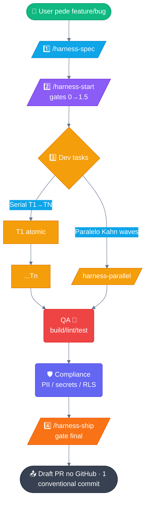
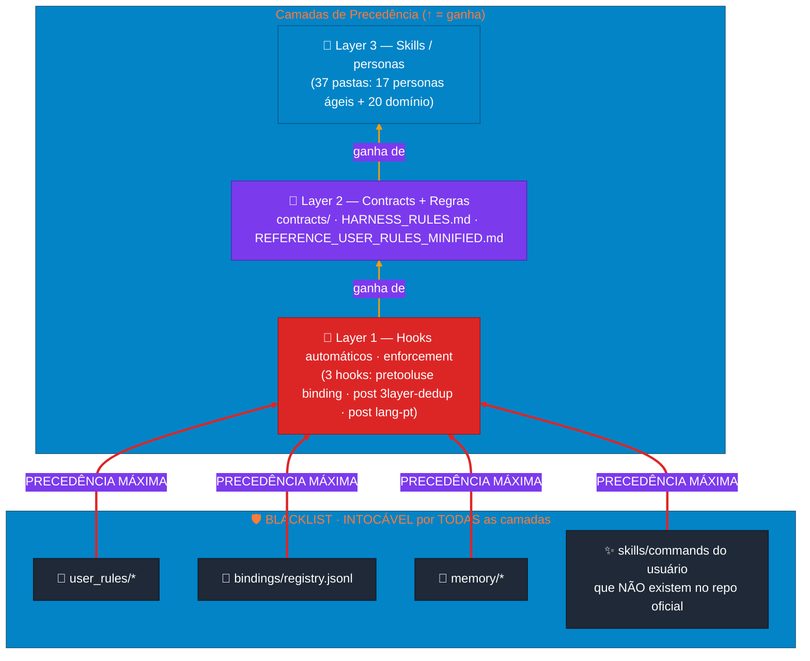
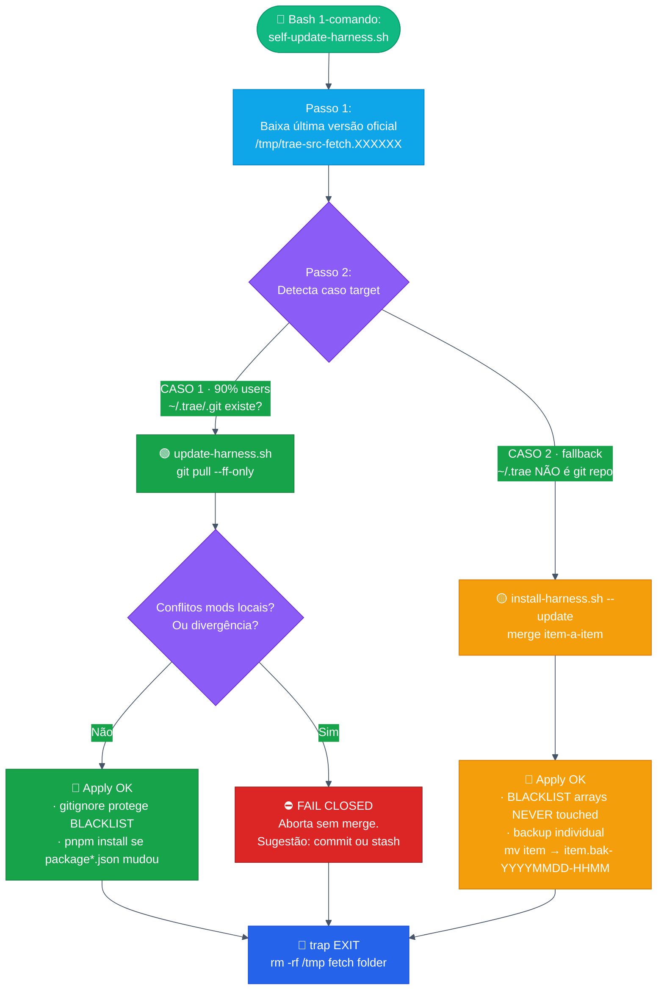

# 🧰 Harness Trae — `.trae` global

> **Repo oficial (público):** [`laionazeredo/trae-config`](https://github.com/laionazeredo/trae-config)  
> **O que é:** Um time ágil simulado inteiro que roda **dentro da sua IDE Trae**.  
> **18 comandos · 38 skills · 3 hooks automáticos · 3 scripts install/update/self-update**  
> **Premissas não negociáveis:** KISS + YAGNI + blast radius mínimo + fail-closed + default dry-run.

---

## 📑 Índice

1. 🚀 **Getting started** — instalar em 3 comandos (máquina nova)
2. ⚡ **Runbook do dia-a-dia** — os 4 comandos que você usa sempre
3. 🏗️ **Arquitetura** — 3 diagramas Mermaid + premissas + precedência 3 camadas
4. 🛡️ **Garantias** — BLACKLIST intocável · defaults · backups · o que NUNCA fazemos
5. 🧭 **18 Comandos** — referência compacta tabela
6. 📝 **Cheatsheet** — copy-paste CLI (scope-check · bindings · decisions · token reduction)
7. 🔧 **Troubleshooting** — 3 casos comuns + rollback
8. ❌ **O que NÃO existe (YAGNI)** · como pedir features novas

---

## 1. 🚀 Getting started (máquina NOVA, `~/.trae` não existe)

> ⚠️ Requisitos mínimos (1 dos 2): `gh` CLI logado, OU só `git` (fallback clone HTTPS).  
> Mais: `corepack enable` (para pnpm/tsx).

```bash
# 1. Clone repo DIRETO em ~/.trae (RECOMENDADO: ~/.trae vira git repo)
gh repo clone laionazeredo/trae-config ~/.trae -- --depth 1

# 2. Instala deps TS (tsx executor zero-build + ts strict + @types/node)
corepack enable
corepack pnpm --dir ~/.trae install --prefer-offline

# 3. Smoke rápido (OBRIGATÓRIO · 10s)
ls ~/.trae/commands | wc -l                           # esperado = 18
corepack pnpm --dir ~/.trae decisions --help | head -2  # CLI decisions TS funciona?
```

Recarregue o Trae (feche/abra ou reload window). **Pronto.**

---

## 2. ⚡ Runbook do dia-a-dia (4 comandos que você usa sempre)

### Fluxo padrão — diagrama



### Tabela dos 4 + comandos intermediários

| # | Comando | O que faz | Quando rodar |
|---|---|---|---|
| ⚡0 | **`bash ~/.trae/scripts/self-update-harness.sh`** + `--apply` | 1-comando: **vai no GitHub**, baixa última versão, detecta `git/zip`, roda update certo. Default **dry-run**. | **Todas as manhãs** — pegar últimas skills/commands novas. |
| 1 | `/harness-spec input=<desc>` | SPEC canônico 7 seções + 15 campos YAML + approval gate 1-pass-A. | Antes de escrever 1 linha de código. |
| 2 | `/harness-start --worktree <path>` | **SM gates obrigatórios 0→1.5**: binding 2-level → spec approved → task graph + locks → envelope → QA empty → compliance → handoff dev (serial ou paralelo Kahn). | SPEC Approved. |
| 3 | `/harness-ship` | **Gate final.** lint → fix CRIT/HIGH → sync docs AGENTS.md → **1 conventional commit** → push → **Draft PR** aberto. | Dev + QA + Compliance concluídos. |

**Intermediários úteis:**
- `/harness-status` — snapshot binding / gates / tasks (done/running/pending).
- `/harness-fix expected=<X> repro=<steps>` — debugging científico.
- `/harness-ci-fix <PR URL>` — diagnostica e corrige CI falhando.
- `/harness-abort` — CANCELLED decision log + release locks (rollback limpo).

---

## 3. 🏗️ Arquitetura (3 diagramas + premissas)

### 3.1 Camadas de precedência (3 camadas + user_rules ganha de TUDO)



### 3.2 Update Flow (como checam novas versões — 1 comando)



### 3.3 Estrutura do diretório (vista pássaro)

```
~/.trae/
├── README.md                 ← ESTE ARQUIVO (ponto de entrada)
├── HARNESS_RULES.md          ← Gates obrigatórios, SPEC approval, paralelismo
├── REFERENCE_USER_RULES_MINIFIED.md  ← Versão bolso p/ agente
│
├── commands/     (18 .md)    ← LEVES (inline) + HEAVIES (skill wrapper + gates)
├── skills/       (38 pastas) ← 18 personas ágeis + 20 domínio (Stripe/Next/Supabase…)
├── contracts/                 ← SINGLE SOURCE OF TRUTH · 17 helpers shell + CLI TS
│   ├── harness_sessions_contract.sh   # paths + decisions + registry + H1-H5 token
│   └── decisions-query.cli.ts         # 4 modos: summary · filter · tail · export
│
├── hooks/        (3)         ← AUTOMÁTICOS: binding scissor · 3layer-dedup · lang-pt
├── scripts/      (3 .sh)     ← install · update · self-update (1-comando fetch GH)
├── permission/               ← global.json allow/deny tools
│
├── user_rules/*  🔴 BLACKLIST  ← VOCÊ que escreve. 1ª precedência. NÃO versiona.
├── bindings/registry.jsonl 🔴 BLACKLIST  ← Level1 session→worktree. Writer ÚNICO contracts helper.
└── memory/       🔴 BLACKLIST  ← Dados Trae. Não toque.
```

### Premissas chave (não muda)

| ID | Premissa | O que significa |
|---|---|---|
| P1 | **Single Writer Principle** | decisions / registry / paths → 1 HELPER OFICIAL em contracts. NUNCA Edit/Write manual. |
| P2 | **Blast radius mínimo** | Escreve só em worktree BOUND + `HARNESS_SESSIONS_ROOT/`. Hook1 BLOQUEIA qualquer path fora. |
| P3 | **Default SEMPRE dry-run** | Nenhum script (install/update/self-update) altera 1 byte sem `--apply` explícito. |
| P4 | **Nenhum `rm` sobre /home** | Todos os scripts. Só `rm -rf /tmp/<temp>` via trap EXIT. Backups são `mv` (item → .bak-TS). |
| P5 | **No dual-write** | Decisions e registry = JSONL só. Nenhum `.md` duplica. |
| P6 | **Update não destrutivo** | Item-a-item. Source não tem, target tem → NUNCA tocado (preserva suas skills/commands custom). |

---

## 4. 🛡️ Garantias — BLACKLIST + defaults

### BLACKLIST ABSOLUTO (nenhum script lê / escreve / renomeia / deleta)

```
🔴 user_rules/*                # suas regras, preferências, idioma, perfil
🔴 bindings/registry.jsonl     # level-1 binding global · single writer contracts
🔴 memory/*                    # histórico do Trae · gerado pela IDE
🔴 skills/<sua-skill-custom>/  # qualquer coisa em skills/ ou commands/ que VOCÊ criou
                               # e NÃO existe no repo oficial: NUNCA iterado, NUNCA tocado
🔴 node_modules/  *.bak-*      # técnicos: ignorados por .gitignore
```

Proteção automática em todos os caminhos:
- **CASO 1 (git ff-only pull):** `.gitignore` protege tudo. Esses arquivos **nunca são trackeados**.
- **CASO 2 (install-update merge):** BLACKLIST_DIRS + BLACKLIST_FILES arrays + skip de target-only items.

### Backups individuais (item granular, não backup gigante)

Sempre que um **item oficial foi alterado**, antes de sobrescrever:
```bash
mv target/skills/harness-developer  \
   target/skills/harness-developer.bak-20260831-231503
```
Rollback manual de 1 item: `mv item.bak-20260831-231503 item`. Nada de restaurar backup gigante.

---

## 5. 🧭 18 Comandos (tabela compacta)

| # | Comando | Tipo | Quando usar |
|---|---|---|---|
| 0 | **`bash scripts/self-update-harness.sh [--apply]`** | shell script (não `/harness-*`) | Manhã diária: pegar últimas skills/commands. Default dry-run. |
| 1 | `/harness-spec input=<desc\|ticket>` | LEVE inline | Criar/validar SPEC + approval ANTES de dev. |
| 2 | `/harness-start [--worktree <path>]` | HEAVY SM | Iniciar time ágil completo. Gates 0→1.5. |
| 3 | `/harness-status` | LEVE | Snapshot binding · gates · tasks · registry. |
| 4 | `/harness-parallel <task_graph.md>` | HEAVY dispatcher | Kahn waves + file locks para ≥2 tasks independentes. |
| 5 | `/harness-abort` | LEVE | Cancelar sessão: decisions CANCELLED + release locks. |
| 6 | `/harness-skip --task Tn --reason=<x>` | LEVE | Skip 1 task com motivo logged. |
| 7 | `/harness-summary [--deep]` | LEVE | Resumo ACs / decisions / blockers / next steps. |
| 8 | `/harness-review [--worktree <p>]` | HEAVY CR | Só bloqueios: runtime regressions / PII / scope drift. Fix CRIT/HIGH. |
| 9 | `/harness-diff [--worktree <p>]` | HEAVY context | Converte diff em talking points (PR OU worktree local). |
| 10 | `/harness-pr-comments <PR URL>` | HEAVY triage | Classifica comentários PR: válido / nitpick / inválido + respostas EN pré-escritas. |
| 11 | `/harness-fix expected=<X> repro=<steps>` | HEAVY bugfix | Scientific debugging hyp→inst→repro→fix→verify. |
| 12 | `/harness-manual-test <plan.md>` | HEAVY Playwright | Executa plan manual com evidências screenshots/logs. |
| 13 | `/harness-ci-fix <PR/Run URL>` | HEAVY CI | Diagnose failing jobs → classify root cause → fix → rerun. |
| 14 | `/harness-design <spec\|brief>` | HEAVY UI | UI pipeline 4 modos. Gate APPROVAL EXPLÍCITA obrigatório antes de executar. |
| 15 | `/harness-figma <link Figma>` | HEAVY UI | Dev-mode exato → reuso componentes → implementa 1ª tentativa → pixel-check. |
| 16 | `/harness-decisions [summary\|filter\|tail\|export]` | Skill | Query JSONL decisions. Summary PT-BR default. |
| 17 | **`/harness-ship`** | HEAVY FINAL | Gate final. 1 conventional commit → push → Draft PR. |
| 18 | **`/harness-scope-check --prd=\|--ticket=\|--task-graph=\|--scope=<X> [PR URL \| --worktree <p>]`** | HEAVY AUDIT | **4-checks audit:** 1 entrega escopo completo (ACs mapped), 2 testes cobrem comportamento, 3 docs atualizados (AGENTS/README/runbooks), 4 novas env vars declaradas + parsers. Verdict 🟢🟡🔴. Gate antes de /harness-ship. |

---

## 6. 📝 Cheatsheet CLI (copy-paste)

```bash
# ====== Atualizar harness (diário de manhã) ======
bash ~/.trae/scripts/self-update-harness.sh          # dry-run, veja relatório
bash ~/.trae/scripts/self-update-harness.sh --apply  # apply real

# ====== 🔍 SCOPE CHECK (antes de /harness-ship ou revisar PR) ======
# 4-checks audit: 1 entrega escopo | 2 cobertura testes | 3 docs | 4 env vars declaradas
# Modo A: revisar PR do GitHub + PRD (ou ticket, task-graph, scope free-text)
/harness-scope-check \
  --prd=/abs/path/docs/prd-refund.md \
  https://github.com/owner/repo/pull/123

# Modo B: revisar worktree local antes de commitar
/harness-scope-check \
  --ticket=https://linear.app/team/issue/FLO-732 \
  --worktree=/home/laion/code/flockr/Lumos.worktrees/feat-FLO-732-abc

# Modo B com base branch explícita (default: auto-detect main/dev)
/harness-scope-check --scope="adiciona filtros dashboard admin + export CSV" \
  --worktree=/abs/wt --base=origin/dev

# ====== Registry Binding (não use Edit/Write manual) ======
source ~/.trae/contracts/harness_sessions_contract.sh
harness_registry_path
harness_registry_lookup_last "$SESSION_ID" | jq -r .worktree_root
harness_registry_append_jsonl "$SESSION_ID" BOUND "$WT" \
  '{"workspace_name":"Flockr","flags":{"LANG_PT_CHECK":"ENABLED"}}'

# ====== Decisions ======
harness_decisions_path "$WT"
harness_append_decision_jsonl "$WT" "GATE_PASS" \
  '{"gate":"0.3_SPEC_APPROVED","spec_id":"SPEC-X","approver":"user"}'
corepack pnpm --dir ~/.trae decisions "$(harness_decisions_path $WT)" summary --lang pt

# ====== Token Reduction H1-H5 (aplicar em outputs longos) ======
git diff big.patch | harness_tr_diff                             # H1 diff trim
{ echo "linhas lidas"; wc -l; } | harness_tr_read 600           # H2 Read cap 300
some-build-command 2>&1 | harness_tr_stdout                     # H4 stdout cap 4k
grep -R "pattern" src/ | harness_tr_collapse_blank              # H3 collapse blank
harness_tr_grep "pattern" src/ ts                               # H5 grep compact
```

---

## 7. 🔧 Troubleshooting (3 casos comuns)

| Caso | Sintoma | Causa provável | Resolução em 2 passos |
|---|---|---|---|
| **Self-update CASO 1 abortou** | `FAIL: non-ff merge would be needed` ou `abort: uncommitted tracked changes` | Ou você tem mods locais trackeados sem commit, OU sua branch divergiu (commits locais + upstream mudou). | **Mods:** `git -C ~/.trae stash push -m "wip harness local"` → apply update → `git stash pop`. **Divergência:** merge manual (o script não faz merges automáticos) ou resete. |
| **Rollback de 1 item** | Update sobrescreveu `SKILL.md` de uma skill que você tinha editado localmente. | Item oficial alterado, backup criado. | `ls -t ~/.trae/skills/harness-developer.bak-* \| head -1` → copy de volta: `mv ~/.trae/skills/harness-developer.bak-TS ~/.trae/skills/harness-developer`. |
| **TypeScript/typecheck quebrou no ~/.trae** | `tsx not found` ou `Cannot find module @types/node`. | node_modules não instalados, ou não rodou `pnpm install` após update que mudou `package.json`. | 1. `corepack enable` · 2. `corepack pnpm --dir ~/.trae install --prefer-offline`. |

### Rollback total (último recurso CASO 1 git)

```bash
cd ~/.trae && git reset --hard HEAD@{1}
```
(Desfaz o último `git pull --ff-only`. Tudo volta. BLACKLIST NUNCA é tocada por git, então user_rules/ bindings/ memory continuam intactos.)

---

## 8. ❌ O que NÃO existe (de propósito — YAGNI hard-stop)

- ❌ Sem SDK `.d.ts` auto-gerado p/ scripts. MVP Script Mode (bash ≤20 lines / node ≤40 lines) resolve 95%.
- ❌ Sem worker thread `isolated-vm` / sem `run_code` transport dedicado. RunCommand shell existe.
- ❌ Sem UI web dashboard do harness. Tudo CLI + markdown docs.
- ❌ Sem deployment/infra integrados com o próprio harness (use as skills individuais: Terraform, Railway, devops-engineer, etc).
- ❌ Sem deploy automático de PRs. Draft PR é entregue para você aprovar.

> **Pedir uma feature nova?** Use `/harness-spec input="adicionar <X> ao harness"` → cria SPEC canônico, approval gate, depois inicie.

---

**Autor:** Time Harness Flockr (17 personas skills simuladas).  
**Changelog recente 2026-08-31:** feat(update): self-update 1-comando · update-harness alias inteligente · install --update merge item-a-item · REGRA 7.9 nomes de testes comportamento observável.
