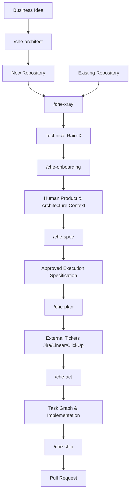

# Che AI ☭

**Che** is an IDE-agnostic Agentic Engineering Harness designed to run inside modern AI coding assistants (such as Trae, Codex, Cursor, Claude Code, and OpenCode). 

It acts as a "plugin" that orchestrates the AI to simulate a full Agile team—including a Scrum Master, Software Engineer, QA, UX Designer, and Compliance Officer. It enforces strict Software Development Life Cycle (SDLC) practices, deterministic project memory, and automated quality gates.

## 🚀 Multi-Agent Support

Che is designed to be portable across different AI agents. After installation, it automatically configures adapters for:
- **Trae**: Native support via root directory.
- **Codex**: Slash commands in `~/.codex/commands/` and skills in `~/.agents/skills/`.
- **Claude Code**: Slash commands in `~/.claude/commands/` and skills in `~/.claude/skills/`.
- **Cursor**: Integrated rules and skills via `.cursor/rules/`.

All agents share the same **Engineering Contracts**, **Expert Skills**, and **Durable Memory**, ensuring a consistent experience regardless of the tool you use.

## 🚀 Quick Install

To install Che into your local environment (defaults to `~/.trae`), run:

```bash
curl -fsSL https://raw.githubusercontent.com/laionazeredo/che-ai/main/scripts/install-che.sh | bash
```

## 🧠 Core Concepts

Che is built on the philosophy that **Agentic Engineering requires boundaries and memory**. 

1. **Zero-Build Core**: The core logic of Che is written in pure Python (`che_core/`), avoiding heavy Node.js dependencies and compilation steps.
2. **Declarative Skills**: AI behaviors and boundaries are defined in simple, declarative Markdown files (`skills/*/SKILL.md`).
3. **Structured Memory**: Che isolates generated artifacts (design tokens, QA reports, decisions, and execution logs) from your user code. It uses a strict 4-level hierarchy:
   - **L1 (Workspace Root)**: `~/.che-workspaces/<workspace-slug>/`
   - **L2 (Project Level)**: `<L1>/<repo-slug>/.project/` (Durable architecture & product knowledge)
   - **L3 (Worktree Level)**: `<L2>/../.wt/__<branch-slug>/` (Shared info across sessions in the same branch)
   - **L4 (Session Level)**: `<L3>/sessions/<CHE_SESSION_ID>/` (Ephemeral logs & debug context)
4. **Automated Quality Gates**: When you ship code via `/che-ship`, Che automatically enforces Scope Checks, Code Review, Security Compliance, and runs your test suite before opening a Draft PR.

## 🔄 Workflow



## 🛠 Usage (Slash Commands)

Once installed, Che exposes its capabilities directly inside your AI assistant's chat interface via slash commands. For example:

- `/che-architect` — Strategic architecture partner to design systems from scratch. Covers stack, infra, security, compliance, accessibility, and operations.
- `/che-xray` — Scans a new repository and generates a technical profile (stack, patterns, DB, CI/CD).
- `/che-onboarding` — Interactive session to capture human context (Roadmap, Business Logic, Personas).
- `/che-spec` — Generates a precise Execution Specification from a ticket or PRD.
- `/che-plan` — Transforms an Approved SPEC into structured tickets (Linear, ClickUp, Jira) with BDD ACs.
- `/che-act` — Decomposes a feature request into a task graph and begins implementation.
- `/che-ship` — Runs quality gates, commits, and opens a Pull Request.
- `/che-fix` — Scientific debug loop to reproduce and fix a specific bug.
- `/che-design` — Orchestrates a complete UX/UI design pipeline.
- `/che-review` — Performs a strict code review against the default branch.

## 🏗 Contributing & Architecture

If you are an AI agent or developer looking to extend Che, please read **[AGENTS.md](./AGENTS.md)** first. It outlines the strict 3-Layer Architecture, the Python core rule, and how to safely manipulate the file system.

### Approval & Contribution Workflow
To ensure the stability and security of the framework, Che enforces a strict contribution workflow:
- **Branch Protection**: Direct pushes to `main` are blocked. All changes must be submitted via Pull Requests.
- **Code Owners**: The `.github/CODEOWNERS` file mandates explicit review and approval from `@laionazeredo` before any PR can be merged.
- **Zero-Build Policy**: No Node.js dependencies (`package.json`) or complex build steps. The core is pure Python. Bash is strictly reserved for the bootstrap/install scripts.
- **Worktree Hygiene**: Temporary scripts, logs, and untracked files must not be left in the repository root. Ephemeral data belongs in the Session Level (L4) folders.

## 🛡️ Quality & Security

Che employs a robust Continuous Integration (CI) pipeline via GitHub Actions to maintain code quality and prevent security regressions:
- **Linting & Formatting**: Python code is strictly linted and formatted using `ruff`. Markdown files are validated with `markdownlint-cli2`.
- **Unit & Security Testing**: `pytest` runs unit tests for the core logic (e.g., path resolution) and executes static security analysis (`test_skill_security.py`) on `SKILL.md` files. This ensures no destructive Bash commands (like `rm -r`, `curl`, `eval`) are embedded in Markdown and limits Python blocks to a maximum of 15 lines, forcing complex logic into the `che_core` package.
- **Secret Scanning**: `TruffleHog` runs on every push and PR to prevent accidental commits of secrets, API keys, or passwords by AI agents.

## 🔄 Updating

To fetch the latest version of Che:

```bash
curl -fsSL https://raw.githubusercontent.com/laionazeredo/che-ai/main/scripts/update-che.sh | bash
```
