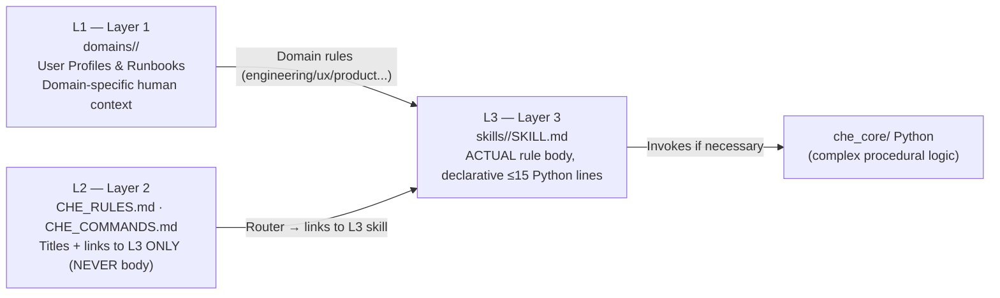
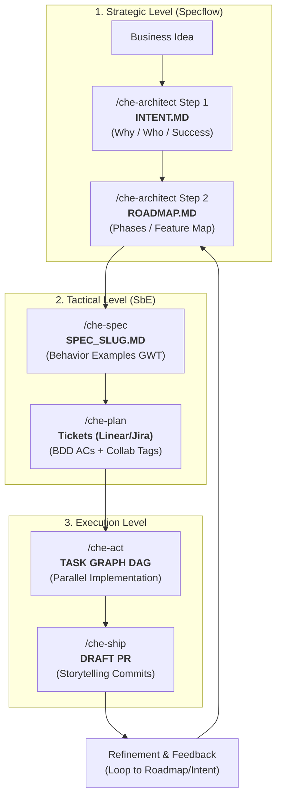

# Che AI ☭

**Che** is an IDE-agnostic Agentic Engineering Harness designed to run inside modern AI coding assistants (such as Trae, Codex, Cursor, Claude Code, and OpenCode).

It acts as a "plugin" that orchestrates AI to simulate a full Agile team — including Scrum Master, Software Engineer, QA, UX Designer, and Compliance Officer. It enforces rigorous Software Development Life Cycle (SDLC) practices, deterministic project memory, a **Politburo of Expert Domains**, and automated quality gates.

## 🚀 Multi-Agent Support

Che is designed to be portable across different AI agents. Upon installation, it automatically configures adapters for:
- **Trae**: Native support via the root directory.
- **Codex**: Slash commands in `~/.codex/commands/` and skills in `~/.agents/skills/`.
- **Claude Code**: Slash commands in `~/.claude/commands/` and skills in `~/.claude/skills/`.
- **Cursor**: Integrated rules and skills via `.cursor/rules/`.

All agents share the same **Engineering Contracts**, **Politburo Expert Skills**, and **Durable Memory**, ensuring a consistent experience regardless of the tool used. Durable project data can be moved between machines using the **Portability Commands** (`/che-export` and `/che-import`), with **optional** inclusion of SQLite databases.

## 🚀 Installation Guide

Che can be installed from any directory using the remote install script.

### 1. Quick Install (One-Liner)

Run the following command to download and execute the installer:

```bash
curl -fsSL https://raw.githubusercontent.com/laionazeredo/che-ai/main/scripts/install-che.sh | bash -s -- --apply
```

### 2. Interactive Setup (Adapters)

During the installation, the script will prompt you to select which AI agents you want to integrate with Che. You can select multiple adapters by entering their numbers separated by commas (e.g., `1,2,3`):

-   **1) Codex**: For the OpenAI Codex CLI.
-   **2) Claude Code**: For Anthropic's Claude Code CLI.
-   **3) Cursor**: For the Cursor IDE.
-   **4) Trae (Global rules)**: Native rules for the Trae IDE.
-   **5) ALL detected**: Automatically configures every agent found on your system.

### 3. Verification

After installation, verify that Che is correctly installed by running:

```bash
# Check CLI availability
python3 -m che_core.cli --help

# Verify global installation path
ls -la ~/.trae/README.md
```

### 4. Adding Adapters Later

If you skipped an adapter during the initial installation or installed a new AI agent later, you can re-run the setup assistant:

```bash
bash ~/.trae/scripts/setup-adapters.sh
```

## 🧠 Core Concepts

Che is built on the philosophy that **Agentic Engineering requires boundaries, specialized domains, and memory**.

---

### 1. Zero-Build Core

Che's core logic is written in pure Python (`che_core/`), avoiding heavy Node.js dependencies and build steps. No `package.json` is required for execution, zero external dependencies (stdlib only — SQLite, json, tarfile, etc.). The canonical configuration file is [`pyproject.toml`](file:///home/laion/.trae/pyproject.toml).

---

### 2. 🏗️ Official 3-Layer Architecture (CANONICAL)

Every rule, skill, and domain instruction follows a 3-layer hierarchy. Any new feature must respect this separation:



- **L1 — `domains/<slug>/`** *(User Profiles & Runbooks)*: Specific instructions for each Politburo domain. Each domain has 5 canonical artifacts (profile, runbook, gate thresholds, glossary, examples).
- **L2 — `CHE_RULES.md` + `CHE_COMMANDS.md`** *(Routers)*: Quick references for the agent.
- **L3 — `skills/*/SKILL.md`** *(Where the rules live)*: 100% declarative skills. Procedural logic > 15 lines is extracted to `che_core/`.

---

### 3. ☭ Politburo of Expert Domains

The **Politburo** is a set of 7 canonical domain profiles that Che uses to **select which specialist handles each task**. Selection precedence:
> 1️⃣ **Task Envelope `domain:`** → 2️⃣ SPEC `domain:` → 3️⃣ Registry L1.5 → 4️⃣ **Default = `engineering`**.

#### 🧑‍🤝‍🧑 The 7 Politburo Domains

| # | Domain Slug | SDLC Role | Default Specialist Profile | Recommended Commands |
|---|---|---|---|---|
| 1 | **`engineering`** ⭐ | Code, tests, lint, architecture, deploy. | Senior Full-stack Engineer | `/che-act` / `/che-ship` / `/che-fix` |
| 2 | **`ux`** | UI/UX design, PenPot/Figma, design systems. | Product Designer UI/UX | `/che-design` / `/che-figma` |
| 3 | **`product`** | Prioritization, PRDs, AC sign-off, roadmap. | Senior Product Manager | `/che-spec` / `/che-plan` |
| 4 | **`devops`** | IaC, Docker, CI/CD, Vercel/Railway/AWS. | Platform / SRE Engineer | `/che-ci-fix` / `/che-onboarding` |
| 5 | **`copywriting`** | Landings, transactional emails, i18n, docs. | Senior Content Writer | `/che-onboarding` / `/che-spec` |
| 6 | **`social`** | Creatives, social media campaigns, assets. | Social Media Strategist | `/che-design` (Mode A) |
| 7 | **`seo-analytics`** | SEO, GA4/GSC, Web Vitals, audits. | SEO & Growth Analyst | `/che-xray` / `/che-review` |

---

### 4. Declarative Skills

Agent behaviors and boundaries are defined in simple Markdown files (`skills/*/SKILL.md`). Python blocks inside are limited to **15 lines**.

---

### 5. Structured Memory — 4 Levels (Specflow Aligned)

Che isolates generated artifacts in a clear hierarchy separating **Strategic** (Project) from **Tactical** (Worktree) levels.

```
~/.che-workspaces/
├── workspaces/          ← Workspace Container (L1)
│   └── <workspace-slug>/
│       └── <project-slug>/
│           ├── project/        ← Strategic Level (L2) (intent, roadmap, profile)
│           ├── _db/            ← SQLite DBs (L2) (che_state.sqlite)
│           └── worktrees/      ← Worktree Container
│               └── <wt-slug>/  ← Tactical Level (L3) (Shared Assets)
│                   ├── task_graph.md, decisions.log.jsonl, spec_*.md
│                   ├── design/, qa/, reports/
│                   └── sessions/   ← Ephemeral Level (L4) (Per-session logs)
├── .registry/           ← Global Metadata (Session Bindings)
└── .trash/              ← Canonical Trash
```

- **L2 Project**: Durable memory (Why & Where To).
- **L3 Worktree**: Shared tactical implementation area.
- **L4 Session**: Temporary execution logs and data.

---

### 6. 🔎 State Store (SQLite FTS5) + Auxiliary RAG

⚠️ **SSOT Rule**: The filesystem is the source of truth. **SQLite is just a materialized cache** rebuildable via `/che state rebuild-index`.

#### 6.1 State Store (FTS5 BM25)
- **`/che-search`**: Full-text lexical search with BM25.
- **`/che-query`**: Parameterized SQL queries (Read-only by default).
- **`/che-sanitize`**: Purges old data. Dry-run by default.

#### 6.2 Hybrid Auxiliary RAG
- `/che-rag search`: Hybrid score `0.4 * BM25 + 0.6 * Vector`.
- Zero-dependency fallback: defaults to 100% BM25 if no vector extensions are loaded.

---

### 7. Automated Quality Gates (che-ship)

When shipping code via `/che-ship`, Che automatically enforces **4 fail-fast executable gates**:
1. **Scope + Lean 6-checks** (min score 7.0)
2. **Code Review** (0 CRITICAL + ≤ 2 HIGH findings)
3. **Heavy Compliance** (0 CRITICAL + 0 HIGH — secrets/PII/injection)
4. **Minimal QA**: Linting + Unit Tests.

Successful approval triggers atomic storytelling commits and a **Draft PR** with auto-assignment.

---

## 🔄 Official SDLC Flow: Specflow + SbE

Che unifies the strategic vision of [**Specflow**](https://www.specflow.com/) with the tactical rigor of [**Specification by Example**](https://martinfowler.com/bliki/SpecificationByExample.html).



---

## 🛠 Slash Commands (22 Heavy + 5 Light)

### Category A — 22 Heavy Commands

| Command | Function | Politburo Domain |
|---|---|---|
| `/che-architect` | Strategic architecture partner (stack, infra, security). | devops + engineering |
| `/che-archeology` | Infers Intent/Roadmap from Git history. | product |
| `/che-workspace` | ✨ **NEW**: Manages L1 workspaces (`create`, `list`, `remove`). | engineering |
| `/che-project` | ✨ **NEW**: Manages L2 projects (`create`, `list`, `remove`). | engineering |
| `/che-xray` | Repository technical onboarding scan. | engineering |
| `/che-onboarding` | Interactive human product context. | product |
| `/che-spec` | Generates Execution Specification (SbE). **Requires worktree & project.** | product |
| `/che-plan` | Transforms SPEC into structured tickets. | product |
| `/che-act` | ★ Central SDLC loop: Implement → Test → Ship. **Requires worktree & project.** | engineering |
| `/che-ship` | Automated quality gates → storytelling commits → Draft PR. | engineering |
| `/che-fix` | Scientific debugging loop. | engineering |
| `/che-review` | Blocking code review. | engineering |
| `/che-diff` | Lightweight diff/PR context. | engineering |
| `/che-export` / `/che-import` | Project portability (L2 + L3). | engineering |
| `/che-eject` | Safe Che uninstallation. | engineering |

### Category B — 5 Light Commands
`/che-status`, `/che-skip`, `/che-decisions`, `/che-summary`, `/che-abort`.

---

## 🏗 Contributing

Please read **[AGENTS.md](./AGENTS.md)** for detailed architecture and contribution guidelines. Che follows a strict **Pull Request + Code Review** workflow.

## 🛡️ Quality & Security

Che employs a robust CI pipeline:
- **Linting**: Ruff (Python) + Markdownlint.
- **Testing**: Pytest (Core) + Skill Security static analysis.
- **Secrets**: TruffleHog scanning on every push.

## 🔄 Updating

To get the latest version of Che:

```bash
curl -fsSL https://raw.githubusercontent.com/laionazeredo/che-ai/main/scripts/update-che.sh | bash
```
