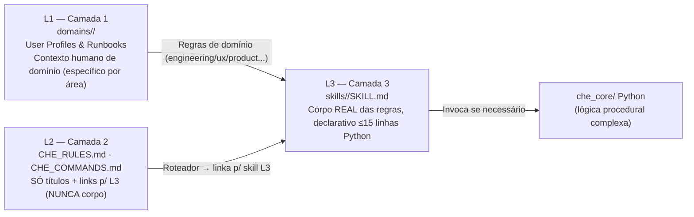
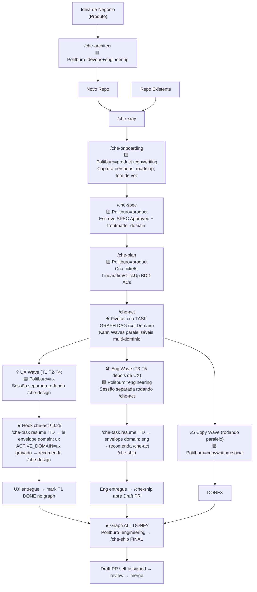

# Che AI ☭

**Che** é um Harness de Engenharia Agêntica agnóstico a IDE, projetado para rodar dentro de assistentes de codificação de IA modernos (como Trae, Codex, Cursor, Claude Code e OpenCode).

Ele atua como um "plugin" que orquestra a IA para simular uma equipe Agile completa — incluindo Scrum Master, Engenheiro de Software, QA, Designer de UX e Oficial de Compliance. Ele impõe práticas rigorosas de Ciclo de Vida de Desenvolvimento de Software (SDLC), memória de projeto determinística, **um Politburo de Domínios Especialistas** e portões de qualidade automatizados.

## 🚀 Suporte Multi-Agente

O Che foi projetado para ser portátil entre diferentes agentes de IA. Após a instalação, ele configura automaticamente adaptadores para:
- **Trae**: Suporte nativo via diretório raiz.
- **Codex**: Comandos slash em `~/.codex/commands/` e skills em `~/.agents/skills/`.
- **Claude Code**: Comandos slash em `~/.claude/commands/` e skills em `~/.claude/skills/`.
- **Cursor**: Regras e skills integradas via `.cursor/rules/`.

Todos os agentes compartilham os mesmos **Contratos de Engenharia**, **Expert Skills do Politburo** e **Memória Durável**, garantindo uma experiência consistente independentemente da ferramenta utilizada. Dados duráveis do projeto podem ser movidos entre máquinas usando os **Comandos de Portabilidade** (`/che-export` e `/che-import`), com inclusão **opcional** dos bancos SQLite.

## 🚀 Instalação Rápida

Para instalar o Che em seu ambiente local (padrão em `~/.trae`), execute:

```bash
curl -fsSL https://raw.githubusercontent.com/laionazeredo/che-ai/main/scripts/install-che.sh | bash
```

## 🧠 Conceitos Principais

O Che é construído sobre a filosofia de que a **Engenharia Agêntica requer limites, domínios especializados e memória**.

---

### 1. Core Zero-Build

A lógica central do Che é escrita em Python puro (`che_core/`), evitando dependências pesadas de Node.js e etapas de compilação. Nenhum `package.json`, zero dependências externas (apenas stdlib — SQLite, json, tarfile, etc.). O arquivo de configuração canônico é [`pyproject.toml`](file:///home/laion/.trae/pyproject.toml).

---

### 2. 🏗️ Arquitetura Oficial de 3 Camadas (CANÔNICA, NÃO DUPLICAR)

Toda regra, skill e instrução de domínio segue um hierarquia de 3 camadas. Qualquer nova feature deve respeitar a separação abaixo (ver também [`AGENTS.md §1`](file:///home/laion/.trae/AGENTS.md)):



- **L1 — `domains/<slug>/`** *(User Profiles & Runbooks)*: Instruções específicas de cada domínio do Politburo. Cada domínio possui 5 artefatos canônicos (profile, runbook, gate thresholds, glossário, exemplos).
- **L2 — `CHE_RULES.md` + `CHE_COMMANDS.md`** *(Roteadores, NUNCA contém regras)*: Apenas títulos + links para a skill L3 correspondente. Serve de referência rápida para o agente.
- **L3 — `skills/*/SKILL.md`** *(Onde a regra realmente mora)*: Skills 100% declarativas. Se uma skill precisar de lógica procedural > 15 linhas Python, essa lógica **OBRIGATORIAMENTE** é extraída para um módulo Python em `che_core/` e invocada via CLI.

---

### 3. ☭ Politburo de Domínios Especialistas

O **Politburo** é o conjunto de 7 perfis de domínio canônicos que o Che usa para **escolher qual especialista assumir cada tarefa ao longo do SDLC**. A precedência de seleção de domínio (do mais forte para o mais fraco) é:

> 1️⃣ **Task Envelope frontmatter `domain:`** (sempre vence — hook automático em [`che-act §0.25`](file:///home/laion/.trae/skills/che-act/SKILL.md)) → 2️⃣ SPEC frontmatter `domain:` → 3️⃣ Registry L1.5 → 4️⃣ **Default = `engineering`**.

#### 🧑‍🤝‍🧑 Os 7 Domínios do Politburo (ORDEM CANÔNICA)

| # | Slug do Domínio | Papel no SDLC | Perfil Especialista Default | Comando downstream recomendado p/ este domínio |
|---|---|---|---|---|
| 1 | **`engineering`** ⭐ DEFAULT | Implementação de código, testes, lint, arquitetura técnica, deploy. | Engenheiro Sênior Full-stack | `/che-act` (implementação) / `/che-ship` (entrega) / `/che-fix` |
| 2 | **`ux`** | Design de interface/experiência, protótipos PenPot/Figma, sistemas de design, acessibilidade WCAG. | Product Designer UI/UX | `/che-design` (ou `/che-figma`) |
| 3 | **`product`** | Priorização, descoberta, escrita de PRDs, aceite de critérios, alinhamento com roadmap. | Product Manager Sênior | `/che-spec` + `/che-plan` (Linear/Jira/ClickUp) |
| 4 | **`devops`** | Infraestrutura como código, Docker, Kubernetes, Terraform, CI/CD, Vercel/Railway/AWS config. | Platform / SRE Engineer | `/che-ci-fix` / `/che-onboarding` (infra) |
| 5 | **`copywriting`** | Escrita de landing, e-mail transacional/marketing, tom de voz, i18n, documentação ao cliente. | Senior Content / Technical Writer | `/che-onboarding` (contexto) + `/che-spec` |
| 6 | **`social`** | Criativos, copys para Instagram/TikTok/LinkedIn, calendário editorial, assets sociais, campanhas. | Social Media Strategist + Designer Social | `/che-design` → modo A "Social Media" |
| 7 | **`seo-analytics`** | SEO on-page, programmatic SEO, schema, GA4/GSC, Search Console, Core Web Vitals, lighthouse audit. | SEO & Growth Analyst | `/che-xray` (audit) + `/che-review` (qualidade) |

#### Como o Politburo é usado na prática no SDLC
- Cada entrada no **Task Graph DAG** (`task_graph.md` L3) possui a **5ª coluna obrigatória `Domain`** com um slug acima.
- Cada Task Envelope (L3) tem **frontmatter obrigatório `domain:` / `expert_skills:` / `handoff_output:`**.
- Quando você roda `/che-task resume T3`, o Che lê o envelope, grava `ACTIVE_DOMAIN=<slug>` no registry e recomenda o comando slash downstream correto — e.g. domínio `ux` → `/che-design`, domínio `engineering` → `/che-act`.
- **Kahn Wave Groups**: Tarefas de domínios diferentes em ondas idênticas (indegree 0) são executáveis em paralelo por sessões distintas.

---

### 4. Skills Declarativas

Comportamentos e limites da IA são definidos em arquivos Markdown simples e declarativos (`skills/*/SKILL.md`). Python blocks dentro de SKILL.md têm limite hard de **15 linhas** — tudo que for maior vai pro `che_core/`. Exemplo de skill implementando o hook do Politburo: [`skills/che-act/SKILL.md §0.25`](file:///home/laion/.trae/skills/che-act/SKILL.md).

---

### 5. Memória Estruturada — 4 Níveis Hierárquicos

O Che isola artefatos gerados (tokens de design, relatórios de QA, decisões e logs de execução) do seu código de usuário. Ele usa uma hierarquia estrita de 4 níveis resolvidos por [`che_core/paths.py`](file:///home/laion/.trae/che_core/paths.py):

```
~/.che-workspaces/  ← L1 Raiz do Workspace (um slug por organização/equipe)
└── <repo-slug>/    ← L2 Nível de Projeto DURÁVEL · arquitetura + registry + SQLite DBs
│   ├── .project/   ← L2 canonical: architecture.md, project_profile.md, roles
│   └── che_state.sqlite  ← ⭐ SQLite FTS5 (L2, não L3 — sobrevive troca de worktree)
│   └── che_rag.sqlite    ← ⭐ SQLite vetores (sqlite-vec optional)
└── .wt/__<branch-slug>/  ← L3 Nível Worktree COMPARTILHADO entre sessões
    ├── decisions.log.jsonl  ← SSOT (decisões)
    ├── task_graph.md        ← DAG com 6 colunas (incluindo Domain)
    ├── tasks/<TID>/envelope.md  ← Envelope com domain/expert_skills/handoff_output
    ├── spec_*.md, qa/, designs/
    └── sessions/<CHE_SESSION_ID>/  ← L4 Nível Sessão EFÊMERO (logs, debug)
```

- **L2 exportável via `/che-export`**: memória durável do projeto que acompanha o repo em qualquer máquina.
- **L3 compartilhado**: task graph, decisões e envelopes que são iguais para qualquer sessão trabalhando na mesma branch.
- **L4 jogado fora**: nunca exportado, sempre efêmero.
- Retrocompat: variáveis de ambiente antigas `HARNESS_*` e `LANG_PT_CHECK=DISABLED` continuam funcionando via fallback.

---

### 6. 🔎 State Store (SQLite FTS5) + RAG Auxiliar

⚠️ **Regra SSOT (Single Source of Truth)**: O filesystem (`task_graph.md`, `decisions.log.jsonl`, `envelope.md`, `spec_*.md`) SEMPRE é a fonte verdadeira. **O banco SQLite é apenas um cache materializado reconstruível a qualquer momento** via `/che state rebuild-index`.

#### 6.1 State Store (FTS5 BM25) — implementado em [`che_core/state_store.py`](file:///home/laion/.trae/che_core/state_store.py)
- 4 tabelas canônicas: `tasks`, `decisions`, `specs`, `bindings` + FTS5 virtual tables para BM25 lexical scoring.
- **`/che-search`**: Full-text com BM25, fallback para `LIKE` se FTS5 não estiver compilado.
- **`/che-query`**: SQL parametrizada com `?` placeholders. **Dual safety por padrão**: (a) SQLite abre com `mode=ro` (read-only), (b) whitelist de prefixos `SELECT / EXPLAIN / PRAGMA`. Writes só aceitos com `--force` explícito.
- **`/che-sanitize`**: Purga 4 categorias independentes (`decisions_old` / `decisions_over_cap` / `bindings_old` / `tasks_done_old`). **`--dry-run` é o DEFAULT** — para realmente apagar é necessário passar explicitamente `--no-dry-run`. No final roda `VACUUM` para recuperar espaço.

#### 6.2 RAG Auxiliar Híbrido — implementado em [`che_core/rag.py`](file:///home/laion/.trae/che_core/rag.py)
O RAG é **auxiliar** (SDLC continua primário). **Sem pip install necessário** — fallback hard:
- `NoneBM25Provider`: vetores dummy unitários 8D sempre funcionam (pure stdlib). Search híbrida degenera para 100% BM25, nunca crasha.
- `AutoProvider` cadeia de fallback: `sentence-transformers` → `OpenAI env var` → `Anthropic env var` → sempre cai em `None`.
- Extensão **sqlite-vec** carrega **opcionalmente** via `enable_load_extension` try/except. Se não carregar, força `NoneBM25Provider`.
- Chunker ~512 tokens (≈ 384 palavras) com 10% overlap entre janelas.
- Build **incremental**: SHA-256 hash de cada chunk. Se o hash já existir no DB → skip (evita reprocessar doc igual).
- `/che-rag search`: score híbrido `0.4 * BM25_norm + 0.6 * Vector_norm` (ambos normalizados `[0,1]` antes do merge). Peso justo: semântica tem mais peso que lexical.

---

### 7. Portões de Qualidade Automatizados (che-ship)

Ao enviar código via `/che-ship`, o Che impõe automaticamente **4 executable gates em ordem fail-fast** antes de qualquer operação de Git:
1. **Scope + Lean 6-checks** (score mínimo 7.0)
2. **Code Review** (0 CRITICAL + ≤ 2 HIGH com auto-remediate sem perguntar)
3. **Compliance Heavy** (0 CRITICAL + 0 HIGH — segredos/PII/SQL injection)
4. **QA Minimal**: `ruff check che_core/ tests/` + `python -m pytest ...`

Só depois dos 4 aprovados: atomic conventional commits → push `--no-verify` → **Draft PR sempre (nunca abre PR pronta)** com auto-assign @me.

---

## 🔄 Fluxo SDLC Oficial com Politburo

O ciclo completo, do início ao fim, envolve o Politburo escolhendo automaticamente o domínio correto em cada etapa — e o Task Graph DAG permite paralelismo multi-sessão entre domínios.



Como ler o fluxo acima com Politburo:
1. **O Task Graph é o SSOT de paralelismo** — o usuário declara no início (via `/che-act`) quais tarefas são de qual domínio do Politburo.
2. **Kahn Waves dividem em ondas**: tarefas no mesmo wave com indegree 0 são rodáveis em sessões DIFERENTES (ex: UX na sua branch com `/che-design`, Eng na sua branch com `/che-act`).
3. **Task Envelope resolve a precedência de domínio**: mesmo que o usuário esqueça de passar `domain:` na SPEC, o envelope vence.
4. **`/che-task resume T<N>`** é o ponto de entrada multi-sessão: qualquer assistente em qualquer máquina roda isso, lê o envelope compartilhado (L3), grava flags `ACTIVE_*` no registry e pega o comando downstream correto.

---

## 🛠 Comandos Slash (19 heavy + 5 light)

Uma vez instalado, o Che expõe suas capacidades diretamente na interface de chat via comandos slash. Os 5 NOVOS (Sprint 1/2/3) estão marcados com ✨.

### Categoria A — 19 Heavy Commands

| Comando | O que faz (resumo) | Politburo Domain Default |
|---|---|---|
| `/che-architect` | Parceiro estratégico de arquitetura de sistemas (stack, infra, segurança, compliance). | devops + engineering |
| `/che-xray [worktree]` | Scan repo → gera project_profile.md 12 seções. | engineering |
| `/che-onboarding [worktree]` | Contexto humano interativo (roadmap, personas, lógica negócio). | product (+ copywriting / ux se ativado) |
| `/che-spec [input] [worktree] [slug]` | Gera/valida Especificação de Execução (SPEC Approved). | product |
| `/che-plan [worktree] [slug]` | SPEC aprovada → tickets estruturados Linear/Jira/ClickUp com BDD ACs. | product |
| `/che-act` | ★ Central: SPEC GATE → scope capture → **Task Graph DAG (col Domain + Envelope)**. | engineering (lê envelope depois) |
| `/che-parallel` | `/che-act` + force_parallel + che-executor-dispatcher (batches Kahn waves independentes). | engineering |
| `/che-ship` | 4 executable gates → atomic commits → push → Draft PR self-assigned. | engineering |
| `/che-fix` | Scientific debugging loop (hypothesize → instrument → reproduce → analyze → fix → verify). | engineering |
| `/che-review` | Revisão blocking de código (local vs origin/main ou PR URL). | engineering |
| `/che-diff` | Contexto leve sobre PR ou diff — DIFERENTE de review blocking. | engineering |
| `/che-manual-test` | Executa manual_test_plan.md passo a passo via Playwright MCP + evidências PNG. | QA (via engineering) |
| `/che-pr-comments` | Classifica e tria comentários do GitHub PR. | engineering |
| `/che-ci-fix` | Diagnóstico e fix de falha de CI GitHub Actions. | devops |
| `/che-design` · `/che-figma` | Orquestra design UI/UX ou social media via open-pencil MCP. | **ux** (default) / social |
| `/che-export [--include-db] [--db-size-limit-mb=N]` | 📦 Empacota L2+L3 para portabilidade. Flags novas abaixo. | engineering |
| `/che-import [--include-db]` | 📦 Restaura archive. Novo: `--include-db` se quiser trazer também SQLite caches. | engineering |
| `/che-task [list\|show\|resume\|set-status]` | ✨ **NOVO Sprint 1**: Multi-domain DAG task picker. Resume grava ACTIVE_* flags + recomenda comando downstream por domain. | *(lê envelope domain:)* |
| `/che-query --sql "..." [--bind ...] [--force]` | ✨ **NOVO Sprint 2**: SQL parametrizada ? no state SQLite. Read-only DEFAULT. | engineering |
| `/che-sanitize [--max-age-days=180] [--max-decisions=5000] [--dry-run]` | ✨ **NOVO Sprint 2**: Purge + VACUUM. dry-run DEFAULT ON. | engineering |
| `/che-search "..." [--top-k=N] [--scope=...]` | ✨ **NOVO Sprint 2**: FTS5 BM25 lexical. | engineering |
| `/che-rag [build-index\|search] [--provider=auto/none/openai/anthropic]` | ✨ **NOVO Sprint 3**: RAG híbrido BM25+vetor. `none` SEMPRE funciona (zero pip). | engineering |

### Categoria B — 5 Light Commands (<15 linhas, inline, não viram skill)
`/che-status`, `/che-skip`, `/che-decisions`, `/che-summary`, `/che-abort`.

---

### 📦 Portabilidade (NOVAS flags opcionais de DB)

Os comandos de portabilidade permitem que você mova o contexto e a memória de um projeto entre diferentes máquinas ou ambientes sem perder o histórico de decisões e a arquitetura definida.

#### `/che-export [worktree] [output.tar.gz] [flags]`
Empacota os dados duráveis do projeto (Níveis L2 e L3).

**Novas flags — Banco OPCIONAL (nunca padrão):**
- `--include-db` (default: **OFF**): Inclui também os bancos SQLite (`che_state.sqlite` + `che_rag.sqlite`) localizados em L2 dentro da pasta `_db/` do tar.
- `--db-size-limit-mb <N>` (default: **250**): Limite de tamanho SOMADO (todos sqlite). Se ultrapassar → DBs são **pulados**, e um arquivo explicativo `_db/SKIPPED.txt` é gravado no archive informando: threshold + tamanho real + qual comando re-exportar com limite maior.
- Se `--include-db` não for passado: o tar só tem markdown/jsonl. Tamanho geral < 1MB, super portátil.

**Exemplos:**
```bash
# Apenas metadados (default / mais comum)
/che-export /home/user/my-repo ./backup-metadata-only.che.tar.gz

# Com bancos, usando limite default 250MB
/che-export --include-db /home/user/my-repo ./backup-full.che.tar.gz

# Limite customizado de 500MB (projeto grande com muitos decisions)
/che-export --include-db --db-size-limit-mb=500 /home/user/my-repo ./backup-full-500.che.tar.gz
```

#### `/che-import [archive] [workspace_dest] [--include-db]`
Restaura um projeto a partir de um archive gerado por `/che-export`.
- **Sem `--include-db`**: apenas L2+L3 metadados. State e RAG são reconstruídos no destino via `/che state rebuild-index`.
- **Com `--include-db`**: também copia `_db/*.sqlite` de volta para a pasta CHE_PROJECT_DIR do destino. Se já houver DB com mesmo nome → resolve conflito adicionando sufixo `--import-YYYYmmdd-HHMM` (não destrói nada, não overwrita).
- Qualquer conflito de slug de projeto → sufixo timestamp não destrutivo.

---

## 🚀 Guia Rápido: Usando o Politburo + Novas Features (Ponta a Ponta)

### Exemplo 1: Feature com UX + Eng paralelas (Politburo 2 domínios)

```
1. /che-spec            # Product: escreve SPEC, domain frontmatter (engenharia no geral)
2. /che-act             # Engineering: abre task_graph.md com TODAS as tarefas + col Domain
                         # Ex: T1 UX Wireframes · T2 UX Design System · T3 Eng API · T4 Eng UI
                         # Tarefas T1 e T2 no Wave 1, T3/T4 dependem de T1 → Wave 2
3. 🟦 Sessão UX (outra janela / outra máquina):
   /che-task resume T1  # → lê envelope.domain = ux
                         # → grava ACTIVE_DOMAIN=ux no registry
                         # → recomenda: "/che-design" com contexto do envelope
4. 🟩 Sessão Eng (janela atual):
   /che-task resume T3  # → T3 depende de T1, vai bloquear até que T1 esteja DONE.
                         # → entao /che-task resume T? (pega outra task do wave)
5. Quando UX termina T1 → mark task_graph.md T1 DONE.
   /che-task resume T3  # → agora roda. envelope.domain = engineering. recomenda /che-act.
6. Terminou tudo → /che-ship → gates → commit → push → Draft PR.
```

### Exemplo 2: State Store em 4 comandos

```bash
# 1. Reconstroi indice SQLite FTS5 a partir do filesystem (SSOT).
/che state rebuild-index /home/laion/.trae

# 2. Query parametrizada READ-ONLY (padrão, seguro)
/che-query --sql "SELECT id,domain,status FROM tasks WHERE domain = ? ORDER BY id" \
           --bind ux \
           --worktree-root /home/laion/.trae

# 3. Busca lexical full-text com BM25
/che-search "sanitize dry-run SQLite" --top-k=10 --scope=decisions

# 4. Sanitize (DRY-RUN DEFAULT: NÃO apaga nada, só mostra o que APAGARIA)
/che-sanitize --max-age-days 365 --max-decisions 2000
# Depois, se você concordar com o planejado:
/che-sanitize --max-age-days 365 --max-decisions 2000 --no-dry-run
```

### Exemplo 3: RAG zero-deps sem precisar instalar NADA

```bash
# Build index inicial (SHA256 hash por chunk, roda incremental depois)
/che-rag build-index /home/laion/.trae --provider=none   # none sempre funciona sem pip

# Search híbrida (mesmo sem vetores: cai 100% BM25, nunca crasha)
/che-rag search "arquitetura 3 camadas Politburo" --provider=none --top-k=5

# Se você tem API key OpenAI no env: auto tenta e cai em none se falhar
/che-rag build-index --provider=auto
```

---

## 🏗 Contribuição e Arquitetura

Se você é um agente de IA ou desenvolvedor querendo estender o Che, por favor leia o **[AGENTS.md](./AGENTS.md)** primeiro. Ele descreve a Arquitetura de 3 Camadas em detalhe, a regra do core em Python (zero bash para lógica), o sistema de hooks Python e como manipular o filesystem L1-L4 com segurança.

### 📘 Normas de Documentação Obrigatórias (Engenharia + Agentes)

Toda feature, mudança ou adição no Che **DEVE** provocar uma auto-verificação de documentação antes de ser considerada concluída. A regra canônica está em [engineering-contracts §22](skills/engineering-contracts/SKILL.md), e o gate automático é o `che-scope-checker CHECK 3`. Três pilares:

1. **Sempre se perguntar sobre relevância de atualizar docs.** Responda 2 perguntas: (a) "Esta mudança altera contrato público, comandos, UX/UI, onboarding, premissas arquiteturais, deploy/runbooks ou APIs?" (SIM = obrigatório atualizar); (b) "Um humano ou agente daqui a 3 meses se beneficiaria de uma explicação?" (TALVEZ/SIM = obrigatório). Três destinos cobrem:
   - **Humanos:** `README.md`, `docs/*.md`, changelogs
   - **Agentes:** `AGENTS.md`, `CLAUDE.md`, `skills/*/SKILL.md`, `CHE_RULES.md`, `CHE_COMMANDS.md`
   - **Runbooks:** `docs/runbook-*.md`, `.github/workflows/*.yml` (comentários)
2. **Docstrings / JSDoc / TSDoc no código (Clean Code Rule).** Sem exagero:
   - ✅ Documente **propósito** de funções/métodos/classes públicas, módulos, tipos customizados difíceis
   - ✅ Documente **partes intrincadas**, workarounds, contracts implícitos, ordenações específicas
   - ❌ Não documente inputs/outputs se **há tipagem forte** (TS, Python com type hints, Rust, Go) — a tipagem já faz isso
   - ❌ Não repita o nome da função literalmente nem documente lógica trivial 2-linhas
3. **Gate de validação automático.** O `che-scope-checker CHECK 3` roda em `/che-ship` e em reviews de PR, verificando explicitamente os 2 itens acima. Se diff grande (>5 arquivos ou >150 linhas) e docs foram pulados, justificativa de 1 linha é obrigatória no `decisions.log`.

### Fluxo de Aprovação e Contribuição
Para garantir a estabilidade e segurança do framework, o Che impõe um fluxo de contribuição rigoroso:
- **Proteção de Branch**: Pushes diretos na `main` são bloqueados. Todas as alterações devem ser enviadas via Pull Requests.
- **Code Owners**: O arquivo `.github/CODEOWNERS` exige revisão e aprovação explícita de `@laionazeredo` antes que qualquer PR possa ser mergeada.
- **Política Zero-Build**: Sem dependências de Node.js (`package.json`) ou etapas complexas de build. O core é Python puro. Bash é estritamente reservado para os scripts de bootstrap/instalação.
- **Higiene da Worktree**: Scripts temporários, logs e arquivos não rastreados não devem ser deixados na raiz do repositório. Dados efêmeros pertencem às pastas de Nível de Sessão (L4).

## 🛡️ Qualidade e Segurança

O Che emprega um pipeline de Integração Contínua (CI) robusto via GitHub Actions para manter a qualidade do código e prevenir regressões de segurança:
- **Linting e Formatação**: O código Python é estritamente lintado e formatado usando `ruff`. Arquivos Markdown são validados com `markdownlint-cli2`.
- **Testes de Unidade e Segurança**: `pytest` roda testes de unidade para a lógica central (ex: resolução de caminhos, task graph, state store, portabilidade) e executa análise estática de segurança (`test_skill_security.py`) nos arquivos `SKILL.md`. Isso garante que nenhum comando Bash destrutivo (como `rm -r`, `curl`, `eval`) seja embutido em Markdown e limita blocos Python a um máximo de 15 linhas, forçando a lógica complexa para o pacote `che_core`.
- **Escaneamento de Segredos**: `TruffleHog` roda em cada push e PR para prevenir commits acidentais de segredos, chaves de API ou senhas por agentes de IA.

## 🔄 Atualizando

Para buscar a versão mais recente do Che:

```bash
curl -fsSL https://raw.githubusercontent.com/laionazeredo/che-ai/main/scripts/update-che.sh | bash
```
