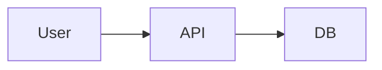

# Template · Engineering Tech Spec / PRD (for features/refactors)

**To be filled after formal SPEC approval. Detailed technical specification.**

---

## 1. 🔴 MANDATORY Metadata
| Field | Value |
|---|---|
| Approved Spec Slug | `spec_<slug>.md` (absolute link) |
| Feature / Ticket URL | |
| Domain | `engineering` |
| Author | |
| Created At | DD/MM/YYYY |
| Last Reviewed At | DD/MM/YYYY |
| Status | Draft | In Review | Approved | Obsolete |
| Estimated Blast Radius | 1-3 files (low) | 4-10 (medium) | >10 (high, requires ADR) |
| Requires ADR? | Yes / No | ADR Number: | |

---

## 2. Context & Problem (2-3 paragraphs)
What are we solving? Why? What is the current state and pain point for the user/stakeholder?

- **Current State (AS-IS):**
- **Problems / Pain Points:**
- **Impact if not addressed:**

---

## 3. Design (Proposed Solution)
### 3.1 Alternatives Considered
| Option | Short Description | Pros | Cons | Chosen? |
|---|---|---|---|---|
| A | | | | ❌ |
| B | | | | ✅ |
| C | | | | ❌ |

### 3.2 Architectural Diagram (Mermaid mandatory if blast radius ≥ medium)


### 3.3 Changes per Module / Layer
| Module / File | Change Type | What is removed / added | Associated Test |
|---|---|---|---|
| `src/auth.ts` | Modify | Add `isPlatformAdmin()` function | `auth.test.ts → isPlatformAdmin cases` |

---

## 4. Data Model (if tables/entities change)
| Entity | Column | Type | Constraints | Note |
|---|---|---|---|---|
| refunds | id | UUID | PK | |
| | amount | INT GBP pence | CHECK ≥0 | |
| | reason | VARCHAR 255 | NOT NULL | |

### 4.1 Migration Script
Path: `migrations/<timestamp>_<slug>.sql`
**DOWNCRAFT script (reverse) always included:**
```sql
-- UP
CREATE TABLE ...;
-- DOWN
DROP TABLE ...;
```

---

## 5. API Surface (new or modified routes)
| Method | Path | Auth | Body (Zod schema summary) | Response | Expected Errors |
|---|---|---|---|---|---|
| POST | /api/refunds/:order_id | Admin JWT | `{amount_pence, reason, idempotency_key}` | `{refund_id, status}` | 403 404 409 Already 422 Validation |

---

## 6. Test Plan
| Level | Expected Coverage | How to Execute | Risks |
|---|---|---|---|
| Unit (Vitest) | 90%+ new code | `nx run <pkg>:test` | |
| Integration (API E2E) | Happy path + 3 errors | `pnpm test:api-e2e` | |
| E2E Playwright (UI) | 1 happy path critical flow | `pnpm test:e2e` | |
| Manual QA | 10-item browser checklist | manual-test-plan.md attached | |

---

## 7. Risks & Mitigations
| Risk | Severity | Probability | Mitigation |
|---|---|---|---|
| Downtime during deploy migration lock | HIGH | LOW | Run migration DURING deploy BEFORE new code. 30s timeout. |
| Race condition duplicate refund | HIGH | MEDIUM | Idempotency key UNIQUE constraint in DB + unique index. |

---

## 8. Rollback Plan (5-minute revert window §20 FIRE DRILL)
| Step | Action | Command |
|---|---|---|
| 1 | Revert previous deploy | `vercel rollback <deployment-id>` or `helm rollback` |
| 2 | If migration reversible | Apply migration DOWN script |
| 3 | If migration irreversible | Compensatory hotfix query + decisions.log entry |

---

## 9. Observability
| What to monitor | SLO Target | Metric |
|---|---|---|
| p95 refund latency | < 500ms | Sentry Tracing |
| refund endpoint error rate | < 0.5% | Sentry Transactions |
| Stripe webhook failures | 0 / hour | Dashboard alerts §21 Connectors Sentry alert config |

---

## 10. Sign-off (after approved review)
| Role | Name | Date | Signature (Approved literal) |
|---|---|---|---|
| SWE Author | | DD/MM/YYYY | |
| Senior Reviewer | | DD/MM/YYYY | |
