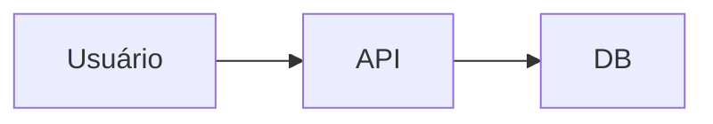

# Template · Engineering Tech Spec / PRD (para features/refactors)

**Preenchido depois do SPEC formal aprovado. Especificação técnica detalhada.**

---

## 1. 🔴 Metadata OBRIGATÓRIA
| Campo | Valor |
|---|---|
| Spec aprovado slug | `spec_<slug>.md` (link absoluto) |
| Feature / ticket url | |
| Domínio | `engineering` |
| Autor | |
| Data criação | DD/MM/YYYY |
| Última revisão | DD/MM/YYYY |
| Status | Draft | In Review | Approved | Obsoleto |
| Blast radius estimado | 1-3 arquivos (baixo) | 4-10 (médio) | >10 (alto, requer ADR) |
| Requer ADR? | Sim / Não | ADR número: | |

---

## 2. Contexto & Problema (2-3 parágrafos)
O que estamos resolvendo? Por que? Qual o estado atual e dor do usuário/stakeholder?

- **Estado atual (AS-IS):**
- **Problemas / dores:**
- **Impacto se não fizermos:**

---

## 3. Design (Solução Proposta)
### 3.1 Alternativas consideradas
| Opção | Descrição curta | Prós | Contras | Escolhida? |
|---|---|---|---|---|
| A | | | | ❌ |
| B | | | | ✅ |
| C | | | | ❌ |

### 3.2 Diagrama arquitetural (Mermaid obrigatório se blast radius ≥ médio)


### 3.3 Mudanças por módulo / camada
| Módulo / arquivo | Tipo mudança | O que sai / entra | Teste associado |
|---|---|---|---|
| `src/auth.ts` | Modify | Adiciona função `isPlatformAdmin()` | `auth.test.ts → isPlatformAdmin cases` |

---

## 4. Data Model (se tabelas/entidades mudarem)
| Entidade | Coluna | Tipo | Constraints | Nota |
|---|---|---|---|---|
| refunds | id | UUID | PK | |
| | amount | INT GBP pence | CHECK ≥0 | |
| | reason | VARCHAR 255 | NOT NULL | |

### 4.1 Migration script
Path: `migrations/<timestamp>_<slug>.sql`
**DOWNCRAFT script (oposto) sempre incluído:**
```sql
-- UP
CREATE TABLE ...;
-- DOWN
DROP TABLE ...;
```

---

## 5. API Surface (rotas novas ou alteradas)
| Method | Path | Auth | Body (Zod schema resumo) | Response | Erros esperados |
|---|---|---|---|---|---|
| POST | /api/refunds/:order_id | Admin JWT | `{amount_pence, reason, idempotency_key}` | `{refund_id, status}` | 403 404 409 Already 422 Validation |

---

## 6. Test plan
| Nível | Cobertura esperada | Como executa | Riscos |
|---|---|---|---|
| Unit (Vitest) | 90%+ novo código | `nx run <pkg>:test` | |
| Integration (API E2E) | Happy path + 3 erros | `pnpm test:api-e2e` | |
| E2E Playwright (UI) | 1 happy path critical flow | `pnpm test:e2e` | |
| Manual QA | Checklista 10 itens no browser | manual-test-plan.md anexo | |

---

## 7. Risks & Mitigations
| Risco | Severidade | Probabilidade | Mitigação |
|---|---|---|---|
| Downtime durante deploy migration lock | HIGH | LOW | Run migration DURANTE deploy ANTES do código novo. Timeout 30s. |
| Race condition duplicate refund | HIGH | MEDIUM | Idempotency key UNIQUE constraint no DB + unique index. |

---

## 8. Rollback plan (5-minute revert window §20 FIRE DRILL)
| Step | Ação | Comando |
|---|---|---|
| 1 | Reverte deploy anterior | `vercel rollback <deployment-id>` ou `helm rollback` |
| 2 | Se migration reversible | Aplica migration DOWN script |
| 3 | Se migration irreversible | Hotfix query compensatória + decisions.log entry |

---

## 9. Observabilidade
| O que monitorar | SLO target | Métrica |
|---|---|---|
| Latência p95 refund | < 500ms | Sentry Tracing |
| Error rate refund endpoint | < 0.5% | Sentry Transactions |
| Stripe webhook failures | 0 / hour | Dashboard alerts §21 Connectors Sentry alert config |

---

## 10. Dupla assinatura (após review aprovado)
| Cargo | Nome | Data | Assinatura (Approved literal) |
|---|---|---|---|
| Autor SWE | | DD/MM/YYYY | |
| Reviewer Sênior | | DD/MM/YYYY | |
