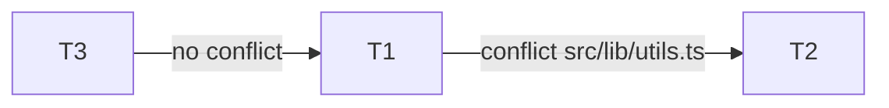

# EXECUTION BATCHES — <task-id>

> Generated by che-executor-dispatcher. DO NOT hand-edit status columns.

## Metadata
- created_at: <ISO datetime>
- worktree: <abs path>
- algorithm: Kahn topological sort + greedy graph-coloring on file-conflict graph
- max_parallel: <N> (hard cap 4)
- task_count_total: <N>

## Batch Matrix

| Batch ID | Kahn Wave | Mini | Type | Tasks | File conflict safety | Status |
|---|---|---|---|---|---|---|
| B1 | 1 | 1 | parallel-safe | T1, T3 | pairwise Files(T) ∩ Files(T') = ∅ | READY |
| B1b | 1 | 2 | serial-fallback | T2 | Files(T2) ∩ Files(T1) = {src/lib/utils.ts} | QUEUED_AFTER_B1 |
| B2 | 2 | 1 | parallel-safe | T4, T5 | disjoint | WAITING_B1_DONE |

## Conflict Graph (all waves)

## Per-Batch File Locks (expected)

### B1 — parallel-safe
- T1 locks: src/a.ts, src/b.ts
- T3 locks: src/x.ts
- Result: pairwise disjoint ✅

### B1b — serial-fallback
- T2 locks: src/lib/utils.ts, src/c.ts
- utils.ts will be free only after B1 MERGE AUDIT passes + locks released

## Notes / Dispatches
- Task file-globs (non-enumerated) refused parallel and moved to serial: <none / list>
- Stale locks purged before run: <list / none>
