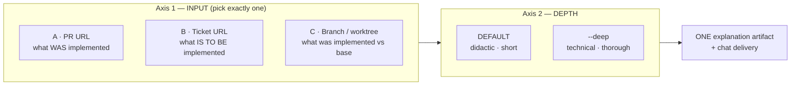
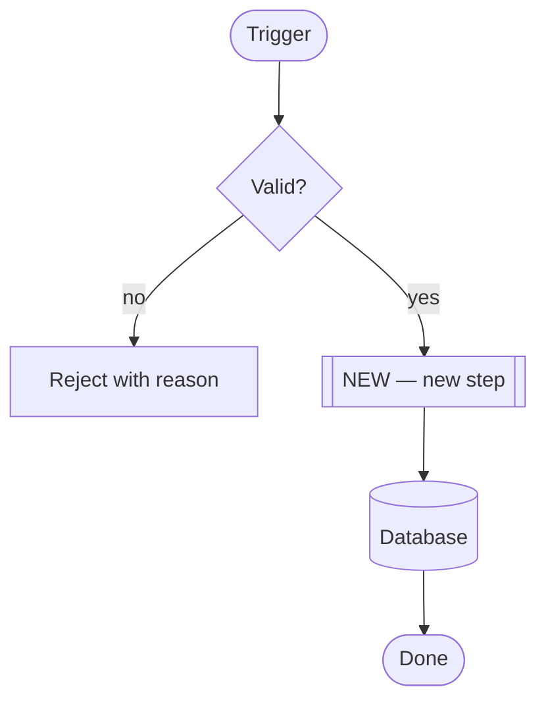
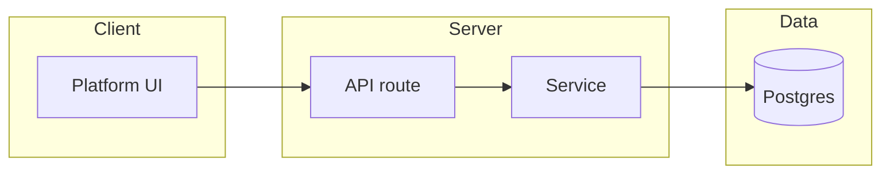
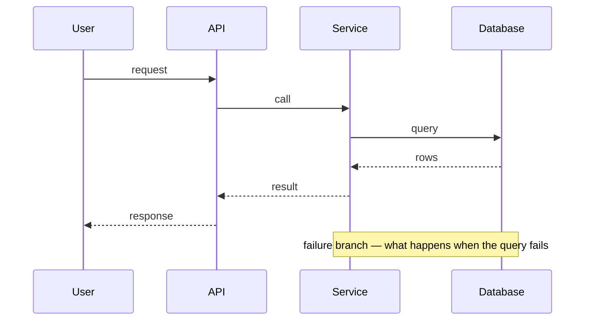

# Che — Explain (Didactic Explainer)

> **SHARED REFERENCES (CANONICAL — DO NOT DUPLICATE here):**
>
> - Storage boundary + path canonicity (never write inside the worktree): `contracts/path-canonicity-che.md`
> - Chat verbosity budget (§18) and worktree session binding (§19): `engineering-contracts` skill
> - Secret / PII patterns when something suspicious surfaces in the diff: `che-compliance` skill
> - Ticket retrieval tooling: `project-management-expert` skill (Linear / ClickUp) + the `mcp_github` MCP server

## 🆚 Boundary vs the neighbours (DO NOT overlap)

| Concern | `che-code-review` | `che-spec` | **`che-explain` (this skill)** |
| --- | --- | --- | --- |
| Goal | Block production breaks | Plan before building | Make a human UNDERSTAND |
| Output | Verdict + numbered blockers | SPEC with acceptance criteria | Plain-language explanation + diagrams |
| Audience | The author who must fix it | The team about to build it | Anyone: onboarding, handover, quick catch-up |
| Verdict | Yes (🔴 / 🟡 / 🟢) | No | **NEVER** |
| Diagrams | No | Only on a risk trigger | **ALWAYS** |

Routing rule — apply it before doing anything else:

- "review / approve / request changes / blocking issues" → `che-code-review`
- "spec / plan / acceptance criteria / task graph" → `che-spec`
- "explain / what is this / help me understand / walk me through / catch me up" → **THIS skill**

## 0. Two orthogonal axes — one INPUT × one DEPTH



Depth is a **rendering flag**, never a separate flow. Resolve the input once (§1), then render at the requested depth (§2). Do not write three or six parallel procedures — that duplication is the one way this skill goes wrong.

| | DEFAULT (didactic) | `--deep` (technical) |
| --- | --- | --- |
| Sections | 5 | 10 |
| Diagrams | 1 (flow) | 3 (architecture + sequence + flow) |
| Length | ~1 page | As long as it needs to be |
| Code | None — names only | Real paths, signatures, payloads |
| Reader | Anyone, no context needed | An engineer joining this area |

## 1. AXIS 1 — INPUT RESOLUTION

### 1.0 Preflight (ALL inputs — run before any write)

```bash
# The `che` CLI owns the 5-tier Che-home cascade (CHE_HOME → HARNESS_HOME
# → ~/.che-ai → legacy ~/.trae iff CHE_RULES.md exists → ~/.che-ai fallback).
command -v che >/dev/null 2>&1 || { echo "❌ FATAL: 'che' CLI not found on PATH. Zero writes without storage boundary. exit 98"; exit 98; }
SESSION_ID="${CHE_SESSION_ID:-${HARNESS_SESSION_ID:-fallback-explain-session}}"
if [ -n "${WORKTREE_ROOT:-}" ] && [ -d "$WORKTREE_ROOT" ]; then
  eval "$(che compute_paths "$WORKTREE_ROOT" "$SESSION_ID" --cwd "$PWD")"
  che ensure_dirs "$WORKTREE_ROOT" "$SESSION_ID" --cwd "$PWD"
fi
# AFTER this: build every path with `che output_path "explain" ...` only.
```

Never use `./reports/` or any path inside the worktree. See §5 STORAGE-BOUNDARY.

Input classification — first match wins:

| Input looks like | Mode | Never do this |
| --- | --- | --- |
| `https://github.com/<org>/<repo>/pull/<N>` | **A** | Do not clone the repo to read the diff; `gh pr diff` is enough |
| A Linear / ClickUp / GitHub issue URL, or a bare key such as `FLO-123` | **B** | Do not guess ticket content; if retrieval fails, ask |
| `--worktree /abs/path`, a branch name, or an absolute repo path | **C** | Do not assume the base branch; ask when ambiguous |

### 1.A — PR URL (what WAS implemented)

Collect three sources, then read the diff.

```bash
gh pr view <PR_URL> --json \
  number,title,body,author,state,isDraft,baseRefName,headRefName,additions,deletions,changedFiles,commits,labels,reviewDecision,mergeable,createdAt,updatedAt
gh pr diff <PR_URL> --name-only
gh pr checks <PR_URL>
```

Then read the diff body itself with `gh pr diff <PR_URL>`. You must actually read it — an explanation built from a filename list is a summary, not an explanation, and the diagrams in §3 cannot be drawn from filenames.

Extract:

- **Intent** — from title + body. If the body is longer than 30 lines, take the TL;DR or first paragraph only.
- **Change areas** — group the file list by module, sorted by churn. Flag any single group holding more than 40% of the diff as the main blast radius.
- **CI state** — passing / failed / pending counts, plus the names of failed checks.
- **Review state** — `reviewDecision`, draft or ready.

### 1.B — Ticket URL (what IS TO BE implemented)

Nothing is implemented yet. This mode explains an **intent**, so every diagram describes the intended design and must be labelled as proposed, never as existing.

1. Retrieve the ticket with the MCP tool that matches its tracker: `mcp_flockr-linear` for Linear, `mcp_laion-clickup` for ClickUp, `mcp_github` for a GitHub issue.
2. Extract: title, description, acceptance criteria, status, labels, and any linked PR or parent epic.
3. If the tracker returns nothing usable → **STOP and ask** the user for the description inline. Never invent scope from a ticket key alone.
4. Read the current code that the ticket will touch, so the diagrams show where the change lands. Without this step the "architecture" diagram is fiction.
5. State in the artifact, in the first line of section 1: **nothing is implemented yet — the diagrams describe the intended design.**

### 1.C — Branch or worktree (what was implemented vs the base)

Run every command inside `<WORKTREE_ROOT>`.

**C.1 Resolve the base branch — if in doubt, ASK.**

```bash
gh repo view --json defaultBranchRef --jq .defaultBranchRef.name
git branch -a --sort=-committerdate | head -20
```

If two candidates are equally plausible (for example `origin/dev` and `origin/main` both exist and are recent) → **STOP and ask** which base to compare against. Never pick silently. Honour an explicit `--base` without asking.

**C.2 Collect the change, split into three temporal buckets.**

```bash
BASE=<BASE_BRANCH_REF>
git log --oneline --decorate "${BASE}..HEAD"
git diff --stat "${BASE}..HEAD"
git diff --name-only "${BASE}..HEAD"
git status --short
git diff --cached --name-only
git ls-files --others --exclude-standard
git branch --show-current
```

| Bucket | Meaning | Why it matters to the reader |
| --- | --- | --- |
| 🟢 Already committed | Will be in a PR if opened now | The durable, reviewable part |
| 🟡 To commit | Staged + unstaged tracked work in progress | Half-finished; may never land |
| ⚪ Untracked | New files not yet added | Often the most interesting, often forgotten |

Skip build noise (`node_modules/`, `.next/`, `dist/`). If a bucket holds more than five files, list the five most meaningful and count the rest. Flag any untracked `.env*` or key-looking file immediately in the attention points.

## 2. AXIS 2 — DEPTH RENDERING

Both depths use the same collected facts. Only the rendering changes.

### 2.1 DEFAULT — didactic (5 sections, ~1 page)

Written for someone who has never seen this code. Short sentences. No jargon; when a technical term is unavoidable, define it in the same sentence. No code blocks.

```markdown
# 🧠 Explain — <what this is, in one line>

**Input:** <PR #N | ticket KEY | branch X vs base Y> | **Depth:** didactic | **Generated at:** <ISO ts>

## 1. 🎯 In one sentence
What this is about, with no context assumed. If you cannot write it in one sentence, you do not yet understand it — go back to §1 and read more.

## 2. 🧩 Why it exists
Two or three sentences: the problem before, the situation after. For a ticket: what is broken or missing today. For a PR or branch: what was wrong before the change.

## 3. 🔄 How it works
ONE Mermaid flow diagram (§3) of the main path, plus three to five bullets walking it through in order. This is the heart of the artifact.

## 4. ⚠️ Points of attention
MAXIMUM 3. Plain language, one sentence each, each stating the consequence — not just the fact.
- Bad: "Migration alters the refunds table."
- Good: "The migration changes the refunds table, so a rollback needs the down migration to run before the code is reverted."

## 5. ❓ Still unclear
MAXIMUM 3 honest open questions, or "Nothing material — the change is self-contained." Never invent certainty you do not have.
```

### 2.2 `--deep` — technical depth (10 sections)

Same structure, but for an engineer who will work in this area. Real paths, real signatures, real payloads.

```markdown
# 🧠 Explain (deep) — <what this is, in one line>

**Input:** <...> | **Depth:** deep | **Generated at:** <ISO ts>

## 1. 🎯 What and why
The precise version of §2.1.1 + §2.1.2: the problem, the constraints that shaped the solution, and the observable outcome.

## 2. 🏗️ Architecture — where this lives
Mermaid architecture diagram (§3.2): components and their relationships AFTER the change. Mark new components and new edges explicitly.

## 3. 🔄 Sequence — the runtime path
Mermaid sequence diagram (§3.3): actor → system → storage, in order, with the failure branches that matter.

## 4. 🔀 Flow — the decisions
Mermaid flow diagram (§3.1): the branching logic and the conditions. Where the default path and the error path split.

## 5. 🧩 Module-by-module walkthrough
One block per meaningful module or file group: path, what it does now, what changed, why it had to change here rather than elsewhere. Skip the mechanical files (lockfiles, formatting) but say that you skipped them.

## 6. 🧠 Design decisions and discarded alternatives
What was chosen, what was rejected, and the reason. If the reasoning is not recorded anywhere, say so plainly instead of inventing a rationale — this is the section readers most often mistake for fact.

## 7. 📜 Contracts touched
Every interface this change moves: HTTP or tRPC endpoints, DB schema and migrations, environment variables, events, config keys, public exports. Write "none" where there are none — an empty answer is information.

## 8. ⚠️ Edge cases and risks
MAXIMUM 5. Each one: the trigger, the consequence, and whether it is handled or open.

## 9. 🧪 How to verify
The concrete commands or steps that prove this works, and the one that would prove it broken. If a manual check is required, write the exact steps.

## 10. 💬 Attention points
MAXIMUM 3, aimed at a reviewer or the next person to touch this. What deserves a question in review.
```

## 3. MERMAID DIAGRAMS — canonical rules

Diagrams are the point of this skill. A wrong diagram is worse than no diagram, because it is believed.

- **Always fenced as ` ```mermaid `** — in the artifact AND in the chat delivery.
- **Never draw a node you have not seen in the code or the diff.** No inferred services, no guessed queues, no imagined caches.
- **Label every new element as new.** Use a distinct node shape or a `NEW` prefix so a reader can tell what this change introduced from what already existed.
- **Keep it readable**: at most 12 nodes per diagram, at most 3 levels deep. Split into two diagrams rather than one unreadable one.
- **Name nodes after real things**: the actual service, file, table, or function. Not "Service A".
- **A diagram must be readable without the prose.** If it needs the surrounding text to make sense, it is not a diagram yet.

### 3.1 Flow — `flowchart`

Use for the main path, the branches, and the decisions. This is the diagram the DEFAULT depth always includes.



### 3.2 Architecture — `flowchart LR` with subgraphs

Use in `--deep` to show components and relationships. Group by layer or by ownership.



### 3.3 Sequence — `sequenceDiagram`

Use in `--deep` for the runtime path and its failure branches.



## 4. SAVE + DELIVERY

Construct the path only through the helper (preflight already ran in §1.0):

```bash
# related_id = pr-<N> (Mode A) | <TICKET-KEY> (Mode B) | worktree-<slug> (Mode C)
EXPLAIN_PATH="$(che output_path "explain" "che-explain" "<related_id>" "session" "md")"
```

Example results:

```text
$CHE_SESSION_DIR/explanations/pr-382/20260902-103000-che-explain.md
$CHE_SESSION_DIR/explanations/FLO-745/20260902-104500-che-explain.md
```

The UTC timestamp prefix keeps repeated runs on the same input ordered, and the helper hard-stops (`exit 99`) if the path would land inside the worktree.

**Language.** The artifact is written in **English** (canonical). The chat delivery is written in the **user's chat language** — and so are the diagram labels in the chat copy. Re-emit the diagram with translated labels rather than pasting the English one: a diagram the user cannot read has no value. Keep node identifiers stable so both copies stay recognisably the same diagram.

**Chat delivery shape** (§18 budget — 250–500 words, 4 sections):

1. 📍 **Status** — what was explained, in one line, with the input it came from.
2. 🧩 **The explanation** — the didactic core: sections 1, 2 and the diagram. Even in `--deep`, the chat copy stays didactic; depth lives in the artifact.
3. ⚠️ **Attention points** — the same 3 at most, in the chat language.
4. 🔗 **Refs** — artifact path, plus the PR or ticket link.

Then one single offer: "Quer que eu aprofunde alguma parte?" (`--deep` if the artifact was didactic, or a specific section if it already was deep). Never dump the whole artifact into the chat unasked.

## 5. GENERAL RULES

1. **No verdict, ever.** Never write "approve", "request changes", or "this is broken". Naming a risk and stating its consequence is in scope; judging the change is `che-code-review`.
2. **Never invent.** No guessed intent, no guessed rationale, no inferred component. When the source is silent, write that it is silent and ask. A short honest explanation beats a confident wrong one.
3. **Read the change, not just its metadata.** Filenames and a PR body are not the change. Read the diff, or the code the ticket will touch.
4. **Say what you did not cover.** If you skipped a module, a bucket or a large file, state it. Silent omission reads as completeness.
5. **Diagrams are mandatory at both depths.** DEFAULT gets one flow diagram; `--deep` gets architecture, sequence and flow.
6. **Depth is a flag, not a different job.** One input resolution, one fact collection, two renderings.
7. **Storage boundary (§1.0).** Every write goes through `che output_path`. Nothing Che writes lands inside the user's repository.
8. **Secret scan (light).** If a raw key, token or credential appears anywhere in the diff, flag it in the attention points regardless of the rest of the content, and route the reader to `che-compliance`.
