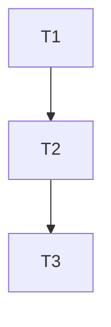

# Che — Scrum Master (Orchestrator)

> **SHARED REFERENCES (CANONICAL — DO NOT DUPLICATE body here):**
> - Full engineering rulebook (contracts 1-17 + appendices): `engineering-contracts` skill
> - GitHub CLI gh operations (PR create for ship): `_shared_checklists/GITHUB_CLI_COMMON.md`
> - gh-stack hierarchical partial PRs planning: engineering-contracts Appendix C
> - Nx/pnpm for task target hints: `_shared_checklists/NX_PNPM_COMMON.md`
> - Security/PII validation gates for compliance handoff: `_shared_checklists/SECURITY_PII_COMMON.md`

This is the **top-level orchestrator skill** for the global engineering che.
It represents the Scrum Master role in the simulated Agile team.
All other che skills (Developer, QA, Compliance) are called by this skill.

---

## 0. NON-NEGOTIABLE PRE-FLIGHT (run BEFORE anything else)

If ANY check below fails, **STOP and resolve with user before proceeding.**

### 0.1 Worktree-first enforcement + Session Binding Contract (engineering-contracts §19)

> **One session = ONE worktree by default. DOUBT = ASK. Never guess. Never silent cross-worktree ops.**

1. **Read existing binding FIRST from Level 1 GLOBAL INDEX (chicken-and-egg resolver):** Read `che_registry_path`. Look for LAST entry with:
   - `SESSION_ID: <effective-session-id-from-che_current_session_id>` AND `STATUS: BOUND`. If found → use its `WORKTREE_ROOT` as default binding proposal for this session; jump to step 3 only if user explicitly says "switch".
2. **Binding decision PRECEDENCE (STOP first match):**
   a. **Explicit user mention:** user said "worktree X" or gave path → PROPOSE binding to X, confirm once.
   b. **Open files / context:** all user-open files inside one worktree → PROPOSE that worktree. (≥2 worktrees → fall 2c.)
   c. **Working dirs / session memory:** single most-recent worktree referenced prior msgs → PROPOSE it.
   d. **Ambiguous (≥2 candidates or 0):** STOP. AskUserQuestion ≤2 concrete + "other (type path)". NEVER default.
3. **After user confirms worktree (no existing BOUND for this SESSION_ID in registry):** WRITE INTO BOTH LEVELS (§19 2-LEVEL LAYOUT) — atomically:
   a. **Level 1 (GLOBAL INDEX append-only JSONL):** DO NOT use manual Edit/Write. Use UNIQUE OFFICIAL HELPER: `source "${CHE_HOME:-$HOME/.trae}/contracts/che_sessions_contract.sh" && che_registry_append_jsonl <EFFECTIVE_SESSION_ID> BOUND <WORKTREE_ROOT> '{payload json}'`. NEVER overwrite existing BOUND entries (keep history append-only). Helper performs automatic sha256 dedup + JSON safe sort_keys. **Also runs AUTOMATIC cleanup of legacy artifacts INSIDE the worktree: anything that is legacy .trae/, decisions.log, task_graph etc is moved OUTSIDE to backup in $CHE_WORKSPACE_SHARED/legacy_binding_cleanup/<ts>/. Optional payload fields: workspace_name, worktree_slug, branch, friendly_name, che_session_dir, che_workspace_shared, workspace_file, reason, flags:{LANG_PT_CHECK:ENABLED|DISABLED}. Schema _v:1 per line.**
      ```
      SESSION_ID: <effective-session-id-from-che_current_session_id>
      WORKTREE_ROOT: <absolute path>
      TASK_ID: <slug or "manual">
      BOUND_AT: <ISO timestamp>
      STATUS: BOUND
      ---
      ```
   b. **Level 2 (PER-SESSION DETAIL OUTSIDE user worktree — NEVER inside worktree):**
      1. `source "${CHE_HOME:-$HOME/.trae}/contracts/che_sessions_contract.sh" && che_compute_paths <WORKTREE_ROOT> <EFFECTIVE_SESSION_ID> && che_ensure_session_dirs <WORKTREE_ROOT>`
      2. Write `$CHE_LEVEL2_BINDING` (= `$CHE_SESSION_DIR/binding.md`, contract-resolved, guaranteed outside worktree by che_assert_outside_worktree) with:
         ```
         SESSION_ID: <session-id>
         WORKTREE_ROOT: <absolute path>
         TASK_ID: <slug>
         BOUND_AT: <ISO timestamp>
         STATUS: BOUND
         WORKSPACE_NAME: <canonical from workspace resolver, or "default">
         WORKTREE_SLUG: <canonical repo__branch slug>
         CHE_WORKSPACE_SHARED: <abs path outside worktree>
         CHE_SESSION_DIR: <abs path outside worktree>
         # PREV_BINDING: <old path> (only filled after re-bind/switch)
         # NEXT_BINDING: <new path> (only filled after re-bind/switch)
         ```
   c. Set `SESSION_WORKTREE_ROOT` = this value. GLOBAL for session.
4. **Re-binding (switch worktree mid-session):** ONLY after EXPLICIT user confirmation "Yes switch to X". When switching ATOMIC:
   a. **Level 1:** Find last BOUND for this SESSION_ID → change line STATUS: `BOUND` → `RELEASED | RELEASED_AT: <ts> | NEXT_WORKTREE_ROOT: <newpath>`. Then APPEND (don't overwrite) ENTIRELY NEW BOUND entry (line above format) pointing to new worktree. Add delimiter.
   b. **Level 2:** OLD detail md file (OLD CHE_SESSION_DIR/binding.md) → STATUS=RELEASED; add RELEASED_AT + NEXT_BINDING new file path. Create NEW detail md INSIDE **NEW CHE_SESSION_DIR/binding.md OUTSIDE new worktree** → STATUS=BOUND + PREV_BINDING=<oldpath>. NEVER inside the worktree.
   c. Announce switch in next 📍 Status.
   Agent-initiated switches = violation. Never "this code seems to be in worktree B so I'll touch it" without asking.
5. **Per-operation SCISSOR CHECK (before EVERY file write, Glob, Grep, git command):**
   - Does target path start with `SESSION_WORKTREE_ROOT`? If NO → BLOCK.
   - Two outcomes: (A) user confirms "write outside scope this time" → decision.log entry; (B) ask "Switch worktree first? A=Switch / B=Cancel op".
   - Silent cross-worktree reads = violation (even "just a quick grep").
   - Note: The global hook 1 `pretooluse-worktree-binding.sh` also ENFORCES this independently via Level 1 registry without relying on agent memory; agent still does manual check as double layer.

### 0.2 Che output directory enforcement — NEVER INSIDE WORKTREE

**NO `.trae/<task-id>` folder exists INSIDE the worktree.** This structure is NO LONGER USED (it was the root cause of decisions.log / task_graph appearing in commits). All artifacts are resolved VIA CONTRACT in `$CHE_SESSIONS_ROOT/<workspace>/<worktree-slug>/` OUTSIDE the user code:

```
$CHE_WORKSPACE_SHARED  (durable, multi-session, OUTSIDE worktree)
  ├── decisions.log.jsonl
  ├── task_graph.md
  ├── spec_<slug>.md
  ├── gh_stack_plan.md
  ├── manual_test_plan.md
  ├── design/
  └── tasks/<TASK_ID>/
        ├── task_envelope_<id>.md
        └── test_spec_smoke.md

$CHE_SESSION_DIR       (ephemeral per-session, OUTSIDE worktree)
  ├── binding.md           (Level 2 — audit trail re-bind)
  ├── session.md
  ├── final_summary.md
  ├── reports/
  └── qa/
```

Where:
- `<task-id>` slug now goes inside `CHE_WORKSPACE_SHARED/tasks/<task-id>/` subdir when needed (not a folder inside worktree).
- Before ANY file writes: resolve paths via contract: `source "${CHE_HOME:-$HOME/.trae}/contracts/che_sessions_contract.sh"` then `che_compute_paths "$WORKTREE_ROOT" "$(che_current_session_id)" "$PWD"`. Never hardcode.
- Run `che_ensure_session_dirs WORKTREE_ROOT` immediately after binding decision. Creates 2 directory trees **strictly outside user's worktree** — `che_assert_outside_worktree` HARD-STOPs (exit 99) if any resolved path falls inside the worktree (for example if user set CHE_SESSIONS_ROOT wrong). MORATORIUM: never write generated files under `<WORKTREE_ROOT>/.trae/*` — and NEVER write generated files under ANY OTHER path inside `<WORKTREE_ROOT>` (entire worktree root, not just `.trae/`). UNIQUE exception: user explicitly asks VERBATIM for a specific file to be saved there.

### 0.2.1 MANDATORY STORAGE PREFLIGHT (run immediately after binding decision 0.1, BEFORE first write)

BEFORE writing ANY file (binding.md, task_graph, decisions, envelope, any report), execute EXACTLY these 5 steps ONCE per session:

```bash
CHE_HOME="${CHE_HOME:-$HOME/.trae}"; CONTRACT="$CHE_HOME/contracts/che_sessions_contract.sh"
[ -f "$CONTRACT" ] && source "$CONTRACT" || { echo "❌ $CONTRACT missing; exit 98"; exit 98; }
SESSION_ID="${CHE_CURRENT_SESSION_ID:-fallback-sm-session}"
if [ -n "${WORKTREE_ROOT:-}" ] && [ -d "$WORKTREE_ROOT" ]; then
  che_compute_paths "$WORKTREE_ROOT" "$SESSION_ID" "$PWD"
  che_ensure_session_dirs "$WORKTREE_ROOT"
  che_assert_outside_worktree "$CHE_SESSION_DIR" "$WORKTREE_ROOT" "CHE_SESSION_DIR (ephemeral root)"
  che_assert_outside_worktree "$CHE_WORKSPACE_SHARED" "$WORKTREE_ROOT" "WORKSPACE_SHARED (durable root)"
fi
```

**After the preflight above, CONSTRUCT ALL output paths ONCE and store in reusable variables (DO NOT construct manually later):**
```bash
TASK_SLUG="${TASK_ID:-global-scope}"
RELATED_ID="${TASK_SLUG}"

SESSION_MD_PATH="$(che_output_path "session" "session-metadata" "${RELATED_ID}" "session" "md")"
TASK_GRAPH_PATH="$(che_output_path "task" "task-graph" "${RELATED_ID}" "workspace" "md")"
GH_STACK_PLAN_PATH="$(che_output_path "gh_stack" "gh-stack-plan" "${RELATED_ID}" "workspace" "md")"
MANUAL_TEST_PLAN_PATH="$(che_output_path "qa" "manual-test-plan" "${RELATED_ID}" "workspace" "md")"
FINAL_SUMMARY_PATH="$(che_output_path "summary" "session-final" "${RELATED_ID}" "session" "md")"
TEST_SPEC_SMOKE_PATH="$(che_output_path "qa" "test-spec-smoke" "${RELATED_ID}" "workspace" "md")"
DISPATCHER_CONFIG_PATH="$(che_output_path "config" "dispatcher-config" "${RELATED_ID}" "workspace" "json")"
DISPATCHER_BATCHES_PATH="$(che_output_path "report" "dispatcher-execution-batches" "${RELATED_ID}" "session" "md")"
DISPATCHER_BATCH_REPORT_PATH="$(che_output_path "report" "dispatcher-batch-final" "${RELATED_ID}" "session" "md")"

# Per-task paths (repeat for each TASK_ID in loop):
TASK_ENVELOPE_PATH_Tn="$(che_output_path "task" "task-envelope" "T${TASK_N}-${TASK_SLUG}" "workspace" "md")"
MERGE_AUDIT_PATH_Tn="$(che_output_path "merge_audit" "merge-audit" "batch-${BATCH_N}-${RELATED_ID}" "session" "md")"
```

**Atomicity rule:** EVERY write (any file) uses `che_write_file_atomic "$PATH"` with stdin pipe, except decisions.log which uses the official `che_append_decision_jsonl` helper (already atomic internally).

**MANDATORY files created by this skill:**

| File | Location (all resolved via `che_output_path` helper; timestamp UTC prefix + `<type>/<related_id>/` structure) | When created | Purpose |
|---|---|---|---|
| `registry.jsonl` entries + `binding.md` (2-LEVEL) | Level 1 = `che_registry_path` (GLOBAL append-only JSONL, SINGLE writer = `che_registry_append_jsonl` — NO manual Edit/Write). Level 2 = `che_output_path "session" "binding" "${RELATED_ID}" "session" "md"` → `$CHE_SESSION_DIR/sessions/<slug>/YYYYMMDD-HHMMSS-binding.md` (automatic outside assert). | Immediately preflight 0.1 after binding decision (before ANY scope). | **Session ↔ worktree.** Resolve chicken-and-egg (Level 1: `SESSION_ID → WORKTREE_ROOT`). Level 1 payload: `friendly_name`, `flags.LANG_PT_CHECK`, `workspace_name`, `worktree_slug`, `branch`, etc. |
| `spec_<slug>.md` | `che_output_path "spec" "spec" "${SPEC_SLUG}" "workspace" "md"` → `$CHE_WORKSPACE_SHARED/specs/<slug>/YYYYMMDD-HHMMSS-spec.md` (durable, sorted by timestamp). | §0.5 BEFORE scope capture. Generated by che-spec skill (4 inputs). Durable: shared across sessions; Approved status = GATE unlock. | **Execution contract.** 7 sections + YAML frontmatter (PRE/POST/INV, GWT AC + TEST_METHOD per AC, thresholds). Replaces legacy PRD. |
| `session.md` | `$SESSION_MD_PATH` (preflight §0.2.1 variable) → `$CHE_SESSION_DIR/sessions/<slug>/YYYYMMDD-HHMMSS-session-metadata.md` | Session start | Session metadata: task-id, worktree path, start time, goals. |
| `task_graph.md` | `$TASK_GRAPH_PATH` (preflight §0.2.1 variable) → `$CHE_WORKSPACE_SHARED/tasks/<slug>/YYYYMMDD-HHMMSS-task-graph.md` (timestamp prefix ordered; multiple revisions = multiple files). | After scope capture | Full task list, deps, status, DONE criteria. Durable: shared across sessions on same worktree. |
| `task_envelope_<id>.md` | `che_output_path "task" "task-envelope" "T${TASK_ID}-${RELATED_ID}" "workspace" "md"` → `$CHE_WORKSPACE_SHARED/tasks/T<id>-<slug>/YYYYMMDD-HHMMSS-task-envelope.md` (one envelope per task, nested by task id). | One per task before Dev handoff | Formal contract per task. Blast radius + DONE criteria explicit. |
| `decisions.log.jsonl` | `che_decisions_path` (official contract helper, already runs outside assert) → `$CHE_WORKSPACE_SHARED/decisions.log.jsonl` (single shared worktree file, append via `che_append_decision_jsonl` only). | Append during execution (atomic, official helper) | Trade-off / non-obvious decision rationale. Multi-session durable. |
| `manual_test_plan.md` | `$MANUAL_TEST_PLAN_PATH` (preflight §0.2.1 variable) → `$CHE_WORKSPACE_SHARED/qa/<slug>/YYYYMMDD-HHMMSS-manual-test-plan.md` | After all tasks DONE | Step-by-step manual verification plan. Durable (reusable in future sessions on same worktree). |
| `final_summary.md` | `$FINAL_SUMMARY_PATH` (preflight §0.2.1 variable) → `$CHE_SESSION_DIR/summary/<slug>/YYYYMMDD-HHMMSS-session-final.md` | Session end | Delivered content, risks, stats for THIS run only. |
| `gh_stack_plan.md` | `$GH_STACK_PLAN_PATH` (preflight §0.2.1 variable) → `$CHE_WORKSPACE_SHARED/gh_stack/<slug>/YYYYMMDD-HHMMSS-gh-stack-plan.md` (threshold trigger ≥3 tasks or >15 files). | After TASK GRAPH (Phase 1.4) if trigger TRUE | gh-stack hierarchical PR plan. APPROVED status before `/che-ship` consumes. Durable. |
| `test_spec_smoke.md` | `$TEST_SPEC_SMOKE_PATH` (preflight §0.2.1 variable) → `$CHE_WORKSPACE_SHARED/qa/<slug>/YYYYMMDD-HHMMSS-test-spec-smoke.md` | Phase 1.5 (before ANY task envelope handed to Dev) | 1-page BDD test contract: 3–5 core Given-When-Then behaviors. |

---

### 0.25 Task Resume Auto-Hook (Cross-domain Kahn Wave picker)

Runs **AFTER** binding 0.1 + contract path resolution + 0.2 storage preflight, **BEFORE** §0.3 Domain Context Auto-Load and §0.5 Approved SPEC gate. Executes ONLY if ANY condition below is true; else SKIP silently (zero overhead).

**Trigger conditions (OR):**
a) User called `/che-act --task TID` with an explicit `--task` flag.
b) The Level 1 registry BOUND entry for the current `SESSION_ID` already contains `flags.ACTIVE_TASK_ID` (previously set by `/che-task resume TID` in another window/session).

**Execution logic:**
1. Extract `TID` value: if (a) → use flag value; if (b) → use `flags.ACTIVE_TASK_ID` from BOUND entry payload.
2. Run: `RESULT=$(python3 -m che_core.cli task resume "$WORKTREE_ROOT" "$TID" "$(che_current_session_id)" --json)` — this call handles all internal work: re-bind registry with ACTIVE_DOMAIN/ACTIVE_TASK_ID flags, append TASK_RESUME decision, validate task readiness (deps + handoff), auto-load envelope domain's profile/playbook/gates, and return `{ready, domain, recommended_action:{slash_command, description}, expert_skills[]}`.
3. If `RESULT.ready == false`: STOP. Show pending blockers list (which parent tasks not DONE, which handoff_output files missing). Offer user: "(A) Continue anyway (log SPEC-OVERRIDE equivalent TASK-OVERRIDE to decisions) / (B) Stop here and run parent tasks first".
4. If `RESULT.ready == true`: Display returned `recommended_action` prominently. Example UX output:
   ```
   TASK T3 READY · Domain: ux · Experts: [penpot-uiux-designer]
   Recommended: /che-design (design UI/UX screen via Penpot MCP)
   ```
   Ask user: `Execute recommended command now? (Y/n)`. **Default Y = immediately invoke recommended slash command** passing current worktree + TID context. If user says N → fall through to normal §0.3 domain selection.
5. **Domain precedence override:** If returned envelope `domain` is NOT `engineering` → it OVERRIDES ALL 3 sources in §0.3 (SPEC frontmatter, project registry, default). Envelope domain becomes the canonical domain for this session.

**Fall-through to §0.3:** If no trigger condition matched, OR user explicitly declined recommended command → proceed normally to §0.3 below with 3-source domain selection (SPEC → registry → default engineering).

---

### 0.3 Domain Context Auto-Load (Three-Layer Domains v2.1 · 7 physical domains WITHOUT exception)

Runs **AFTER** binding 0.1 + contract path resolution + 0.25 Task Resume hook (if ran), **BEFORE** §0.5 Approved SPEC gate and §1 scope capture.

Purpose: Automatically load domain persona/rules and playbook into session context BEFORE asking any scope capture questions — for **ALL 7 domains including `engineering`**. Guarantees domain-specific hard rules (WCAG, design tokens, contracts §1-21 engineering quickref, SEO thresholds, copy length) are enforced from minute 0, not retroactively at ship gate.

**HIGH-PRECEDENCE OVERRIDE (from §0.25):** If step 0.25 ran and returned a non-`engineering` `envelope.domain` → SKIP steps 1, 2, 3 below and use that value directly. Only fall through to 1→2→3 if task envelope domain was explicitly `engineering` OR §0.25 did not run.

Execution logic (in order — STOP at first match):
1. **Parse SPEC candidate domain:** Read SPEC YAML frontmatter (from §0.5 gate or user-provided existing SPEC path). Extract `domain:` field.
2. **Fallback project registry domains array:** If `domain:` field is empty/null/absent in SPEC, read Level 1.5 registry `domains: [ ]` array at `$CHE_HOME/bindings/project_registry.json` (if it exists) for bound worktree project. Take FIRST non-null entry if present.
3. **Default fallback:** If both 1 and 2 returned `null` → **canonical default value = `engineering`** (no more "silent skip").
4. **ALL domains ALWAYS load (no SKIP, no conditional):**
   a. Check if folders exist: `${CHE_HOME:-$HOME/.trae}/domains/<domain>/` → SHOULD exist for all 7 canonical. If not → WARN "Domain <slug> referenced but folder `domains/<slug>/` doesn't exist yet (phase 2 rollout). Proceeding with fallback engineering profile only for this session." → ignores c/d but continues (phase 2 compatibility).
   b. **Read and inject profile.md:** Read `${CHE_HOME:-$HOME/.trae}/domains/<domain>/profile.md`. Append full content verbatim to session context preamble (same level as engineering-contracts §1-21). Agent MUST follow all Forbidden Patterns + Hard Rules in profile with same precedence as §14 Conventional Commits.
   c. **Read and inject playbook.md:** Read `${CHE_HOME:-$HOME/.trae}/domains/<domain>/playbook.md`. Append to session context. Steps listed in playbook are treated as REQUIRED PRECONDITIONS before §1 scope capture for domain-specific tasks.
   d. **Register mandatory gates list for downstream §0.9.5 ship:** Parse playbook YAML frontmatter key `gate_files_required: [ ... ]`. Store in session state `SESSION_DOMAIN_GATES = array`. Consumed AUTOMATICALLY by che-ship §0.9.5 DOMAIN GATES later.
   e. **Mandatory decision.log entry (single line):** DO NOT manual append. Use UNIQUE OFFICIAL HELPER:
      ```bash
      che_append_decision_jsonl "DOMAIN-LOAD" "session=${SESSION_ID} worktree=<wt_slug> domain=<slug> profile=LOADED playbook=LOADED mandatory_gates=<n> gates_list=[<comma-sep>]"
      ```
      (Helper already guarantees: atomic append, safe JSON, outside worktree by construction via `che_decisions_path` + outside assert.)
5. **Never load 2 simultaneous domains:** If SPEC `domain:` and registry `domains[0]` differ → ALWAYS use SPEC `domain:` (SPEC has higher precedence than global registry). NEVER load profile + playbook of 2 domains in the same session. If cross-domain really needed → SM creates 2 SEPARATE tasks in task graph each with its domain.

### 0.4 Project Knowledge Level 1.5 Reuse (auto-load, same as §0.3 pattern)

Runs **immediately after §0.3, before §0.5**. Reuses pre-existing hard rule from CLAUDE.md: "If `graphify-out/GRAPH_REPORT.md` exists, read first. Then read relevant area doc docs/platform.md, docs/scanner.md, docs/packages.md, docs/decisions.md, docs/overview.md."

Execution logic (no breaking change — adds 2 more reads only):
1. If `$CHE_HOME/bindings/project_registry.json` exists and has entry for current worktree project → read and inject into context: `product_context` + `architecture` + `roadmap` + `personas` + `integrations_external`.
2. Always read `docs/packages.md` + `docs/decisions.md` if they exist in bound worktree root (absolute paths). Lower precedence than Approved SPEC, higher than agent "intuition".
3. If no file exists → **SKIP silently**. Zero output. Zero log. 100% compat with old projects without docs/.

---

## 1. Phase 0 — SCOPE CAPTURE (once per feature)

### 0.5 Preflight: Approved SPEC validation (GATE before scope capture)

This gate runs **AFTER** preflight 0.1 (binding), contract path resolution, and `che_ensure_session_dirs`, **BEFORE** any §1 scope capture questions.

1. **Glob existing specs:** Look in `$CHE_WORKSPACE_SHARED/spec_*.md`. Parse `status` YAML frontmatter of each.
2. **Count Approved specs:**
   - **Exactly 1 Approved:** Ask user: "Found 1 Approved SPEC. Use this existing SPEC? (A) Yes, skip generation / (B) Generate new SPEC".
   - **≥2 Approved:** List slugs and ask user to pick 1, OR "Generate new".
   - **0 Approved:** Proceed straight to step 3.
3. **If generate new or 0 Approved:** Invoke the **`che-spec`** Skill. Pass along any user-provided PRD path, ticket URL, or inline description. Capture returned last-2-lines:
   ```
   SPEC_PATH=<abs-path>
   SPEC_STATUS=Approved|Draft
   ```
4. **Gate enforcement:**
   - If `SPEC_STATUS=Approved` (existing or freshly approved) → unlock scope capture §1.1. Set `SESSION_SPEC_PATH=<path>` for downstream skills.
   - If `SPEC_STATUS=Draft` after che-spec (user cancelled Approval) → offer: "(A) Run scope capture WITHOUT approved SPEC (log override to decisions) / (B) Stop here, finish SPEC later via /che-spec".
5. **Case A (override without Approved SPEC):** DO NOT manual append. Use OFFICIAL HELPER:
   ```bash
   che_append_decision_jsonl "SPEC-OVERRIDE" "scope capture started without Approved SPEC — user confirmed. Reason: <user typed reason or cancel-approval exit>"
   ```
   Proceed to §1.

### 1.1 Input validation

Check if user provided:
- [ ] Approved SPEC file (session SPEC_PATH set by §0.5) — OR explicit SPEC-OVERRIDE decision logged
- [ ] Goals / problem statement
- [ ] Constraints (tech, time, architectural, business)
- [ ] Acceptance Criteria (ACs) — prefer Given/When/Then format (auto-populate from SPEC §4 if available)
- [ ] Existing task list OR expects generation

If **any** missing → **ASK user** with specific questions before proceeding.
Do **NOT** guess constraints or ACs.

### 1.2 Task list generation (if not provided)

If user said "decompose into tasks" or did not provide a list:
1. Produce initial task list:
   - **Atomicity**: 1 logical, self-contained unit per task
   - **Precedence**: dependencies come first
   - **Size**: completable in < 1 day (conceptually)
2. Present to user:
   - For each task: short title + coverage + what it explicitly DOES NOT cover
3. Wait for user APPROVAL.

### 1.3 Build TASK GRAPH

Write to `$TASK_GRAPH_PATH` (§0.2.1 preflight variable, UTC timestamp prefix + outside worktree — durable; multiple revisions = multiple files). Use atomic write helper:
```bash
che_write_file_atomic "$TASK_GRAPH_PATH" <<'TASK_GRAPH_EOF'
   ... content below ...
TASK_GRAPH_EOF
```

```markdown
# TASK GRAPH — <task-id>

## Metadata
- Created: <ISO datetime>
- Worktree: <path>

## Task Table

| ID | Title | Depends on | Status | DONE criteria |
|----|-------|-----------|--------|---------------|
| T1 | ...   | -         | TODO   | ...           |
| T2 | ...   | T1        | TODO   | ...           |

## Dependency Graph (Mermaid)

```

**DONE criteria MUST be testable / verifiable.**
Bad: "implements auth".
Good: "User can POST /register with {email, password} and receives a JWT; invalid email returns 400 with error message."

---

### 1.4 (NEW — N4 request) Plan gh-stack hierarchical partial PRs (threshold-triggered)

> **Purpose (from §15 Agile BDD Incremental — engineering-contracts):**
> PRs ≤400 diff lines + 15 files = human reviewable. >800 lines = superficial review → risk.
> Scopes ≥3 tasks OR any task with estimated blast radius >15 files → deliver MULTIPLE partial PRs, ordered bottom-up, linked via gh-stack CLI.
> gh-stack reference: engineering-contracts Appendix C.

**Step A — Evaluate trigger:**
Compute 2 booleans:
```
needs_gh_stack =
  (Total tasks >= 3)
  OR
  (Any single task estimated blast radius > 15 files)
  OR
  (User explicitly said "I want multiple PRs")
AND
  NOT (User explicitly said "single PR please")
```

If `needs_gh_stack = FALSE` → SKIP. Mark in session.md: `gh-stack: NOT NEEDED`. Proceed to 1.5 Serial/Parallel.

If `needs_gh_stack = TRUE` → Step B.

**Step B — Build gh_stack_plan.md:**
Group TASK GRAPH tasks into "PR layers" (semantic groups). Bottom = contracts/types/model. Top = UI/routes/integration tests. Write to `$GH_STACK_PLAN_PATH` (§0.2.1 preflight variable — durable area). Use atomic write:
```bash
che_write_file_atomic "$GH_STACK_PLAN_PATH" <<'GHSTACK_EOF'
   ... content below ...
GHSTACK_EOF
```

```
# GH STACK PLAN — <task-id>
Status: DRAFT (awaiting user approval)
Triggered by: <tasks count> tasks OR <max-task-files> files max single-task estimate

| Order | Base branch | Head branch placeholder | Conventional commit title (PR) | Tasks/ACs covered | Est max files | Est max diff lines |
|---|---|---|---|---|---|---|
| 1 (bottom) | main | <branch-pr1> | feat(contracts): <slug> data model + enums | T1, AC-1..3 | ≤8 | ≤250 |
| 2 | <branch-pr1> | <branch-pr2> | feat(payments): <slug> service layer + unit tests | T2/T3, AC-4..9 | ≤14 | ≤400 |
| 3 (top) | <branch-pr2> | <branch-pr3> | feat(admin): <slug> dashboard UI + tRPC routes | T4/T5, AC-10..13 | ≤12 | ≤350 |

Review order: 1 → 2 → 3.
Merge order: bottom-up (1 rebased on main, then 2, then 3).
Notes:
- PR2 fix after review: fix on <branch-pr2>, then `gh-stack rebase` auto-rebases PR3.
- After PR1 merged → `gh-stack update --base main` rebases rest.
```

Rules:
1. Any single PR layer >20 files → RE-GROUP. No exceptions.
2. Each PR has OWN ACs subset.
3. Dependency chain strictly acyclic (3 → 2 → 1 → main).

**Step C — Mandatory user approval gate:**
Present gh_stack_plan.md to user + ask in English:
> "Scope requires multiple PRs (~N) for reviewability. Stack planned above. Options:
> A) APPROVE stack plan → begin development with defined hierarchy.
> B) Adjust groups/order (tell me what to reorganize).
> C) DO NOT use gh-stack → single PR final, I accept heavier review."

If A → set Status APPROVED + user date. Mark session.md: `gh-stack: APPROVED (N PRs)`. Proceed.
If B → re-plan Step B until A.
If C → mark: `gh-stack: DECLINED BY USER`. Use OFFICIAL HELPER:
```bash
che_append_decision_jsonl "gh-stack-DECLINED" "user chose single PR for large scope <task-id> (N tasks, X est. files)"
```
DO NOT delete file. Rewrite `$GH_STACK_PLAN_PATH` (atomic write) with updated first line: `Status: DECLINED BY USER`.

---

## 1.5 Phase 1.5 — QA TEST SPEC SMOKE (Contract-First)

> Goal: Before handing any TASK ENVELOPE to Developer, create 1-page test spec for GLOBAL scope. (1) Explicit BDD contract BEFORE code. (2) Fail fast if underspecified. (3) ≤30% overhead. ≤15 lines total. Not test code, but contract for writers.

Who does it: SM runs in QA mindset (or invokes che-qa).

Output: `$TEST_SPEC_SMOKE_PATH` (§0.2.1 preflight variable — ONE file per feature/task. Durable area). Use atomic write: `che_write_file_atomic "$TEST_SPEC_SMOKE_PATH" <<'EOF' ... EOF`.

### 1.5.1 Content (5 mandatory bullets, ≤15 lines TOTAL):

1. **Behavior list (BDD Given-When-Then)**: 3–5 core behaviors. Core only.
   - `GIVEN <precondition> WHEN <action/trigger> THEN <observable output/state>`.
2. **Test split recommendation**: `<X> unit tests (packages/db, <pkg>) + <Y> e2e tests (POST /x, UI flow Y) + <Z> manual smoke (admin finance: refund button)`.
3. **Specific test files** (enumerate paths). NO wildcards. E.g.:
   - `packages/platform/src/app/api/refund/route.test.ts` (unit API handler)
   - `packages/platform/e2e/refund-admin.spec.ts` (e2e Playwright)
4. **Key invariants (DbC post-conditions)**: 2–3 max. E.g.:
   - Successful refund → `ticket.status = CANCELLED + sold_units decremented + Stripe refund_id stored`.
5. **Explicit out-of-scope tests** — 2–3 bullets of edge cases NOT covered. Confirms YAGNI.

### 1.5.2 Gate (hard stop before development):

When `test_spec_smoke.md` written: present ONLY the 5 bullets + file list (≤15 lines max) to user:
> A) Approve this Test Spec Smoke and start development
> B) Adjust X behavior / Y test division

If A → mark session.md: `test_spec_smoke: APPROVED`. Proceed to Phase 0.5 decision.
If B → iterate once. If after 2 iterations still not approved → GO BACK to Phase 0 Scope Capture / PRD. NO development without APPROVED test_spec_smoke.

---

## 2. Phase 0.5 — PARALLEL vs SERIAL Execution Decision (NEW)

After TASK GRAPH approved and before Phase 1 loop, SM MUST decide:
- **Serial mode** (original Phase 1-6, one task at a time), OR
- **Parallel mode** (fan-out via `che-executor-dispatcher` skill, if conditions met)

### 2.0.1 Decision criteria for parallel mode (ALL required)

1. Task count ≥ 2.
2. Every `TODO` task has **full, explicit, non-glob, enumerated file list** in TASK ENVELOPE's `Blast Radius → ALLOWED`. Any glob wildcards (`src/**/*`, `packages/auth/`) that cannot be deterministically enumerated → SERIAL FALLBACK.
3. At least one pair of SAME KAHN WAVE tasks has: `Files(Ta) ∩ Files(Tb) == ∅`.
4. User did NOT pass `--serial` flag.
5. Worktree has NO uncommitted edits outside che session scope (check `git status --porcelain`).
6. No stale `$CHE_SESSION_DIR/_locks/*.lock.json` with `HELD` state from prior aborted run exists.

### 2.0.2 If ANY precondition FAIL → FALL BACK to serial

Proceed to original **Phase 1-6 — Per-Task Serial Execution Loop**.

### 2.0.3 If ALL preconditions PASS → fan out via `che-executor-dispatcher`

1. Write per-task envelopes FIRST (all TODO tasks) for dispatcher.
2. Write optional overridable dispatcher config to `$DISPATCHER_CONFIG_PATH` (§0.2.1 variable — outside worktree):
   ```bash
   che_write_file_atomic "$DISPATCHER_CONFIG_PATH" <<'EOF'
   {"max_parallel": 3}
   EOF
   ```
   (default: min(cpu_cores, 3); hard cap 4). NEVER inside `<WORKTREE_ROOT>`.
3. **Ask user explicit confirmation** before fan-out in English:
   > 🚀 Parallel mode detected! 
   > - Total tasks: N 
   > - Parallelizable in first batch: [T1, T3, ...]
   > - Serial-fallback (file conflict): [T2, ...]
   > - max_parallel = 3 (cap 4)
   > Confirm parallel execution via dispatcher? (yes / no → serial)
4. If NO (serial fallback) → Phase 1-6 serial loop.
5. If YES → call `che-executor-dispatcher` skill with context (worktree, task-id, task_graph, envelopes, max_parallel, dispatcher.config.json path).
6. Dispatcher returns (all outside worktree via `che_output_path`):
   - `$DISPATCHER_BATCHES_PATH` (§0.2.1)
   - `$MERGE_AUDIT_PATH_Tn` (per batch, §0.2.1)
   - `$DISPATCHER_BATCH_REPORT_PATH` (§0.2.1)
7. SM post-processes report:
   - **All DONE, 0 FAIL, 0 CONFLICT**: proceed to Phase 7.
   - **Any failures**: SM takes failed tasks into **SERIAL mode** one-by-one.
8. Update `task_graph.md` `Status = DONE`.

---

## 2. Phase 1-6 — Per-Task Serial Execution Loop

Runs when: parallel REFUSED, user opted out, or re-running parallel failures serially.

For EACH task in dependency order:

### 2.1 TASK ENVELOPE (before Developer)

Create per-task envelope using `references/TASK_ENVELOPE_TEMPLATE.md`. Construct path ONCE using canonical helper:
```bash
TASK_ENVELOPE_PATH="$(che_output_path "task" "task-envelope" "T${TASK_ID}-${TASK_SLUG}" "workspace" "md")"
che_write_file_atomic "$TASK_ENVELOPE_PATH" <<'ENVEOF'
   ... envelope content ...
ENVEOF
```
Output = `$CHE_WORKSPACE_SHARED/tasks/T<id>-<slug>/YYYYMMDD-HHMMSS-task-envelope.md`. NEVER inside worktree.

**CRITICAL fields:**
- **Blast radius**: explicit list of files / directories MAY be touched. If Dev needs outside → come back to SM, log to `decisions.log.jsonl`.
- **Reuse mandate**: specific existing symbols MUST be reused.
- **Max files heuristic**: if > 10 files → SM re-evaluate and justify in decision.log.

### 2.2 Call Developer (skill: che-developer)

Pass **full TASK ENVELOPE**. Wait for return: implementation pre-report, files touched list, auto-checks.

### 2.3 SCOPE VALIDATION (SM + Dev)

Compare Developer's output against TASK ENVELOPE:

| Check | Pass / Fail |
|---|---|
| All Acceptance Criteria from envelope demonstrably met? | ▢ |
| No files outside "blast radius" list (or approval logged)? | ▢ |
| No scope creep — features not listed in envelope not added? | ▢ |
| Atomic: task stands alone, no partial / WIP left behind? | ▢ |

**If FAIL**: Return task to Developer with clear delta list.
**If 2 consecutive iterations fail** → PAUSE and ask user.

**If PASS**: Mark `SCOPE_OK` in `task_graph.md`.

### 2.4 Call QA (skill: che-qa)

Pass: worktree path, Task ID, files modified list, change type hints.
Wait for QA report.
**If any check FAILS**: back to Developer.
**If ALL pass**: mark `QA_OK`.

### 2.5 Call Compliance — LIGHT (per-task)

Pass: `stage: per-task`. Checks: secrets/PII in diff, SQL injection, auth holes.
**If FAIL**: back to Dev.
**If PASS**: mark `DONE` in `task_graph.md`.

---

## 3. Phase 7 — Final Stage (all tasks DONE)

When last task marked DONE:

### 3.1 Compliance — HEAVY (full sweep)

Call `che-compliance` with `stage: final`. Scans ENTIRE worktree diff.

### 3.2 Generate MANUAL_TEST_PLAN.md

Create at `$MANUAL_TEST_PLAN_PATH` (§0.2.1 preflight variable — durable). Use atomic write: `che_write_file_atomic "$MANUAL_TEST_PLAN_PATH" <<'EOF' ... EOF`.
Path = `$CHE_WORKSPACE_SHARED/qa/<slug>/YYYYMMDD-HHMMSS-manual-test-plan.md`. NEVER inside worktree.
Must have: AC sections, GIVEN/WHEN/THEN, expected result per step, rollback/smoke checklist.

### 3.3 Generate FINAL_SUMMARY.md

Create at `$FINAL_SUMMARY_PATH` (§0.2.1 preflight variable — ephemeral). Use atomic write: `che_write_file_atomic "$FINAL_SUMMARY_PATH" <<'EOF' ... EOF`.
Path = `$CHE_SESSION_DIR/summary/<slug>/YYYYMMDD-HHMMSS-session-final.md`. NEVER inside worktree.

```markdown
# Final Summary — <task-id>

## Delivered
- [T1]: <1 line summary>
- [T2]: <1 line summary>

## Stats
- Files modified: <total count>
- Files NEW: <count>
- Files EDITED: <count>
- Tests ADDED: <count>
- Total Dev iterations: <sum of loops>

## Trade-offs / Decisions Logged
- <bulleted list of key entries>

## Remaining Risks
- <anything that could blow up in prod, with severity>

## Next steps
- Manual test (see manual_test_plan.md)
- Open PR
- Assign reviewers
```

### 3.4 Report to user

Print concise English summary:
- Delivered tasks
- Main stats
- Artifact locations (all OUTSIDE worktree via canonical helper):
  - Task envelopes
  - Dispatcher config
  - Manual test plan
  - Test spec smoke
  - Decisions log
  - Final summary
  - Parallel dispatcher reports
  - Task graph + gh-stack plan
- Ready for `/che-ship` or manual validation.

---

## Appendix A: Mandatory checkpoints (never skip)

- [ ] Preflight: worktree path confirmed
- [ ] Preflight: `che_compute_paths` + `che_ensure_session_dirs` executed WITHOUT CONTRACT VIOLATION (all paths OUTSIDE worktree)
- [ ] Scope capture: ACs explicit and user-approved
- [ ] TASK GRAPH: user approved or provided
- [ ] Per task: ENVELOPE written with blast radius + DONE criteria
- [ ] Per task: 2-iteration rule enforced
- [ ] Final: both compliance stages (light + heavy) ran
- [ ] Final: manual_test_plan.md and final_summary.md exist
