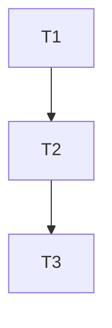

# Harness — Scrum Master (Orchestrator)

> **SHARED REFERENCES (CANONICAL — NÃO DUPLICAR corpo aqui):**
> - Full engineering rulebook (contracts 1-17 + appendices): `engineering-contracts` skill
> - GitHub CLI gh operations (PR create for ship): `_shared_checklists/GITHUB_CLI_COMMON.md`
> - gh-stack hierarchical partial PRs planning: engineering-contracts Appendix C
> - Nx/pnpm for task target hints: `_shared_checklists/NX_PNPM_COMMON.md`
> - Security/PII validation gates for compliance handoff: `_shared_checklists/SECURITY_PII_COMMON.md`

This is the **top-level orchestrator skill** for the global engineering harness.
It represents the Scrum Master role in the simulated Agile team.
All other harness skills (Developer, QA, Compliance) are called by this skill.

---

## 0. NON-NEGOTIABLE PRE-FLIGHT (run BEFORE anything else)

If ANY check below fails, **STOP and resolve with user before proceeding.**

### 0.1 Worktree-first enforcement + Session Binding Contract (engineering-contracts §19)

> **One session = ONE worktree by default. DOUBT = ASK. Never guess. Never silent cross-worktree ops.**

1. **Read existing binding FIRST from Level 1 GLOBAL INDEX (chicken-and-egg resolver):** Read `harness_registry_path`. Look for LAST entry with:
   - `SESSION_ID: <effective-session-id-from-harness_current_session_id>` AND `STATUS: BOUND`. If found → use its `WORKTREE_ROOT` as default binding proposal for this session; jump to step 3 only if user explicitly says "switch".
2. **Binding decision PRECEDENCE (STOP first match):**
   a. **Explicit user mention:** user said "worktree X" or gave path → PROPOSE binding to X, confirm once.
   b. **Open files / context:** all user-open files inside one worktree → PROPOSE that worktree. (≥2 worktrees → fall 2c.)
   c. **Working dirs / session memory:** single most-recent worktree referenced prior msgs → PROPOSE it.
   d. **Ambiguous (≥2 candidates or 0):** STOP. AskUserQuestion ≤2 concrete + "other (type path)". NEVER default.
3. **After user confirms worktree (no existing BOUND for this SESSION_ID in registry):** WRITE INTO BOTH LEVELS (§19 2-LEVEL LAYOUT) — atomically:
   a. **Level 1 (GLOBAL INDEX append-only JSONL):** NÃO use Edit/Write manual. Use HELPER OFICIAL ÚNICO: `source "${HARNESS_HOME:-$HOME/.trae}/contracts/harness_sessions_contract.sh" && harness_registry_append_jsonl <EFFECTIVE_SESSION_ID> BOUND <WORKTREE_ROOT> '{payload json}'. NEVER overwrite existing BOUND entries (keep histórico append-only). Helper faz dedup sha256 automaticamente + JSON safe sort_keys. **Também roda cleanup AUTOMÁTICO de artifacts legados DENTRO da worktree: tudo que for .trae/ legacy, decisions.log, task_graph etc é movido FORA para backup em $HARNESS_WORKSPACE_SHARED/legacy_binding_cleanup/<ts>/. Payload fields opcionais: workspace_name, worktree_slug, branch, friendly_name, harness_session_dir, harness_workspace_shared, workspace_file, reason, flags:{LANG_PT_CHECK:ENABLED|DISABLED}. Schema _v:1 por linha.
      ```
      SESSION_ID: <effective-session-id-from-harness_current_session_id>
      WORKTREE_ROOT: <absolute path>
      TASK_ID: <slug or "manual">
      BOUND_AT: <ISO timestamp>
      STATUS: BOUND
      ---
      ```
   b. **Level 2 (PER-SESSION DETAIL OUTSIDE user worktree — NEVER inside worktree):**
      1. `source "${HARNESS_HOME:-$HOME/.trae}/contracts/harness_sessions_contract.sh" && harness_compute_paths <WORKTREE_ROOT> <EFFECTIVE_SESSION_ID> && harness_ensure_session_dirs <WORKTREE_ROOT>`
      2. Write `$HARNESS_LEVEL2_BINDING` (= `$HARNESS_SESSION_DIR/binding.md`, contract-resolved, guaranteed outside worktree by harness_assert_outside_worktree) with:
         ```
         SESSION_ID: <session-id>
         WORKTREE_ROOT: <absolute path>
         TASK_ID: <slug>
         BOUND_AT: <ISO timestamp>
         STATUS: BOUND
         WORKSPACE_NAME: <canonical from workspace resolver, or "default">
         WORKTREE_SLUG: <canonical repo__branch slug>
         HARNESS_WORKSPACE_SHARED: <abs path outside worktree>
         HARNESS_SESSION_DIR: <abs path outside worktree>
         # PREV_BINDING: <old path> (only filled after re-bind/switch)
         # NEXT_BINDING: <new path> (only filled after re-bind/switch)
         ```
   c. Set `SESSION_WORKTREE_ROOT` = this value. GLOBAL for session.
4. **Re-binding (switch worktree mid-session):** ONLY after EXPLICIT user confirmation "Yes switch to X". When switching ATOMIC:
   a. **Level1:** Find last BOUND for this SESSION_ID → change line STATUS: `BOUND` → `RELEASED | RELEASED_AT: <ts> | NEXT_WORKTREE_ROOT: <newpath>`. Then APPEND (don't overwrite) ENTIRELY NEW BOUND entry (line above format) pointing to new worktree. Add delimiter.
   b. **Level2:** OLD detail md file (OLD HARNESS_SESSION_DIR/binding.md) → STATUS=RELEASED; add RELEASED_AT + NEXT_BINDING new file path. Create NEW detail md INSIDE **NEW HARNESS_SESSION_DIR/binding.md OUTSIDE new worktree** → STATUS=BOUND + PREV_BINDING=<oldpath>. NUNCA dentro do worktree.
   c. Announce switch in next 📍 Status.
   Agent-initiated switches = violation. Never "this code seems to be in worktree B so I'll touch it" without asking.
5. **Per-operation SCISSOR CHECK (before EVERY file write, Glob, Grep, git command):**
   - Does target path start with `SESSION_WORKTREE_ROOT`? If NO → BLOCK.
   - Two outcomes: (A) user confirms "write outside scope this time" → decision.log entry; (B) ask "Switch worktree first? A=Switch / B=Cancel op".
   - Silent cross-worktree reads = violation (even "just a quick grep").
   - Note: The global hook 1 `pretooluse-worktree-binding.sh` also ENFORCES this independently via Level1 registry without relying on agent memory; agent still does manual check as double layer.

### 0.2 Harness output directory enforcement — NUNCA DENTRO WORKTREE

**NÃO EXISTE pasta `.trae/<task-id>` DENTRO da worktree.** Essa estrutura NÃO É MAIS USADA (foi causa raiz de decisions.log / task_graph aparecendo em commits). Todos os artifacts resolvidos VIA CONTRATO EM `$HARNESS_SESSIONS_ROOT/<workspace>/<worktree-slug>/` FORA do código do usuário:

```
$HARNESS_WORKSPACE_SHARED  (durable, multi-session, FORA worktree)
  ├── decisions.log.jsonl
  ├── task_graph.md
  ├── spec_<slug>.md
  ├── gh_stack_plan.md
  ├── manual_test_plan.md
  ├── design/
  └── tasks/<TASK_ID>/
        ├── task_envelope_<id>.md
        └── test_spec_smoke.md

$HARNESS_SESSION_DIR       (ephemeral per-session, FORA worktree)
  ├── binding.md           (Level 2 — audit trail re-bind)
  ├── session.md
  ├── final_summary.md
  ├── reports/
  └── qa/
```

Where:
- `<task-id>` slug now goes inside `HARNESS_WORKSPACE_SHARED/tasks/<task-id>/` subdir when needed (not a folder inside worktree).
- Before ANY file writes: resolve paths via contract: `source "${HARNESS_HOME:-$HOME/.trae}/contracts/harness_sessions_contract.sh"` then `harness_compute_paths "$WORKTREE_ROOT" "$(harness_current_session_id)" "$PWD"`. Never hardcode.
- Run `harness_ensure_session_dirs WORKTREE_ROOT` immediately after binding decision. Creates 2 directory trees **strictly outside user's worktree** — `harness_assert_outside_worktree` HARD-STOPs (exit 99) se qualquer path resolvido cair dentro da worktree (por exemplo se usuário setou HARNESS_SESSIONS_ROOT errado). MORATORIUM: never write generated files under `<WORKTREE_ROOT>/.trae/*`.

**MANDATORY files created by this skill:**

| File | Location | When created | Purpose |
|---|---|---|---|
| `registry.jsonl` entries + `binding.md` (2-LEVEL) | Level1 = `harness_registry_path` (GLOBAL append-only JSONL, entry por session. ÚNICO writer = helper `harness_registry_append_jsonl`, NÃO Edit/Write manual). Level2 = `$HARNESS_SESSION_DIR/binding.md` (per session, OUTSIDE user worktree — never committed). | Immediately preflight 0.1 after binding decision (before ANY scope). | **Session ↔ worktree.** Resolve chicken-and-egg (Level1: `SESSION_ID → WORKTREE_ROOT`). Level1 payload JSONL fields: `friendly_name`, `flags.LANG_PT_CHECK=ENABLED|DISABLED`, `workspace_name`, `worktree_slug`, `branch`, `harness_session_dir`, `harness_workspace_shared`, `workspace_file`, `reason`. |
| `spec_<slug>.md` | `$HARNESS_WORKSPACE_SHARED/` | §0.5 BEFORE scope capture. Generated by harness-spec skill (4 inputs: existing/ticket/Flockr PRD/inline). Durable: shared across sessions; Approved status = GATE unlock. | **Execution contract.** 7 sections + YAML frontmatter (change_class, blast radius, DbC PRE/POST/INV, MoSCoW GWT AC + TEST_METHOD per AC, test strategy thresholds, hints, approved_at). Replaces legacy PRD. |
| `session.md` | `$HARNESS_SESSION_DIR/` | Start session | Session metadata: task-id, worktree path, start time, goals. |
| `task_graph.md` | `$HARNESS_WORKSPACE_SHARED/` | After scope capture | Full list tasks, deps, status, DONE criteria. Durable: shared across sessions on same worktree. |
| `task_envelope_<id>.md` | `$HARNESS_WORKSPACE_SHARED/tasks/<TASK_ID>/` | One per task before Dev handoff | Formal contract per task. Subdir per task in durable workspace area. |
| `decisions.log.jsonl` | `$HARNESS_WORKSPACE_SHARED/` | Append during execution (single shared file per worktree) | Trade-off / non-obvious decision rationale. Multi-session durable: not fragmented per task-id. |
| `manual_test_plan.md` | `$HARNESS_WORKSPACE_SHARED/` | After all tasks DONE | Step-by-step manual verification plan. Durable (reusable in future sessions on same worktree). |
| `final_summary.md` | `$HARNESS_SESSION_DIR/` | End of session | Delivered content, risks, stats for THIS run only. |
| `gh_stack_plan.md` | `$HARNESS_WORKSPACE_SHARED/` | After TASK GRAPH (Phase 1.4) only if trigger ≥3 tasks or >15 files | gh-stack hierarchical PR plan. APPROVED status before `/harness-ship` consumes. Durable. |
| `test_spec_smoke.md` | `$HARNESS_WORKSPACE_SHARED/tasks/<task-id>/` | Phase 1.5 (before ANY task envelope handed to Dev) | 1-page BDD test contract: 3–5 core Given-When-Then behaviors. |

---

### 0.3 Domain Context Auto-Load (NOVO · Three-Layer Domains v2)

Runs **AFTER** binding 0.1 + contract path resolution, **BEFORE** §0.5 Approved SPEC gate and §1 scope capture.

Purpose: If the current feature/spec belongs to a non-engineering domain (ux/product/devops/copywriting/social/seo-analytics), automatically load the domain persona/rules and playbook into session context BEFORE asking any scope capture questions. This guarantees domain-specific hard rules (WCAG, design tokens, SEO thresholds, copy length) are enforced from minute 0, not retroactively at ship gate.

Execution logic (in order — STOP at first match):
1. **Parse SPEC candidate domain:** Read the SPEC YAML frontmatter (from §0.5 gate or user-provided existing SPEC path). Extract field `domain:`.
2. **Fallback project registry domains array:** If `domain:` field is empty/null/absent in SPEC, read the Level 1.5 registry `domains: [ ]` array at `$HARNESS_HOME/bindings/project_registry.json` (if it exists) for the bound worktree project. Take the FIRST non-null, non-engineering entry if present.
3. **Default fallback:** If both 1 and 2 returned `null` OR `engineering` → **SKIP THIS STEP COMPLETELY AND SILENTLY (ZERO log lines, ZERO output)**. Session proceeds EXACTLY with the legacy pre-v2 behavior. 100% backward compatibility for all existing sessions/branches/skills (default implicit engineering = skip).
4. **If domain != engineering (one of: ux | product | devops | copywriting | social | seo-analytics):**
   a. Check if folders exist: `${HARNESS_HOME:-$HOME/.trae}/domains/<domain>/` → MUST exist. If not → WARN "Domain <slug> referenced but folder domains/<slug>/ doesn't exist yet (fase 2 rollout). Skipping domain load." → skip rest.
   b. **Read and inject profile.md:** Read `${HARNESS_HOME:-$HOME/.trae}/domains/<domain>/profile.md`. Append full content verbatim to session context preamble (same level as engineering-contracts §1-21). Agent MUST follow all Forbidden Patterns + Hard Rules in profile with same precedence as §14 Conventional Commits.
   c. **Read and inject playbook.md:** Read `${HARNESS_HOME:-$HOME/.trae}/domains/<domain>/playbook.md`. Append to session context. Steps listed in playbook (e.g. UX 5 phases Brief→Wire→Hi-fi→Gates→Handoff) are treated as REQUIRED PRECONDITIONS before §1 scope capture for domain-specific tasks. If playbook says "Need Brief Approved Gate literal 'Approved' before wireframes", agent enforces it.
   d. **Register mandatory gates list for downstream §0.9.5 ship:** Parse playbook frontmatter YAML key `gate_files_required: [ ... ]`. Store in session state `SESSION_DOMAIN_GATES = array`. This list is consumed AUTOMATICALLY by harness-ship §0.9.5 DOMAIN GATES later.
   e. **Mandatory decision.log entry (1 single line):** Append to `$HARNESS_WORKSPACE_SHARED/decisions.log.jsonl`:
      ```
      [DOMAIN-LOAD] session=<sid> worktree=<wt_slug> domain=<slug> profile=LOADED playbook=LOADED mandatory_gates=<n> gates_list=[<comma-sep>]
      ```
5. **Nunca carrega 2 domínios simultâneos:** Se SPEC `domain:` e registry `domains[0]` forem diferentes → usa SPEC `domain:` SEMPRE (SPEC tem maior precedência que registry global). NUNCA carrega profile + playbook de 2 domínios na mesma sessão. Se realmente precisa cross-domain → SM cria 2 tasks SEPARADAS no task graph cada uma com seu domínio.

### 0.4 Project Knowledge Level 1.5 Reuse (auto-load, mesmo padrão §0.3)

Runs **immediately after §0.3, before §0.5**. Reuses pre-existing hard rule from CLAUDE.md: "If `graphify-out/GRAPH_REPORT.md` exists, read first. Then read relevant area doc docs/platform.md, docs/scanner.md, docs/packages.md, docs/decisions.md, docs/overview.md."

Execution logic (no breaking change — adds 2 more reads only):
1. Se `$HARNESS_HOME/bindings/project_registry.json` existir e tiver entry para o projeto da worktree atual → ler e injetar no contexto: `product_context` + `architecture` + `roadmap` + `personas` + `integrations_external`.
2. Sempre lê `docs/packages.md` + `docs/decisions.md` se existirem no bound worktree root (caminhos absolutos). Precedência menor que SPEC aprovada, maior que "intuition" do agente.
3. If no file exists → **SKIP silently**. Zero output. Zero log. Compat 100% projetos antigos sem docs/.

---

## 1. Phase 0 — SCOPE CAPTURE (once per feature)

### 0.5 Preflight: Approved SPEC validation (GATE before scope capture)

This gate runs **AFTER** preflight 0.1 (binding), contract path resolution, and `harness_ensure_session_dirs`, **BEFORE** any §1 scope capture questions.

1. **Glob existing specs:** Look in `$HARNESS_WORKSPACE_SHARED/spec_*.md`. Parse YAML frontmatter `status` of each.
2. **Count Approved specs:**
   - **Exactly 1 Approved:** Ask user: "Found 1 Approved SPEC. Use this existing SPEC? (A) Yes, skip generation / (B) Generate new SPEC".
   - **≥2 Approved:** List slugs and ask user to pick 1, OR "Generate new".
   - **0 Approved:** Proceed straight to step 3.
3. **If generate new or 0 Approved:** Invoke the **`harness-spec`** Skill. Pass along any user-provided PRD path, ticket URL, or inline description the user gave in the current message. Capture returned last-2-lines:
   ```
   SPEC_PATH=<abs-path>
   SPEC_STATUS=Approved|Draft
   ```
4. **Gate enforcement:**
   - If `SPEC_STATUS=Approved` (either existing or freshly approved by user) → unlock scope capture §1.1. Set `SESSION_SPEC_PATH=<path>` for downstream skills.
   - If `SPEC_STATUS=Draft` after harness-spec finishes (user cancelled Approval) → offer: "(A) Run scope capture WITHOUT approved SPEC (log override to decisions) / (B) Stop here, finish SPEC later via /harness-spec".
5. **Case A (override without Approved SPEC):** Append entry to `$HARNESS_WORKSPACE_SHARED/decisions.log.jsonl` → `[SPEC-OVERRIDE] scope capture started without Approved SPEC — user confirmed. Reason: <user typed reason or "cancel-approval" exit>`. Proceed to §1.

### 1.1 Input validation

Check if user provided:
- [ ] Approved SPEC file (session SPEC_PATH set by §0.5) — OR explicit SPEC-OVERRIDE decision logged
- [ ] Goals / problem statement
- [ ] Constraints (tech, time, architectural, business)
- [ ] Acceptance Criteria (ACs) — prefer Given/When/Then format (auto-populate from SPEC §4 if available)
- [ ] Existing task list OR expects this skill to generate one

If **any** item above is missing → **ASK the user** with specific questions before proceeding.
Do **NOT** guess constraints or ACs.

### 1.2 Task list generation (if user did not provide one)

If user said "decompose into tasks" or did not provide a list:
1. Produce an initial task list following:
   - **Atomicity**: each task should be 1 logical, self-contained unit of work
   - **Precedence**: tasks that others depend on come first
   - **Size**: each task should be completable in < 1 day (conceptually)
2. Present the task list to the user:
   - For each task: short title + what it covers + what it explicitly DOES NOT cover
3. Wait for user APPROVAL before moving on.

### 1.3 Build TASK GRAPH

Write `$HARNESS_WORKSPACE_SHARED/task_graph.md` (resolved via `harness_compute_paths` — durable, shared across sessions on this worktree):

```markdown
# TASK GRAPH — <task-id>

## Metadata
- Created: <ISO datetime>
- Worktree: <path>

## Task Table

| ID | Title | Depends on | Status | DONE criteria |
|----|-------|-----------|--------|---------------|
| T1 | ...   | -         | TODO   | ...           |
| T2 | ...   | T1        | TODO   | ...           |

## Dependency Graph (Mermaid)

```

**DONE criteria per task MUST be testable / verifiable.**
Bad: "implements auth".
Good: "User can POST /register with {email, password} and receives a JWT; invalid email returns 400 with error message."

---

### 1.4 (NEW — N4 solicitação) Plan gh-stack hierarchical partial PRs (threshold-triggered)

> **Purpose (from §15 Agile BDD Incremental — engineering-contracts):**
> PRs ≤400 diff lines + 15 files = human reviewable. >800 lines = superficial review → risk.
> For scopes ≥3 tasks OR any task with estimated blast radius >15 files → deliver MULTIPLE partial PRs, ordered bottom-up, linked via gh-stack CLI.
> Full gh-stack workflow reference: engineering-contracts Appendix C. Install via `gh extension install github/gh-stack`.

**Step A — Evaluate trigger:**
Compute 2 booleans:
```
needs_gh_stack =
  (Total tasks >= 3)
  OR
  (Any single task estimated blast radius > 15 files)
  OR
  (User explicitly said "I want multiple PRs for this one")
AND
  NOT (User explicitly said "single PR please" for this scope)
```

If `needs_gh_stack = FALSE` → SKIP. Mark in session.md: `gh-stack: NOT NEEDED (below threshold)`. Proceed to 1.5 Serial/Parallel.

If `needs_gh_stack = TRUE` → Step B.

**Step B — Build gh_stack_plan.md:**
Group the TASK GRAPH tasks into "PR layers" (semantic groups). Bottom layers = contracts/types/data-model. Top layers = UI/routes/integration tests. Write to `$HARNESS_WORKSPACE_SHARED/gh_stack_plan.md` (durable area):

```
# GH STACK PLAN — <task-id>
Status: DRAFT (awaiting user approval)
Triggered by: <tasks count> tasks OR <max-task-files> files max single-task estimate

| Order | Base branch | Head branch placeholder | Conventional commit title (PR) | Tasks/ACs covered | Est max files | Est max diff lines |
|---|---|---|---|---|---|---|
| 1 (bottom) | main | <branch-pr1> | feat(contracts): <slug> data model + enums | T1, AC-1..3 | ≤8 | ≤250 |
| 2 | <branch-pr1> | <branch-pr2> | feat(payments): <slug> service layer + unit tests | T2/T3, AC-4..9 | ≤14 | ≤400 |
| 3 (top) | <branch-pr2> | <branch-pr3> | feat(admin): <slug> dashboard UI + tRPC routes | T4/T5, AC-10..13 | ≤12 | ≤350 |

Review order for team: 1 → 2 → 3.
Merge order: bottom-up (1 first, then 2 rebased on main, then 3 rebased on 2).
Notes:
- If PR2 needs fix after review: push fix on <branch-pr2>, then `gh-stack rebase` auto-rebases PR3 on top of new PR2 head.
- After PR1 merged → `gh-stack update --base main` rebases the rest onto actual main merge-base.
```

Rules enforced for layers:
1. Any single PR layer >20 files → RE-GROUP into smaller layers. No exceptions.
2. Each PR has OWN ACs subset (can be merged independently IF PRs below are merged).
3. Bottom-up dependency chain strictly acyclic (no cycles; 3 → 2 → 1 → main).

**Step C — User approval gate (MANDATORY before development starts):**
Present gh_stack_plan.md to user + ask (Portuguese):
> "Escopo vai precisar de múltiplos PRs (~N) por revisibilidade. Planejei a stack acima. Opções:
> A) APROVAR o plano da stack como está → começo desenvolvimento com a hierarquia definida.
> B) Ajustar grupos/ordem de PRs (me diga o que reorganizar).
> C) NÃO quero usar gh-stack p/ este escopo (mesmo que maior) → single PR final, eu aceito que revisão vai ser mais pesada."

If user chooses A → set Status APPROVED + user date in plan. Mark in session.md: `gh-stack: APPROVED (N PRs)`. Proceed.
If user chooses B → re-plan Step B until A.
If user chooses C → mark: `gh-stack: DECLINED BY USER (single PR)`. Log entry decision.log: `[gh-stack DECLINED] user chose single PR for large scope <task-id> (N tasks, X est. files)`. Delete gh_stack_plan.md OR save it with status = DECLINED.

Also add `gh_stack_plan.md` to the mandatory files list (OPTIONAL; present only when needs_gh_stack triggered).

---

## 1.5 Phase 1.5 — QA TEST SPEC SMOKE (Contract-First, before any code writes)

> Goal: Before ANY TASK ENVELOPE is handed off to Developer (serial) or envelopes are batch-written (parallel), the QA mindset creates a 1-page test spec for the GLOBAL scope. Reasoning: (1) BDD contract is explicit BEFORE code exists → no bias. (2) Fail fast: if QA cannot write the test spec from current scope capture + approved PRD → scope is underspecified → DO NOT start development. Fix scope first. (3) ≤30% overhead. Total test spec budget: ≤1 page, ≤15 lines. This is NOT the actual test file code — it is a contract spec that the actual test file writers follow later.

Who does it: SM runs in QA mindset (or invokes harness-qa for this specific step if separate QA agent slot is available).

Output file: `$HARNESS_WORKSPACE_SHARED/tasks/<task-id>/test_spec_smoke.md` (ONE file for the whole feature/task, NOT per-task per envelope. Durable area: reusable, survives session cleanup.)

### 1.5.1 Content (5 mandatory bullets, ≤15 lines TOTAL):

1. **Behavior list (BDD Given-When-Then)**: 3–5 core behaviors under test. Core only. No edge cases listed here. Edge cases = defer until actual test file creation. Format:
   - `GIVEN <precondition> WHEN <user action or trigger occurs> THEN <expected observable output or state>`.
2. **Test split recommendation**: `<X> unit tests (where: packages/db, <pkg>) + <Y> e2e tests (routes: POST /x, UI flow Y) + <Z> manual smoke (admin finance page: refund button)`.
3. **Specific test files to be created or updated** (enumerate file paths expected). NO wildcards. Example:
   - `packages/platform/src/app/api/refund/route.test.ts` (unit API handler)
   - `packages/platform/e2e/refund-admin.spec.ts` (e2e Playwright)
4. **Key invariants that tests must assert (DbC post-conditions)**: 2–3 max. Example:
   - After successful refund → `ticket.status = CANCELLED + sold_units decremented in same tx + Stripe refund_id stored`.
5. **Explicit out-of-scope tests (NÃO TESTAR AGORA)** — write 2–3 bullets of edge cases explicitly NOT covered (deferred to future if needed). This prevents scope creep and confirms YAGNI.

### 1.5.2 Gate (hard stop before development):

When `test_spec_smoke.md` is written: present to user **ONLY the 5 bullets + file list** (≤15 lines max — do not rewrite full document again in chat, just reference it):
> A) Aprovar este Test Spec Smoke e iniciar desenvolvimento
> B) Ajustar X comportamento / Y divisão de testes

If user chooses A → mark in session.md: `test_spec_smoke: APPROVED`. Add `test_spec_smoke.md` into MANDATORY output files table. Proceed to Phase 0.5 Parallel/Serial decision (next below).
If user chooses B → iterate once on test_spec_smoke. If after 2 iterations still not approved → GO BACK to Scope Capture (Phase 0) / PRD adjustments, because scope is ambiguous. DO NOT start development without APPROVED test_spec_smoke.

---

## 2. Phase 0.5 — PARALLEL vs SERIAL Execution Decision (NEW)

After the TASK GRAPH is user-approved and before Phase 1 loop, the Scrum Master MUST decide whether to use:
- **Serial mode** (original Phase 1-6, one task at a time), OR
- **Parallel mode** (fan-out via `harness-executor-dispatcher` skill, if conditions met)

### 2.0.1 Decision criteria for parallel mode (ALL required for parallel to be accepted)

1. Task count ≥ 2.
2. Every `TODO` task in the task graph has a **full, explicit, non-glob, enumerated file list** in its TASK ENVELOPE's `Blast Radius → ALLOWED` section. If any task has glob wildcards (e.g., `src/**/*` or `packages/auth/`) that cannot be deterministically enumerated — that task and any that share a Kahn wave with it → SERIAL FALLBACK.
3. At least one pair of tasks in the SAME KAHN WAVE (zero in-degree simultaneously) has: `Files(Ta) ∩ Files(Tb) == ∅` — i.e., there exists at least one parallel gain to be had, otherwise it's just serial with extra overhead.
4. User did NOT pass `--serial` flag.
5. Worktree has NO uncommitted edits outside the scope of this harness session (check `git status --porcelain` — if dirty outside envelope files, ask user if they want to proceed parallel anyway or stash first).
6. No stale `$HARNESS_SESSION_DIR/_locks/*.lock.json` files with state `HELD` from a prior aborted run exist → if they do, list them + prompt user "purge stale locks before proceeding (Y/N)?".

### 2.0.2 If ANY parallel precondition FAIL → FALL BACK to serial

Proceed to the original **Phase 1-6 — Per-Task Serial Execution Loop** (section 2 below).
No change in behavior.

### 2.0.3 If ALL parallel preconditions PASS → fan out via `harness-executor-dispatcher`

1. Write the per-task envelopes FIRST (same as Phase 2.1 in serial, but for all TODO tasks now), so dispatcher has all file lists.
2. Write an optional user-overridable `dispatcher.config.json` in `$HARNESS_WORKSPACE_SHARED/tasks/<TASK_ID>/`:
   ```json
   {"max_parallel": 3}
   ```
   (default: min(cpu_cores, 3); hard cap 4). Resolve via `harness_compute_paths`; NEVER inside `<WORKTREE_ROOT>`.
3. **Ask user explicit confirmation** before fanning out. Message template (Portuguese):
   > 🚀 Modo paralelo detectado! 
   > - Tasks totais: N 
   > - Tarefas paralelizáveis no primeiro batch (arquivos disjuntos): [T1, T3, ...]
   > - Tarefas em serial-fallback por conflito de arquivo: [T2, ...]
   > - max_parallel = 3 (cap 4)
   > 
   > Confirmar execução paralela via dispatcher? (sim / não → serial)
4. If user says NÃO (serial fallback) → go to original Phase 1-6 serial loop.
5. If user says SIM → call `harness-executor-dispatcher` skill with full context (worktree, task-id, task_graph, envelope paths, max_parallel, dispatcher.config.json path).
6. Dispatcher returns (all resolved via `harness_compute_paths`, NEVER inside worktree):
   - `$HARNESS_SESSION_DIR/reports/execution_batches.md`
   - `$HARNESS_SESSION_DIR/reports/merge_audit_Bx_My.md` per batch
   - `$HARNESS_SESSION_DIR/reports/BATCH_EXECUTION_REPORT.md` with per-task final status (DONE / FAIL).
7. SM post-processes the report:
   - **All DONE, 0 FAIL, 0 CONFLICT**: proceed to Phase 7 (Compliance HEAVY + manual_test_plan + final_summary) as usual.
   - **Any failures (SCOPE / QA / COMPLIANCE_LIGHT / HIGH conflict rollback)**: SM takes the failed tasks back into **SERIAL mode** one-by-one, re-running them through Phase 1-6 serially (de-scoped, not parallel — since they already showed instability/conflict). Then proceed to Phase 7 once all individually DONE.
8. Update `task_graph.md` rows with `Status = DONE` for every DONE from the parallel run.

---

## 2. Phase 1-6 — Per-Task Serial Execution Loop

> Runs when: parallel mode is REFUSED, OR the user opted out of parallel mode, OR we are re-running failed tasks from a parallel run.

For EACH task in the TASK GRAPH, in dependency order:

### 2.1 TASK ENVELOPE (before calling Developer)

Create `$HARNESS_WORKSPACE_SHARED/tasks/<TASK_ID>/task_envelope_<TASK_ID>.md`
using the template in `references/TASK_ENVELOPE_TEMPLATE.md`.
Resolve the path via `harness_compute_paths` + `harness_ensure_session_dirs`; NEVER inside `<WORKTREE_ROOT>`.

**CRITICAL fields that prevent scope creep:**
- **Blast radius**: explicit list of files / directories that MAY be touched. If Dev needs to touch something outside → must come back to SM for approval, logged to `decisions.log.jsonl`.
- **Reuse mandate**: specific existing functions, classes, or modules that MUST be reused (if applicable).
- **Max files heuristic**: if task envelope anticipates > 10 files → SM must re-evaluate and justify in decision.log.

### 2.2 Call Developer (skill: harness-developer)

Pass the **full TASK ENVELOPE** to `harness-developer`. Wait for it to return with:
- Pré-relatório de implementação
- Lista de arquivos realmente tocados
- Auto-checks realizados

### 2.3 SCOPE VALIDATION (SM + Dev)

Compare Developer's output against TASK ENVELOPE:

| Check | Pass / Fail |
|---|---|
| All Acceptance Criteria from envelope are demonstrably met? | ▢ |
| No files outside the "blast radius" list (or approval logged)? | ▢ |
| No scope creep — features not listed in envelope were not added? | ▢ |
| Atomic: task stands alone, no partial / WIP left behind? | ▢ |

**If FAIL**: Return the task to Developer with a clear, numbered list of deltas.
**If 2 consecutive iterations fail** → PAUSE and ask user for input / direction.

**If PASS**: Mark task as `SCOPE_OK` in `task_graph.md` and proceed.

### 2.4 Call QA (skill: harness-qa)

Pass to `harness-qa`:
- Worktree path
- Task ID
- Files modified list
- What type of changes (pure function / UI / API route / DB schema etc.)

Wait for QA report.
**If any check FAILS**: send numbered list of failures back to Developer, loop.
**If ALL pass**: mark task as `QA_OK`.

### 2.5 Call Compliance — LIGHT (per-task stage)

Pass to `harness-compliance` with `stage: per-task`.
Checks: secrets/PII in diff, basic SQL injection patterns, basic auth holes.

**If FAIL**: back to Dev.
**If PASS**: mark task as `DONE` in `task_graph.md`.

---

## 3. Phase 7 — Final Stage (all tasks DONE)

When last task is marked DONE:

### 3.1 Compliance — HEAVY (full sweep)

Call `harness-compliance` with `stage: final`.
This scans the ENTIRE worktree diff (not just per-task), checks for:
- Hidden secrets / keys
- PII accumulation across files
- Architecture boundary violations
- Environment-specific bugs (prod vs dev)

### 3.2 Generate MANUAL_TEST_PLAN.md

Create `$HARNESS_WORKSPACE_SHARED/manual_test_plan.md` using the template (durable, shared across sessions for the same worktree).
Resolve via `harness_compute_paths`; NEVER inside `<WORKTREE_ROOT>`.
It must have:
- One section per Acceptance Criteria (from the whole PRD)
- GIVEN / WHEN / THEN structure
- Expected result per step
- Rollback / smoke-test checklist

### 3.3 Generate FINAL_SUMMARY.md

Create `$HARNESS_SESSION_DIR/final_summary.md` (ephemeral per-session; resolved via `harness_compute_paths`, NEVER inside worktree):

```markdown
# Final Summary — <task-id>

## Delivered
- [T1]: <1 line summary>
- [T2]: <1 line summary>

## Stats
- Files modified: <total count>
- Files NEW: <count>
- Files EDITED: <count>
- Tests ADDED: <count>
- Total Dev iterations: <sum of (scope loops + qa loops + compliance loops)>

## Trade-offs / Decisions Logged
- <bulleted list of key entries from decisions.log.jsonl>

## Remaining Risks
- <anything that could blow up in prod, with severity>

## Next steps
- Manual test (see manual_test_plan.md)
- Open PR
- Assign reviewers
```

### 3.4 Report to user

Print a concise, human-readable summary in Portuguese:
- Quais tasks foram entregues
- Stats principais
- Onde encontrar os artefatos (todos FORA worktree, via `harness_compute_paths`):
  - Task envelopes + dispatcher config → `$HARNESS_WORKSPACE_SHARED/tasks/<TASK_ID>/`
  - Manual test plan → `$HARNESS_WORKSPACE_SHARED/manual_test_plan.md`
  - Decisions log → `$HARNESS_WORKSPACE_SHARED/decisions.log.jsonl`
  - Final summary + parallel reports → `$HARNESS_SESSION_DIR/` (`final_summary.md`, `reports/*`)
- Avisar que está pronto para `/harness-ship` ou validação manual

---

## Appendix A: Mandatory checkpoints (never skip)

- [ ] Preflight: worktree path confirmed by user
- [ ] Preflight: `harness_compute_paths WORKTREE_ROOT` + `harness_ensure_session_dirs WORKTREE_ROOT` executados SANS `HARNESS SESSIONS CONTRACT VIOLATION` (todos paths FORA worktree)
- [ ] Scope capture: ACs explicit and user-approved
- [ ] TASK GRAPH: user approved or provided
- [ ] Per task: ENVELOPE written with blast radius + DONE criteria
- [ ] Per task: 2-iteration rule enforced (no infinite loops)
- [ ] Final: both compliance stages (light + heavy) ran
- [ ] Final: manual_test_plan.md and final_summary.md exist
