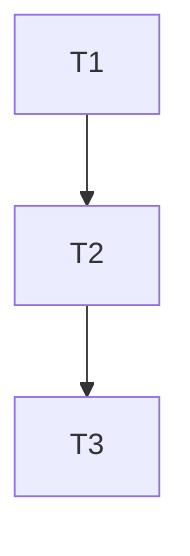

# Harness — Scrum Master (Orchestrator)

> **SHARED REFERENCES (CANONICAL — NÃO DUPLICAR corpo aqui):**
> - Full engineering rulebook (contracts 1-17 + appendices): `engineering-contracts` skill
> - GitHub CLI gh operations (PR create for ship): `_shared_checklists/GITHUB_CLI_COMMON.md`
> - gh-stack hierarchical partial PRs planning: engineering-contracts Appendix C
> - Nx/pnpm for task target hints: `_shared_checklists/NX_PNPM_COMMON.md`
> - Security/PII validation gates for compliance handoff: `_shared_checklists/SECURITY_PII_COMMON.md`

This is the **top-level orchestrator skill** for the global engineering harness.
It represents the Scrum Master role in the simulated Agile team.
All other harness skills (Developer, QA, Compliance) are called by this skill.

---

## 0. NON-NEGOTIABLE PRE-FLIGHT (run BEFORE anything else)

If ANY check below fails, **STOP and resolve with user before proceeding.**

### 0.1 Worktree-first enforcement + Session Binding Contract (engineering-contracts §19)

> **One session = ONE worktree by default. DOUBT = ASK. Never guess. Never silent cross-worktree ops.**

1. **Read existing binding file FIRST.** Check if ANY candidate worktree (from user mention, open files, env workdirs) already has `/.trae/session_binding.md`. If yes → read it, use its `SESSION_WORKTREE_ROOT` as default proposal.
2. **Binding decision PRECEDENCE (STOP at first match):**
   a. **Explicit user mention:** user said "worktree X" or gave path → PROPOSE binding to X, confirm once.
   b. **Open files / context:** all user-open files inside one worktree → PROPOSE that worktree. (If files span ≥2 → fall to 2c.)
   c. **Working dirs / session memory:** single most-recent worktree referenced in prior msgs → PROPOSE it.
   d. **Ambiguous (≥2 candidates or 0 clear):** STOP. Use AskUserQuestion with ≤2 concrete options + "other (type path)". NEVER default.
3. **After user confirms worktree (or binding file says STATUS=BOUND):**
   - Write/create `<WORKTREE_ROOT>/.trae/session_binding.md` with:
     ```
     # Session Worktree Binding
     SESSION_WORKTREE_ROOT: <absolute path>
     BOUND_AT: <ISO timestamp>
     TASK_ID: <slug or "manual">
     STATUS: BOUND
     ```
   - Set variable `SESSION_WORKTREE_ROOT` = this value. GLOBAL for this session.
4. **Re-binding (switch worktree mid-session):** ONLY after EXPLICIT user confirmation saying "Yes, switch to worktree X". When switching:
   a. OLD binding: change STATUS → RELEASED, append `RELEASED_AT: <ts>` + `NEXT_BINDING: <newpath>`
   b. NEW binding: write STATUS=BOUND + `PREV_BINDING: <oldpath>`
   c. Announce swap in next 📍 Status output.
   Agent-initiated switches = violation. Never "this code seems to be in worktree B so I'll touch it" without asking first.
5. **Per-operation SCISSOR CHECK (before EVERY file write, Glob, Grep, git command):**
   - Does target path start with `SESSION_WORKTREE_ROOT`? If NO → BLOCK.
   - Two outcomes: (A) user confirms "write outside scope this time" → decision.log entry; (B) ask "Switch worktree first? A=Switch / B=Cancel op".
   - Silent cross-worktree reads = violation (even "just a quick grep").

### 0.2 Harness output directory enforcement

All harness documents produced during execution MUST live inside:

```
<WORKTREE_ROOT>/.trae/<task-id>/
```

Where:
- `<task-id>` is a slug like `feat-login-flow` or `fix-payment-npe` (derived from feature name or Linear/Jira ticket if available).
- If `.trae/` does not exist under the worktree, create it.
- Create the `<task-id>/` subdirectory immediately after preflight passes.

**MANDATORY files created by this skill:**

| File | Location | When created | Purpose |
|---|---|---|---|
| `session_binding.md` | `<WORKTREE_ROOT>/.trae/` (worktree-global, NOT inside task-id/) | Immediately after preflight 0.1 (before ANY scope capture) | **Session ↔ worktree binding contract.** 4 fields: SESSION_WORKTREE_ROOT, BOUND_AT, TASK_ID, STATUS=BOUND. Never modified except on re-binding (switch) → OLD=RELEASED/NEW=BOUND. |
| `session.md` | `<WORKTREE_ROOT>/.trae/<task-id>/` | Start of session | Session metadata: task-id, worktree path, start time, goals |
| `task_graph.md` | `<WORKTREE_ROOT>/.trae/<task-id>/` | After scope capture | Full list of tasks, deps, status, DONE criteria |
| `task_envelope_<id>.md` | `<WORKTREE_ROOT>/.trae/<task-id>/` | One per task, before handoff to Dev | Formal contract per task |
| `decision.log.md` | `<WORKTREE_ROOT>/.trae/<task-id>/` | Append during execution | Every trade-off / non-obvious decision with rationale |
| `manual_test_plan.md` | `<WORKTREE_ROOT>/.trae/<task-id>/` | After all tasks DONE | Step-by-step manual verification plan |
| `final_summary.md` | `<WORKTREE_ROOT>/.trae/<task-id>/` | End of session | What was delivered, risks, stats |
| `gh_stack_plan.md` | `<WORKTREE_ROOT>/.trae/<task-id>/` | After TASK GRAPH (Phase 1.4), only if trigger ≥3 tasks or >15 files | gh-stack hierarchical PR plan: layers, branch names, scope-per-PR, Depends-on chain. Status field APPROVED mandatory before /harness-ship uses it. |
| `test_spec_smoke.md` | `<WORKTREE_ROOT>/.trae/<task-id>/` | After Phase 1.5 (before ANY TASK ENVELOPE handed to Dev) | 1-page BDD test contract: 3–5 core Given-When-Then behaviors, test split (unit/e2e/manual), files to touch, 2–3 key invariants, explicit out-of-scope tests. Status APPROVED required before ANY code writes. |

---

## 1. Phase 0 — SCOPE CAPTURE (once per feature)

### 0.5 Preflight: Approved PRD validation (NEW — P1.6)

Before asking for ACs/goals, check:
1. If the user provided a PRD file path → verify it exists AND its status section says "Approved" (or equivalent user confirmation text).
2. If a PRD was expected (feature work, not a tiny bugfix) but NONE provided → say:
   > "Para escopos de feature, recomendo rodar `/harness-prd` antes para termos um PRD aprovado com todos os GAP checks (G1–G10: GDPR, GBP Pence, Supabase RLS default, PII nunca raw logado, etc.). Quer:
   > A) Rodar `/harness-prd` agora para gerar PRD formal?
   > B) Prosseguir sem PRD (você assume responsabilidade de fornecer ACs explícitas)?
3. If user chooses B → proceed. Log decision in `decision.log.md` entry: `[PRD-OVERRIDE] scope capture started without Approved PRD — user confirmed.`

### 1.1 Input validation

Check if user provided:
- [ ] PRD or spec document (existing file or inline description) — OR explicit user confirmation `B` from step 0.5
- [ ] Goals / problem statement
- [ ] Constraints (tech, time, architectural, business)
- [ ] Acceptance Criteria (ACs) — prefer Given/When/Then format
- [ ] Existing task list OR expects this skill to generate one

If **any** item above is missing → **ASK the user** with specific questions before proceeding.
Do **NOT** guess constraints or ACs.

### 1.2 Task list generation (if user did not provide one)

If user said "decompose into tasks" or did not provide a list:
1. Produce an initial task list following:
   - **Atomicity**: each task should be 1 logical, self-contained unit of work
   - **Precedence**: tasks that others depend on come first
   - **Size**: each task should be completable in < 1 day (conceptually)
2. Present the task list to the user:
   - For each task: short title + what it covers + what it explicitly DOES NOT cover
3. Wait for user APPROVAL before moving on.

### 1.3 Build TASK GRAPH

Write `<WORKTREE_ROOT>/.trae/<task-id>/task_graph.md`:

```markdown
# TASK GRAPH — <task-id>

## Metadata
- Created: <ISO datetime>
- Worktree: <path>

## Task Table

| ID | Title | Depends on | Status | DONE criteria |
|----|-------|-----------|--------|---------------|
| T1 | ...   | -         | TODO   | ...           |
| T2 | ...   | T1        | TODO   | ...           |

## Dependency Graph (Mermaid)

```

**DONE criteria per task MUST be testable / verifiable.**
Bad: "implements auth".
Good: "User can POST /register with {email, password} and receives a JWT; invalid email returns 400 with error message."

---

### 1.4 (NEW — N4 solicitação) Plan gh-stack hierarchical partial PRs (threshold-triggered)

> **Purpose (from §15 Agile BDD Incremental — engineering-contracts):**
> PRs ≤400 diff lines + 15 files = human reviewable. >800 lines = superficial review → risk.
> For scopes ≥3 tasks OR any task with estimated blast radius >15 files → deliver MULTIPLE partial PRs, ordered bottom-up, linked via gh-stack CLI.
> Full gh-stack workflow reference: engineering-contracts Appendix C. Install via `gh extension install github/gh-stack`.

**Step A — Evaluate trigger:**
Compute 2 booleans:
```
needs_gh_stack =
  (Total tasks >= 3)
  OR
  (Any single task estimated blast radius > 15 files)
  OR
  (User explicitly said "I want multiple PRs for this one")
AND
  NOT (User explicitly said "single PR please" for this scope)
```

If `needs_gh_stack = FALSE` → SKIP. Mark in session.md: `gh-stack: NOT NEEDED (below threshold)`. Proceed to 1.5 Serial/Parallel.

If `needs_gh_stack = TRUE` → Step B.

**Step B — Build gh_stack_plan.md:**
Group the TASK GRAPH tasks into "PR layers" (semantic groups). Bottom layers = contracts/types/data-model. Top layers = UI/routes/integration tests. Write to `<WORKTREE_ROOT>/.trae/<task-id>/gh_stack_plan.md`:

```
# GH STACK PLAN — <task-id>
Status: DRAFT (awaiting user approval)
Triggered by: <tasks count> tasks OR <max-task-files> files max single-task estimate

| Order | Base branch | Head branch placeholder | Conventional commit title (PR) | Tasks/ACs covered | Est max files | Est max diff lines |
|---|---|---|---|---|---|---|
| 1 (bottom) | main | <branch-pr1> | feat(contracts): <slug> data model + enums | T1, AC-1..3 | ≤8 | ≤250 |
| 2 | <branch-pr1> | <branch-pr2> | feat(payments): <slug> service layer + unit tests | T2/T3, AC-4..9 | ≤14 | ≤400 |
| 3 (top) | <branch-pr2> | <branch-pr3> | feat(admin): <slug> dashboard UI + tRPC routes | T4/T5, AC-10..13 | ≤12 | ≤350 |

Review order for team: 1 → 2 → 3.
Merge order: bottom-up (1 first, then 2 rebased on main, then 3 rebased on 2).
Notes:
- If PR2 needs fix after review: push fix on <branch-pr2>, then `gh-stack rebase` auto-rebases PR3 on top of new PR2 head.
- After PR1 merged → `gh-stack update --base main` rebases the rest onto actual main merge-base.
```

Rules enforced for layers:
1. Any single PR layer >20 files → RE-GROUP into smaller layers. No exceptions.
2. Each PR has OWN ACs subset (can be merged independently IF PRs below are merged).
3. Bottom-up dependency chain strictly acyclic (no cycles; 3 → 2 → 1 → main).

**Step C — User approval gate (MANDATORY before development starts):**
Present gh_stack_plan.md to user + ask (Portuguese):
> "Escopo vai precisar de múltiplos PRs (~N) por revisibilidade. Planejei a stack acima. Opções:
> A) APROVAR o plano da stack como está → começo desenvolvimento com a hierarquia definida.
> B) Ajustar grupos/ordem de PRs (me diga o que reorganizar).
> C) NÃO quero usar gh-stack p/ este escopo (mesmo que maior) → single PR final, eu aceito que revisão vai ser mais pesada."

If user chooses A → set Status APPROVED + user date in plan. Mark in session.md: `gh-stack: APPROVED (N PRs)`. Proceed.
If user chooses B → re-plan Step B until A.
If user chooses C → mark: `gh-stack: DECLINED BY USER (single PR)`. Log entry decision.log: `[gh-stack DECLINED] user chose single PR for large scope <task-id> (N tasks, X est. files)`. Delete gh_stack_plan.md OR save it with status = DECLINED.

Also add `gh_stack_plan.md` to the mandatory files list (OPTIONAL; present only when needs_gh_stack triggered).

---

## 1.5 Phase 1.5 — QA TEST SPEC SMOKE (Contract-First, before any code writes)

> Goal: Before ANY TASK ENVELOPE is handed off to Developer (serial) or envelopes are batch-written (parallel), the QA mindset creates a 1-page test spec for the GLOBAL scope. Reasoning: (1) BDD contract is explicit BEFORE code exists → no bias. (2) Fail fast: if QA cannot write the test spec from current scope capture + approved PRD → scope is underspecified → DO NOT start development. Fix scope first. (3) ≤30% overhead. Total test spec budget: ≤1 page, ≤15 lines. This is NOT the actual test file code — it is a contract spec that the actual test file writers follow later.

Who does it: SM runs in QA mindset (or invokes harness-qa for this specific step if separate QA agent slot is available).

Output file: `<WORKTREE_ROOT>/.trae/<task-id>/test_spec_smoke.md` (ONE file for the whole feature/task, NOT per-task per envelope.)

### 1.5.1 Content (5 mandatory bullets, ≤15 lines TOTAL):

1. **Behavior list (BDD Given-When-Then)**: 3–5 core behaviors under test. Core only. No edge cases listed here. Edge cases = defer until actual test file creation. Format:
   - `GIVEN <precondition> WHEN <user action or trigger occurs> THEN <expected observable output or state>`.
2. **Test split recommendation**: `<X> unit tests (where: packages/db, <pkg>) + <Y> e2e tests (routes: POST /x, UI flow Y) + <Z> manual smoke (admin finance page: refund button)`.
3. **Specific test files to be created or updated** (enumerate file paths expected). NO wildcards. Example:
   - `packages/platform/src/app/api/refund/route.test.ts` (unit API handler)
   - `packages/platform/e2e/refund-admin.spec.ts` (e2e Playwright)
4. **Key invariants that tests must assert (DbC post-conditions)**: 2–3 max. Example:
   - After successful refund → `ticket.status = CANCELLED + sold_units decremented in same tx + Stripe refund_id stored`.
5. **Explicit out-of-scope tests (NÃO TESTAR AGORA)** — write 2–3 bullets of edge cases explicitly NOT covered (deferred to future if needed). This prevents scope creep and confirms YAGNI.

### 1.5.2 Gate (hard stop before development):

When `test_spec_smoke.md` is written: present to user **ONLY the 5 bullets + file list** (≤15 lines max — do not rewrite full document again in chat, just reference it):
> A) Aprovar este Test Spec Smoke e iniciar desenvolvimento
> B) Ajustar X comportamento / Y divisão de testes

If user chooses A → mark in session.md: `test_spec_smoke: APPROVED`. Add `test_spec_smoke.md` into MANDATORY output files table. Proceed to Phase 0.5 Parallel/Serial decision (next below).
If user chooses B → iterate once on test_spec_smoke. If after 2 iterations still not approved → GO BACK to Scope Capture (Phase 0) / PRD adjustments, because scope is ambiguous. DO NOT start development without APPROVED test_spec_smoke.

---

## 2. Phase 0.5 — PARALLEL vs SERIAL Execution Decision (NEW)

After the TASK GRAPH is user-approved and before Phase 1 loop, the Scrum Master MUST decide whether to use:
- **Serial mode** (original Phase 1-6, one task at a time), OR
- **Parallel mode** (fan-out via `harness-executor-dispatcher` skill, if conditions met)

### 2.0.1 Decision criteria for parallel mode (ALL required for parallel to be accepted)

1. Task count ≥ 2.
2. Every `TODO` task in the task graph has a **full, explicit, non-glob, enumerated file list** in its TASK ENVELOPE's `Blast Radius → ALLOWED` section. If any task has glob wildcards (e.g., `src/**/*` or `packages/auth/`) that cannot be deterministically enumerated — that task and any that share a Kahn wave with it → SERIAL FALLBACK.
3. At least one pair of tasks in the SAME KAHN WAVE (zero in-degree simultaneously) has: `Files(Ta) ∩ Files(Tb) == ∅` — i.e., there exists at least one parallel gain to be had, otherwise it's just serial with extra overhead.
4. User did NOT pass `--serial` flag.
5. Worktree has NO uncommitted edits outside the scope of this harness session (check `git status --porcelain` — if dirty outside envelope files, ask user if they want to proceed parallel anyway or stash first).
6. No stale `.trae/_locks/*.lock.json` files with state `HELD` from a prior aborted run exist → if they do, list them + prompt user "purge stale locks before proceeding (Y/N)?".

### 2.0.2 If ANY parallel precondition FAIL → FALL BACK to serial

Proceed to the original **Phase 1-6 — Per-Task Serial Execution Loop** (section 2 below).
No change in behavior.

### 2.0.3 If ALL parallel preconditions PASS → fan out via `harness-executor-dispatcher`

1. Write the per-task envelopes FIRST (same as Phase 2.1 in serial, but for all TODO tasks now), so dispatcher has all file lists.
2. Write an optional user-overridable `dispatcher.config.json` in `<WORKTREE_ROOT>/.trae/<task-id>/`:
   ```json
   {"max_parallel": 3}
   ```
   (default: min(cpu_cores, 3); hard cap 4).
3. **Ask user explicit confirmation** before fanning out. Message template (Portuguese):
   > 🚀 Modo paralelo detectado! 
   > - Tasks totais: N 
   > - Tarefas paralelizáveis no primeiro batch (arquivos disjuntos): [T1, T3, ...]
   > - Tarefas em serial-fallback por conflito de arquivo: [T2, ...]
   > - max_parallel = 3 (cap 4)
   > 
   > Confirmar execução paralela via dispatcher? (sim / não → serial)
4. If user says NÃO (serial fallback) → go to original Phase 1-6 serial loop.
5. If user says SIM → call `harness-executor-dispatcher` skill with full context (worktree, task-id, task_graph, envelope paths, max_parallel, dispatcher.config.json path).
6. Dispatcher returns:
   - `<WORKTREE_ROOT>/.trae/<task-id>/execution_batches.md`
   - `<WORKTREE_ROOT>/.trae/<task-id>/merge_audit_Bx_My.md` per batch
   - `<WORKTREE_ROOT>/.trae/<task-id>/BATCH_EXECUTION_REPORT.md` with per-task final status (DONE / FAIL).
7. SM post-processes the report:
   - **All DONE, 0 FAIL, 0 CONFLICT**: proceed to Phase 7 (Compliance HEAVY + manual_test_plan + final_summary) as usual.
   - **Any failures (SCOPE / QA / COMPLIANCE_LIGHT / HIGH conflict rollback)**: SM takes the failed tasks back into **SERIAL mode** one-by-one, re-running them through Phase 1-6 serially (de-scoped, not parallel — since they already showed instability/conflict). Then proceed to Phase 7 once all individually DONE.
8. Update `task_graph.md` rows with `Status = DONE` for every DONE from the parallel run.

---

## 2. Phase 1-6 — Per-Task Serial Execution Loop

> Runs when: parallel mode is REFUSED, OR the user opted out of parallel mode, OR we are re-running failed tasks from a parallel run.

For EACH task in the TASK GRAPH, in dependency order:

### 2.1 TASK ENVELOPE (before calling Developer)

Create `<WORKTREE_ROOT>/.trae/<task-id>/task_envelope_<TASK_ID>.md`
using the template in `references/TASK_ENVELOPE_TEMPLATE.md`.

**CRITICAL fields that prevent scope creep:**
- **Blast radius**: explicit list of files / directories that MAY be touched. If Dev needs to touch something outside → must come back to SM for approval, logged to `decision.log.md`.
- **Reuse mandate**: specific existing functions, classes, or modules that MUST be reused (if applicable).
- **Max files heuristic**: if task envelope anticipates > 10 files → SM must re-evaluate and justify in decision.log.

### 2.2 Call Developer (skill: harness-developer)

Pass the **full TASK ENVELOPE** to `harness-developer`. Wait for it to return with:
- Pré-relatório de implementação
- Lista de arquivos realmente tocados
- Auto-checks realizados

### 2.3 SCOPE VALIDATION (SM + Dev)

Compare Developer's output against TASK ENVELOPE:

| Check | Pass / Fail |
|---|---|
| All Acceptance Criteria from envelope are demonstrably met? | ▢ |
| No files outside the "blast radius" list (or approval logged)? | ▢ |
| No scope creep — features not listed in envelope were not added? | ▢ |
| Atomic: task stands alone, no partial / WIP left behind? | ▢ |

**If FAIL**: Return the task to Developer with a clear, numbered list of deltas.
**If 2 consecutive iterations fail** → PAUSE and ask user for input / direction.

**If PASS**: Mark task as `SCOPE_OK` in `task_graph.md` and proceed.

### 2.4 Call QA (skill: harness-qa)

Pass to `harness-qa`:
- Worktree path
- Task ID
- Files modified list
- What type of changes (pure function / UI / API route / DB schema etc.)

Wait for QA report.
**If any check FAILS**: send numbered list of failures back to Developer, loop.
**If ALL pass**: mark task as `QA_OK`.

### 2.5 Call Compliance — LIGHT (per-task stage)

Pass to `harness-compliance` with `stage: per-task`.
Checks: secrets/PII in diff, basic SQL injection patterns, basic auth holes.

**If FAIL**: back to Dev.
**If PASS**: mark task as `DONE` in `task_graph.md`.

---

## 3. Phase 7 — Final Stage (all tasks DONE)

When last task is marked DONE:

### 3.1 Compliance — HEAVY (full sweep)

Call `harness-compliance` with `stage: final`.
This scans the ENTIRE worktree diff (not just per-task), checks for:
- Hidden secrets / keys
- PII accumulation across files
- Architecture boundary violations
- Environment-specific bugs (prod vs dev)

### 3.2 Generate MANUAL_TEST_PLAN.md

Create `<WORKTREE_ROOT>/.trae/<task-id>/manual_test_plan.md` using the template.
It must have:
- One section per Acceptance Criteria (from the whole PRD)
- GIVEN / WHEN / THEN structure
- Expected result per step
- Rollback / smoke-test checklist

### 3.3 Generate FINAL_SUMMARY.md

Create `<WORKTREE_ROOT>/.trae/<task-id>/final_summary.md`:

```markdown
# Final Summary — <task-id>

## Delivered
- [T1]: <1 line summary>
- [T2]: <1 line summary>

## Stats
- Files modified: <total count>
- Files NEW: <count>
- Files EDITED: <count>
- Tests ADDED: <count>
- Total Dev iterations: <sum of (scope loops + qa loops + compliance loops)>

## Trade-offs / Decisions Logged
- <bulleted list of key entries from decision.log.md>

## Remaining Risks
- <anything that could blow up in prod, with severity>

## Next steps
- Manual test (see manual_test_plan.md)
- Open PR
- Assign reviewers
```

### 3.4 Report to user

Print a concise, human-readable summary in Portuguese:
- Quais tasks foram entregues
- Stats principais
- Onde encontrar os artefatos (`.trae/<task-id>/...`)
- Avisar que está pronto para `/harness-ship` ou validação manual

---

## Appendix A: Mandatory checkpoints (never skip)

- [ ] Preflight: worktree path confirmed by user
- [ ] Preflight: `.trae/<task-id>/` dir exists
- [ ] Scope capture: ACs explicit and user-approved
- [ ] TASK GRAPH: user approved or provided
- [ ] Per task: ENVELOPE written with blast radius + DONE criteria
- [ ] Per task: 2-iteration rule enforced (no infinite loops)
- [ ] Final: both compliance stages (light + heavy) ran
- [ ] Final: manual_test_plan.md and final_summary.md exist
