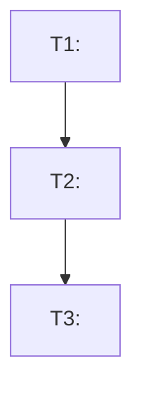

# TASK GRAPH TEMPLATE

> Resolve path via `source $HOME/.trae/contracts/harness_sessions_contract.sh && harness_compute_paths WORKTREE_ROOT`. NEVER inside `<WORKTREE_ROOT>/.trae/*`.
> File location: `$HARNESS_WORKSPACE_SHARED/task_graph.md` (durable, shared across sessions for same worktree)
> Updated by Scrum Master as tasks progress through stages.
> Language: English.

---

# TASK GRAPH — `<task-id-slug>`

## Metadata

- **Created:** `<ISO datetime>`
- **Feature / Bug description (1 line):** `<English>`
- **Worktree:** `<absolute path>`
- **Source PRD / Spec:** `<link or path>`

## Summary counts

| Metric | Count |
|---|---|
| Total tasks | `N` |
| TODO | `N` |
| SCOPE_OK | `N` |
| QA_OK | `N` |
| DONE | `N` |
| BLOCKED | `N` |

## Task Table

| ID | Title | Depends on | Status | DONE criteria (testable) |
|----|-------|-----------|--------|---------------------------|
| T1 | `<imperative title>` | - | TODO | `<1-2 sentences: what is "done" for this task>` |
| T2 | `<imperative title>` | T1 | TODO | ... |
| T3 | `<imperative title>` | T2 | TODO | ... |

Statuses flow: `TODO` → `IN_PROGRESS` → `SCOPE_OK` → `QA_OK` → `DONE`.
Failure state: `BLOCKED:<reason short>`.

## Dependency Graph (visual)



## Legend — which agent owns each transition

| Transition | Owner | Checklists applied |
|---|---|---|
| TODO → IN_PROGRESS | SM | TASK ENVELOPE fully written; blast radius approved |
| IN_PROGRESS → SCOPE_OK | SM | Developer pre-report vs envelope AC match |
| SCOPE_OK → QA_OK | QA | Build + Lint + Typecheck + Tests 0 failing |
| QA_OK → DONE | Compliance | Per-task LIGHT scan, 0 CRITICAL / HIGH |
| Any → BLOCKED | SM | 2 consecutive fails without progress; pending user input |

---

## Append if / when BLOCKED occurs

```
### BLOCKED — T<N> — <date>
Blocked at stage: <scope/qa/compliance>
Iterations: <N> (>= 2)
Pending user input: <specific question>
```
